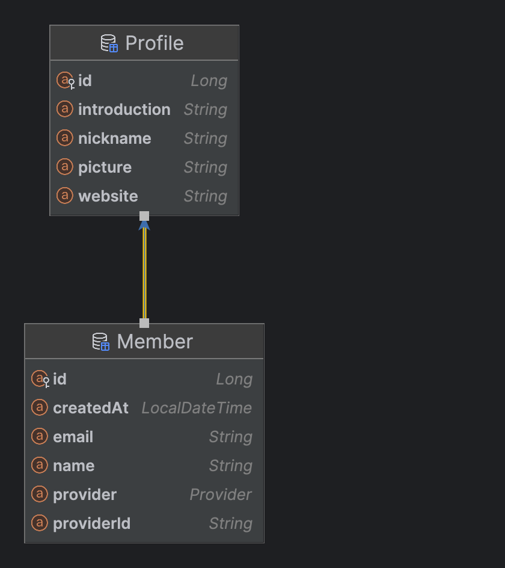

# Member Service SRS

## 1. 문서 개요 (Overview)

이 문서는 `무물보 회원 서비스`에 대한 명세를 정의합니다.

## 2. 서비스 개요

### 2-1. 회원 서비스 시스템 구성

`mmb-member-service(이하 회원 서비스)`는 회원 및 프로필 정보를 관리하는 서비스입니다.  
회원 서비스는

1. Api 형태로 서비스를 제공하는 `Spring Boot Application`
2. 회원 및 프로필 정보를 관리하는 `MySQL`
3. 프로필 사진을 저장 및 조회하는 `MinIO`

로 구성됩니다.

### 2-2. 회원 서비스 인증 방식

모든 회원 서비스 api는 `api-gateway`를 거칩니다.  
회원 인증이 필요 요청을 받으면 `api-gateway`가 요청 헤더에서 `Bearer 토큰`을 꺼내 인증 서비스에 전달하고 회원 id를 받아옵니다.  
응답 받은 회원 id를 요청 헤더(`X-User-ID`)에 저장하여 회원 서비스로 전달합니다.

## 3. 기능 명세 (Functional Requirements)

### 3-1. 회원 정보 저장

내부 서비스 간 통신에서 사용하는 기능입니다.  
인증 서비스가 소셜 로그인을 통해 조회한 회원 정보를 회원 서비스에 전달하여 회원 정보를 저장합니다.

### 3-2. 회원 정보 조회

회원 id, 이름, 이메일, 닉네임, 프로필 이미지 정보를 조회합니다.

### 3-3. 회원 정보 삭제

내부 서비스 간 통신에서 사용하는 기능입니다.  
인증 서비스가 탈퇴할 회원 정보를 회원 서비스에 전달하여 회원 정보와 프로필 정보를 함께 삭제합니다.

### 3-4. 프로필 조회

이름, 이메일, 닉네임, 프로필 이미지, 자기소개, 웹사이트 정보를 조회합니다.

### 3-5. 프로필 이미지 수정

프로필 이미지 정보를 수정합니다.

### 3-6. 프로필 정보 수정

닉네임, 자기소개, 웹사이트 정보를 수정합니다.

## 4. API 명세 요약

Reference. [Member Service Api Docs](https://github.com/A-OverFlow/mmb-docs/blob/main/0_%ED%94%84%EB%A1%9C%EC%A0%9D%ED%8A%B8_%EA%B4%80%EB%A6%AC/1_%EA%B0%9C%EB%B0%9C/API_Docs/MEMBER_REST_API_Docs.md)

| HTTP Method | URL                                                   | Bearer Token Required | Description | 비고     |
|-------------|-------------------------------------------------------|-----------------------|-------------|--------|
| POST        | https://mumulbo.com/api/v1/members                    | x                     | 회원 정보 저장    | 내부 통신용 |
| GET         | https://mumulbo.com/api/v1/members/me                 | ㅇ                     | 회원 정보 조회    | -      |
| DELETE      | https://mumulbo.com/api/v1/members/me                 | ㅇ                     | 회원 정보 삭제    | 내부 통신용 |
| GET         | https://mumulbo.com/api/v1/members/me/profile         | ㅇ                     | 프로필 조회      | -      |
| PUT         | https://mumulbo.com/api/v1/members/me/profile/picture | ㅇ                     | 프로필 이미지 수정  | -      |
| PATCH       | https://mumulbo.com/api/v1/members/me/profile/info    | ㅇ                     | 프로필 정보 수정   | -      |

## 5. 도메인 모델 요약

### ERD Diagram

## 6. 비기능 요구사항

| 항목          | 설명                                      |
|-------------|-----------------------------------------|
| 인증          | 회원 정보 저장 기능을 제외한 모든 기능들은 JWT 인증이 필요합니다. |
| API 보안      | `API Gateway`에서 인증 및 요청 라우팅을 수행합니다.     |
| RESTful API | 모든 API는 REST API 형식을 따릅니다.              |
| 확장성         | MSA로 구성되어 독립적인 확장이 가능합니다.               |
| 가용성         | 서비스는 99.9% 이상의 가용성 목표                   |
| 부하          | 100 TPS 처리를 목표로 합니다.                    |

## 7. 연동 서비스

인증, 질문, 답변, 채팅 서비스들에 회원 정보를 제공합니다.

## 8. 기타

.
