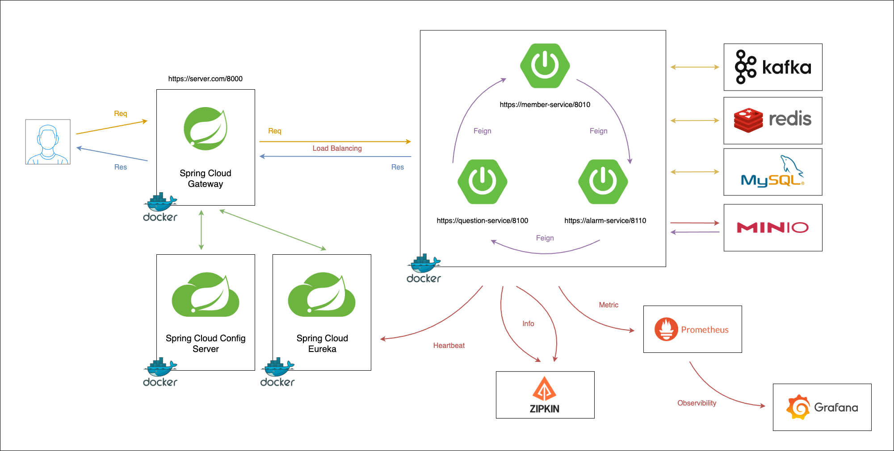

# 무물보 SRS (Software Requirements Specification)

## 1. 소개(Introduction)

### 1.1 문서 목적(Purpose of Document)

안랩에서 주관하는 안아카데미의 Ahnlab Overflow 팀에서 개발하는 웹 서비스인 `무물보` 프로젝트의 요구 사항을 정리하는 문서 입니다.  
프로젝트의의 진행 범위, 목표, 기능, 성능, 품질에 대한 요구사항을 정의 합니다.

### 1.2 프로젝트 개요(Project Overview)

#### 1.2.1. 소프트웨어(프로젝트) 개요

`무불보`는 스택 오버플로우를 벤치 마킹하는 질문/답변형 웹 서비스 입니다.  

#### 1.2.2. 주요 목표

4달간의 설계, 개발, 테스트 과정을 거쳐 웹 서비스를 출시 하는것을 목표로 합니다.   
안랩에는 전사 질문/답변 공유 시스템이 존재하지 않아 스터디를 통해 개발된 서비스를 전사 플랫폼으로 활용하는것을 목표로 합니다.

#### 1.2.3. 사용자(이해관계자) 범주

`무불보`웹 서비스로써 누구나 질문/답변을 남길 수 있습니다.  

#### 1.2.4. 관련된 사업적 배경

안랩 오버플로우는 안랩에서 주관하는 스터디 그룹 입니다.  
스터디 진행 방식을 이론 위주의 진행 보다는 실습 위주의 방식을 진행하자는 구성들의 공통적인 의견이 있었습니다.  
따라서 실제 웹서비스를 개발해보기 위해 `무물보`라는 웹 서비스를 만들게 되었습니다.  

### 1.3 문서 구조(Document Structure)

문서는 필요한 내용을 텍스트, 그림, 표를 통해 표현 합니다.  
각장의 목차에 해당되는 내용을 기술 하도록 합니다.  

---

## 2. 전체 기술 개요(Overall Description)

### 2.1 시스템 범위와 기능(System Scope & Features)

#### 2.1.1. 소프트웨어의 주요 범위

- 플랫폼 서비스
- 비즈니스 로직 서비스
- IaC (Infra As Code)
- CD/CI

#### 2.1.2. 핵심 기능

##### 2.1.2.1. 사용자 관련 기능

- 소셜 로그인을 통한 회원 가입 & 로그인 & 회원 탈퇴
- 사용자 정보 조회/수정/삭제
- 사용자 프로필 사진 조회/수정/삭제

##### 2.1.2.2. 질문/답변 관련 기능

- 질문 조회/추가/수정/삭제
- 답변 조회/추가/수정/삭제
- 댓글 조회/추가/수정/삭제
- 좋아요/싫어요(이모지) 조회/추가/수정/삭제
- 답변 채택

##### 2.1.2.2. 편의 기능

- 답변 채택시 알림 기능
- 답변 추가시 알림 기능
- 댓글 추가시 알림 기능
- 좋아요/싫어요(이모지) 추가시 알림 기능

### 2.2 이해관계자 및 사용자 특성(Stakeholders & User Characteristics)

#### 2.2.1. 요구사항 제공자, 사용자 유형

요구사항 제공자
- 릴리즈 이전까지는 내부 구성원의 요구사항 수집 및 분석  
- 릴리즈 이후 실제 일반 사용자의 의견을 수집 및 분석  

사용자 유형
- 사용자는 프로그래밍 또는 컴퓨터 사이언스 지식을 습득/공유하려는 의도를 가지고 서비스를 사용한다.  

#### 2.2.1. 사용자의 기술 수준, 요구사항 우선순위

사용자의 기술 수준
- 질문을 주로 남기는 사용자의 경우는 초중급의 기술력을 보유 했을 것으로 기대된다.   
- 답변을 주로 남기는 사용자의 경우는 중고급의 기술력을 보유 했을것으로 기대된다.   

요구사항 우선 순위
- 편의성과 관련된 요구사항을 우선적으로 수행 한다.
- 성능 개선, 구조 개선등의 요구 사항은 장기적인 플랜을 가지고 수행 한다.   

### 2.3 운영 환경(Operating Environment)

OS, 하드웨어, 네트워크 등 필수 환경
- AWS 기반의 클라우드 컴퓨팅 환경
- 기타 환경 (온프레미스 환경)도 지원 가능 하도록 한다.   

제한사항, 기술적 제약
- 리소스의 사용 제한으로 인해 확장 (스케일링), HA 등는 고려하지 않는다.  
- MSP는 운영환경 변경을 고려하여 사용하지 않도록 한다. (ex. MSK, ECS, EKS)

### 2.4 설계 및 구현에 대한 제한사항(Design & Implementation Constraints)

서비스 아키텍쳐
- MSA (마이크로 서비스 아키텍쳐)를 필수적으로 사용 한다.  
    - 

서비스 구동 단위
- 도커 기반의 컨테이너 환경

라이센스
- GPL, GNU, 아파치등 사용하는 코드의 라이센스를 준수하도록 한다.

### 2.5 시스템 가정 및 종속성(Assumptions & Dependencies)

서비스 구성
- 플랫폼 서비스
    - API Gateway
    - Eureka Service
    - Config Service
    - 스토리지 서비스
    - 알림 서비스
- 기능 서비스
    - 회원 서비스
    - 인증 서비스
    - 질문 답변 서비스
- 인프라
    - Redis
    - RDB (MysQL)
    - MinIO

와부 의존
- 소셜 로그인 OAuth 서버 (Google, Kakao)

---

## 3. 기능 요구사항(Functional Requirements)

### 3.1. UX

- **메인 화면**
    - 비로그인: 로그인 화면
    - 로그인: 질문 답변 게시판
- **로그인 화면**
    - 소셜 로그인 버튼
- **회원 정보 화면**
    - 사용자의 프로필 사진, 가입 날짜등을 표시
    - 로그인 회원의 정보인 경우 수정, 회원 탈퇴 버튼 활성화
    - 로그인 회원의 정보인 경우 알림 여부 선택 버튼 활성화
- **공통 화면**
    - header
        - 좌측 상단
            - 무물보 로고
        - 우측 상단
            - 비로그인: 기본 프로필 사진
            - 로그인: 로그인 회원은 프로필 사진
    - main
        - 기능에 따른 화면 구성
    - footer
        - 이용약관, 개인 정보 처리 방침 등
- **질문 답변 게시판**
    - 리스크 상단에 질문 검색 창
        - 입력시 검색된 질문 표시
    - 질문 리스트
        - 무한 스크롤 방식의 게시판
- **질문 화면**
    - 질문 리스트에서 클릭시 이동
    - 질문 제목, 작성자, 등록 날짜 정보 표시
        - 로그인 회원의 질문인 경우 수정, 삭제 버튼 활성화
    - 답변, 댓글 표시
        - 좋아요/싫어요 (이모지) 표시
        - 로그인 회원의 답변, 댓글인 경우 수정, 삭제 버튼 활성화

### 3.2. 회원 기능
- 로그인 기능
    - 소셜 로그인 버튼 클릭시 해당 소셜 로그인 화면 표시
    - 로그인 완료시 정상 로그인 처리
    - 로그인 완료시 메인 화면 표시
- 사용자 정보 보기
    - 사용자 정보 보기
    - 로그인 사용자의 정보가 아닌경우 수정 버튼 비활성화
- 사용자의 활동 내역 보기
    - 사용자가 등록한 질문 보기
        - 최신순서, 오래된순서
    - 사용자가 등록한 답변 보기
        - 최신순서, 오래된순서, 추천 많은순서, 추천 적은순서, 댓글 많은순서, 댓글 적은순서
    - 사용자가 등록한 댓글 보기
        - 최신순서, 오래된 순서
- 사용자 정보 수정
    - 내프로필 페이지에서 수정 가능
    - 사용자 정보 수정 기능
        - 이메일을 제외한 이름, 프로필 사진 변경 가능
- 알림 기능
    - 질문, 답변, 댓글에 대한 알림 여부를 통해 알림 기능
    - 회원 가입시 모든 알림 on, 이후 사죵자 화면에서 수정

### 3.3. 질문 답변
- 질문 등록
    - 질문 제목, 내용 등 입력 후 저장 버튼 클릭시 질문 생성
    - 질문은 1분에 최대 5개 까지만 등록 가능
- 질문 수정
    - 제목 수정, 본문 수정 가능
    - 수정된 경우 최초 등록 날짜, 수정된 날짜 표시
    - 수정 내역은 지원하지 않는다
- 질문 삭제
    - 질문은 답변이 하나도 없는 경우 삭제 가능
    - 답변이 존재하는 댓글은 수정만 가능
- 답변 등록
    - 질문에 대한 답변 추가
    - 하나의 질문에 유저당 1개의 답변만 등록 가능
- 답변 삭제
    - 답변은 어떠한 경우라도 삭제 가능
    - 답변 삭제시 댓글은 전부 같이 삭제
- 답변 채택
    - 질문에 대한 답변중 채택은 단 1개만 가능
    - 채택된 답변은 일반 답변과 다른 표시 필요

### 3.4. 알림 기능
- 알림 발송
    - 이벤트 발생시 이벤트에 해당 되는 내용의 알림 발송
- 알림 내역 조회
    - 사용자의 알림 내역을 조회 가능
    - 사용자의 알림 건수 조회 가능

---

## 4. 비기능 요구사항(Non-Functional Requirements)

### 4.1 성능 및 확장성(Performance & Scalability)

- 처리 속도, 동시 사용자 수, 트랜잭션 처리량
    - 배포 이후 `nGrinder` 또는 `pinpoint`를 통해 측정

- 확장성 요구사항
    - 스케일업(수평확장)이 가능한 구조로 개발

### 4.2 보안(Security)

- HTTPS 사용
- AWS EC2는 보안 정책 & vpc 설정을 통해 인가된 사용자만 접근 가능 하도록 수정
    - Root 계정이 아닌 Iam게정을 통해 EC2관리
    - Iam 유저는 MFA 필수 사용
- Rate Limit 제한을 통한 DDos 공격 방지
- 사용자 권한에 따른 서비스의 기능 제한

### 4.3 사용성(Usability)
- UI/UX 요구사항
    - 화면 설계서를 통한 요구사항의 시각화
    - 유저 플로우를 통한 유저의 사용 패턴 정리
- 접근성(Accessibility) 기준
    - 오픈 서비스로 언제 어디서나 온라인 환경에서 접근 가능 하도록 한다
- 사용 편의성 측면
    - 데스크탑 버전 및 모바일 버전을 모두 지원하도록 한다.

### 4.4 신뢰성 및 가용성(Reliability & Availability)
- 장애 발생 시 복구 방식
    - 컨테이너 롤백 전략을 통한 업데이트 오류 방지
    - 서비스 재시작을 통한 즉각적인 장애 복구 시도
- 시스템 다운타임 최소화
    - 롤링 업데이트를 통한 서비스 다운 타임 최소화
- 백업 및 복구 정책
    - 특정 횟수 이상 에러 발생시 롤백
- 프로메테우스 & 그라파나를 이용한 모니터링 시스템 구축
    - 리소스 모니터링 및 각종 정보 모니터링

### 4.5 호환성(Compatibility)
- 크롬 브라우저 우선 지원
- 반응형 웹 구성으로 모바일 웹 브라우저 지원
    - 모바일 네이티브 앱은 지원하지 않음
- 멀티플랫폼(OS) 요구사항
    - FE는 웹 기반 서비스로 상기 지원 대상을 따름
    - BE는 도커 컨테이너가 구축된 서비스에서 구동 가능

### 4.6 유지보수성(Maintainability)
- 코드 구조, 문서화
    - API 문서 작성
- 버전 관리 정책
    - Git을 통한 코드 버전 관리
    - Git-Flow를 통한 브랜치 관리
- 리팩토링 기준
    - 최최 릴리즈 이후 운영시에 고려 한다

### 4.7 기타 요구사항(Other Constraints)
- 법적 규제 및 산업 규정 준수
- 국제 표준, 인증 요구사항 준수

---

## 5. 인터페이스 요구사항(External Interface Requirements)

### 5.1 사용자 인터페이스(User Interface Requirements)
- 화면 설계서
    - 별도의 화면 설계서 참조
- 주요 화면 흐름, 디자인 가이드
    - 별도의 화면 설계서 및 디자인 관련 문서 참조

### 5.2 하드웨어 인터페이스(Hardware Interfaces)
- Aws EC2를 따름 (Vcpu등)

### 5.3 소프트웨어 인터페이스(Software Interfaces)
- 서비스간 인터페이스
    - FE/BE간 Rest api를 통한 통신 사용
    - 내부 BE간 Rest api를 이용한 통신 사용
- 연동할 외부 시스템/API
    - 외부 서비스에서 지원하는 방식을 따름
    - 대부분의 OAuth 서비스는 Rest api를 지원
- 데이터 포맷(JSON, XML 등)
    - JSON 포맷을 기본 포맷으로 사용
    - 각 서비스는 필요로 하는 방식을 사용
- 인증/보안 방식
    - OAuth 인증 방식 사용
    - JWT를 이용한 세션리스(Sessionless) 인증 방식

### 5.4 통신 인터페이스(Communication Interfaces)
- 네트워크 프로토콜, 포트
    - 서비스의 인터페이스 및 포트는 서비스에서 정의 한다.
    - 인터페이스를 통한 통신시 협의를 통해 결정 한다.
- TLS/SSL 등 보안 통신 방식 사용

---

## 6. 데이터 요구사항(Data Requirements)
- 데이터베이스 스키마(ERD, 테이블 구조)
    - 
- 데이터 처리 정책(백업, 암호화)
    - 백업은 1일 1회로 규정
    - 백업 파일을 별도로 저장하며 장애시 자동 복구하도록 한다
- 주요 데이터 흐름(DFD 등)
    - 

---

## 7. 테스트 및 검증 계획(Validation & Verification Plan)
- 요구사항 검증 방법(테스트 케이스, 시나리오)
    - 단위 테스트
    - 인그레이션 테스트
- 품질 보증 전략, 테스트 범위
    - 부하 테스트의 경우 별도 인프라 이용해 진행
- QA 프로세스
    - N/A

---

## 8. 부록(Appendix)

### 8.1 용어 정의(Glossary)
- `AOF`: Ahnlab OverFlow의 약자
- `무물보`: 무엇이든 물어 보세요의 줄임말

### 8.2 참고 문서(Reference)
- N/A

### 8.3 변경 로그(Revision History)
- 버전별 변경 사항 요약
- 변경 일자, 작성자, 변경 내용

위의 두개의 내용을 하단의 표에 작성 한다.

|날짜|작성자|설명|
|:------|:-----|:-----|
|2025.03.22|임준섭|SRS 초안 작성|
||||
||||
