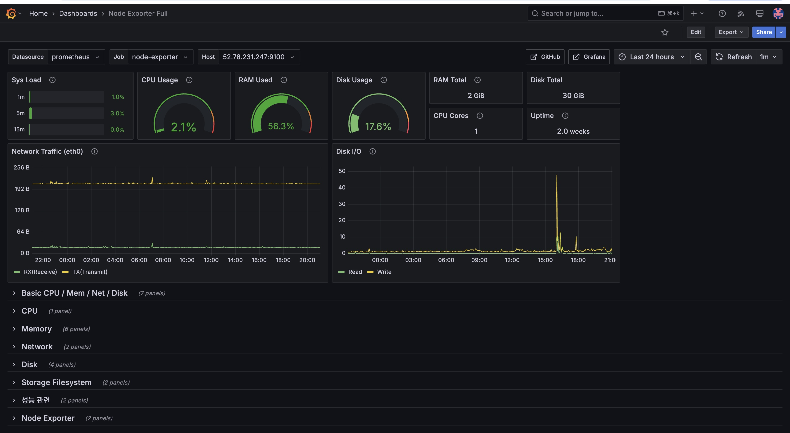

# 개발 일정

- 설계 :  25.03.13 ~ 27
- 개발 : 25.03.28 ~ 25.04.09
- 테스트 : 없음
- 배포
    - 1차 : 25.04.10 (실패)
    - 2차 : 25.04.17 (예정)
- 접속 URL : https://mumulbo.com

# 서비스 기능

## 회원 관리

### 기능 상세

* 로그인
    * `소셜 로그인` 버튼 클릭
    * 로그인 진행 (계정 정보 입력)
    * 로그인 완료
    * 무뭅보 메인 페이지로 이동
* 로그아웃
    * `로그아웃` 버튼 클릭
    * 정말 로그아웃 하시겠습니까? 팝업 창 표시 (`예` 클릭시 로그아웃 요청)
    * 서비스에서 토큰 삭제
* 회원 가입
    * `소셜 로그인` 버튼 클릭
    * 계정 정보 입력을 통한 로그인 진행
    * 무뭅보 서비스로 회원 가입 요청 (회원 가입 요청)
    * 회원 가입 완료시 토큰 발급 (access_token, refresh_token)
* 회원 탈퇴
    * `회원 탈퇴` 버튼 클릭
    * 정말 회원탈퇴 하시겠습니까? 팝업 창 표시 (`예` 클릭시 회원탈퇴 요청)
    * 토큰 삭제, 회원 작성글 (게시글, 답변, 질문) 삭제, 회원 정보 삭제

### 구성도

- todo
    - 비지니스 로직 중심으로 구성도 그리기
    - ex) gateway -> 서비스 -> DB

## QnA 게시판

### 기능 상세

* 게시글 리스트 조회
    * 게시글 `리스트` 조회 (리스트 조회 요청)
        * 전체 게시글을 조회하도록 한다.
        * 페이징 방식(no-offset, cursor)은 후에 지원
* 게시글 단일 조회
    * 게시글 리스트에서 `게시글` 클릭
    * 게시글 단건 조회 (단건 조회 요청)
* 게시글 작성
    * 게시글 제목 입력
    * 게시글 내용 입력
    * `저장` 버튼 클릭시 저장
* 게시글 수정
    * 게시글 클릭 (단건 조회 요청)
    * 게시글 내부 `수정` 버튼 클릭
    * 기존 내용 수정
    * 수정 버튼 클릭시 수정 (수정 요청)
* 게시글 삭제
    * 개시글 목록에서 게시글 클릭 (단건 조회 요청)
    * 게시글 내부 `삭제` 버튼 클릭
    * 게시글 목록으로 이동

### 데이터 흐름

- todo
    - 비지니스 로직 중심으로 구성도 그리기
    - ex) gateway -> 서비스 -> DB

# 인증 프로세스

## 🎯 서비스 관계도

```plaintext
[Front]
   ↓
[API Gateway]
   ├──> /api/v1/auth/** → [Auth Service]
   ├──> /api/v1/members/** → [Member Service]
   └──> /api/v1/questions/** → [Question Service]
```

## ✅ 서비스별 역할 정리

| 서비스 이름               | 주요 책임            | 주요 기능                                                                                                                                                                                                                                            | 주요 통신 대상                                                 |
|----------------------|------------------|--------------------------------------------------------------------------------------------------------------------------------------------------------------------------------------------------------------------------------------------------|----------------------------------------------------------|
| **API Gateway**      | 요청 라우팅, 인증 필터 처리 | - 경로 기반 라우팅 (`/api/v1/members/**`, `/api/v1/questions/**`, `/api/v1/auth/**`)<br>- Auth Service를 통한 JWT 검증<br>- 사용자 정보(ID, 권한 등) 서비스로 전달<br>- 인증 예외 경로 관리 (구글 로그인 이후 리다이렉트 경로, 전체 게시글 조회 API 등)<br>- 모니터링을 위한 요청 로깅<br>- 요청 횟수 제한(Rate Limiting) | - Auth Service<br>- Member Service<br>- Question Service |
| **Auth Service**     | 인증 전용 책임         | - 구글 소셜 로그인 (OAuth2)<br>- JWT 발급 (Access, Refresh)<br>- 토큰 검증 (`/api/v1/auth/verify`)<br>- 토큰 갱신 (`/api/v1/auth/refresh`)<br>                                                                                                                    | - API Gateway<br>- Member Service                        |
| **Member Service**   | 사용자 정보 관리 책임     | - 회원 가입/조회/수정<br>- 소셜 계정 기반 회원 존재 확인<br>- 회원 탈퇴 처리<br>- 사용자 상세 정보 제공<br>                                                                                                                                                                         | - Auth Service<br>- API Gateway                          |
| **Question Service** | 게시글 도메인 책임       | - 게시글 등록/수정/삭제/조회<br>- 사용자 ID 기반 게시글 관리<br>                                                                                                                                                                                                      | - API Gateway<br>- Member Service                        |

## 전체 시나리오

### 요약

```plaintext
[1]  Front        →  Google Login 버튼 클릭 
[2]  Front        →  Gateway  →  Auth (로그인 API 호출)
[3]  Auth         →  Gateway  →  Front  →  Google OAuth (Google OAuth 서버로 리디렉션) 
[4]  Google OAuth →  Front (로그인 창 생성. 로그인 진행) 
[5]  Front        →  Gateway  →  Auth (로그인 완료. 인가 코드와 함께 Auth 서비스로 리디렉션)
[6]  Auth         →  Google Resource (인가 코드 사용하여 구글 리소스 서버에서 사용자 정보 획득) 
[7]  Auth         →  Member (회원 가입 API 호출)
[8]  Auth         →  Gateway  →  Front (JWT 발급 후 Front 전달)
[9]  Front        → (전달받은 JWT 저장. 이후 모든 요청에 JWT 포함)
[10]  Front        →  Gateway (게시글 작성 요청)
[11]  Gateway      →  Auth (토큰 검증)
[12]  Gateway      →  Question (요청 라우팅)
[13]  Question     →  Question DB (게시글 저장) 
```

### 상세

전체 과정에서 리디렉션이 2번 발생함.

1. 구글 로그인 버튼 클릭
2. Auth 서비스 API 호출
    1. mumulbo.com/api/v1/oauth2/authorization/google
3. Auth 서비스는 구글 OAuth 서버로 **리디렉션** 시킴
    1. accounts.google.com/o/oauth2/v2/auth
4. 구글 OAuth 서버는 사용자에게 로그인 페이지를 출력
5. 로그인을 완료하면 구글 OAuth 서버가 사전에 등록한 URL로 인가 코드와 함께 **리디렉션** 시킴
    1. mumulbo.com/api/v1/login/oauth2/code/google?code=xxx&state=yyy
    2. URL 파라미터로 인가 코드(code) 설정하여 리디렉션 해줌
    2. 리디렉션으로 인하여 Auth 서비스 API가 자동으로 호출됨
6. Auth 서비스는 전달받은 인가 토큰으로 구글 리소스 서버에 접근하여 사용자 정보 획득
7. Auth 서비스는 사용자 정보를 사용하여 Member 서비스의 회원 가입 API 호출
8. Auth 서비스는 JWT를 발급하여 Front로 전달
9. JWT를 응답받은 Front는 JWT를 저장하고 앞으로의 모든 요청에 JWT를 포함
10. 게시글 작성 API 호출
11. GW는 JWT 검증을 위해 Auth 서비스의 JWT 검증 API 호출
12. 정상적인 토큰이라면 요청 헤더(x-user-id)에 사용자 ID를 추가하여 Question 서비스로 라우팅
13. Question 서비스는 요청을 수신하고 DB에 게시글 저장

# 서비스 운영

## 서비스 구성도


## API Gateway 설정

### SSL 인증서 설정

- 인증서 경로
    - /home/ec2-user/certs
- 인증서 갱신 (추후)
    - 90일 마다 갱신되는 cron 추가예정
- 인증서 설정 방법
    - sudo certbot certonly —standalone -d dev.mumulbo.com —config-dir /home/ec2-user/certs
      —logs-dir /home/ec2-user/certs/logs —work-dir /home/ec2-user/certs/work

### 라우팅 설정

[참고 링크](https://github.com/A-OverFlow/mmb-docs/blob/main/1_%EC%9D%B8%ED%94%84%EB%9D%BC%EC%9A%B4%EC%98%81_%ED%8C%8C%ED%8A%B8/%EA%B9%80%ED%98%9C%EB%A6%B0/5%EC%A3%BC%EC%B0%A8_API_Gateway_%EA%B0%9C%EB%B0%9C_%EC%9A%B4%EC%98%81_%EB%B6%84%EB%A6%AC.md)

- 회원서비스 라우팅 (dev/prod)
- 질문답변서비스 라우팅 (dev/prod)
- 그라파나 라우팅

## 컨테이너 관리 및 설정

### docker-compose.yml 설정

- 개발 / 운영 환경분리는 env 파일 경로를 docker-compose 실행시 파라미터로 넘긴다.
    - docker-compose --env-file <env 파일 경로>
- 컨테이너 실행 순서
    - Database (MySQL, Redis)
    - Spring Boot 애플리케이션 (Question Service, Member Service)
    - Spring Cloud Gateway
    - Exporter들 (Node Exporter, Process Exporter)
    - Prometheus, Grafana
- 도커 네트워크
    - bridge 로 네트워크 구성을하여 컨테이너 이름으로 통신할수있도록 한다.
        - (app1에서 app2를 접근할 때: http://app2:8080)
    - 백앤드와 모니터링은 별도의 네트워크를 갖도록 설정한다
        - backend , monitoring

## 자동 배포

**github action**


### Branch 구조

- feature: 새로운 기능을 개발하는 브랜치
- develop: 개발 완료 후 병합되는 브랜치
- main: 운영 배포를 위한 최종 브랜치

### CI (Continuous Integration)

- PR이 생성될 때 수행
    - feature → develop
    - develop → main

### CD (Continuous Deployment)

- Dev 환경 배포
    - PR이 merge될 때 (feature → develop)
    - Docker 이미지 빌드 및 Docker Hub 푸시
    - EC2 서버에 배포
- Prod 환경 배포
    - PR이 merge될 때 (develop → main)
    - Docker 이미지 빌드 및 Docker Hub 푸시
    - EC2 서버에 배포

## 모니터링

### 그라파나

- **접속 방법**
    - http://mumulbo.com:3000
    - 각 팀원 별 계정 별도 생성 및 권한 부여
- **모니터링 대상 지표**
    - 기본
        - CPU, Memory, Network, Disk 기본 정보
        - CPU, Memory, Network, Disk 사용률
    - 상세
        - CPU, Memory, Network, Disk 상세 정보
        - 프로세스별 CPU/메모리 사용량

- **대시보드 구성**
    - 기본적으로 확인해야 할 지표들은 상단에 배치, 각 지표들에 대한 상세 내용은 하단에 배치

- **대시보드 예시**  
  

- **경보 알림**
    - 주요 지표( CPU, 메모리, 디스크, 네트워크)의 임계치 초과 시 경보(알림) 기능 제공

### 프로메테우스

- **`prometheus.yml` 설정 파일 구성**
    - scrape_interval(스크랩 간격) : 60s
    - job_name(스크랩 대상(노드, 프로세스)) : node_exporter, process_exporter

- **스크랩 대상**
    - **node-exporter**: `http://<EC2_IP>:9100`
    - **process-exporter**: `http://<EC2_IP>:9256`

### 익스포터

- **node-exporter**
    - 호스트(EC2) 시스템 레벨 메트릭(CPU, 메모리, 디스크 I/O, 네트워크, 파일시스템 등) 제공

- **process-exporter**
    - 프로세스 단위의 CPU, 메모리 사용량 제공
    - 주요 프로세스(예: 마이크로서비스, DB, Redis 등)가 시스템 자원을 얼마나 소비하는지 확인 가능  

