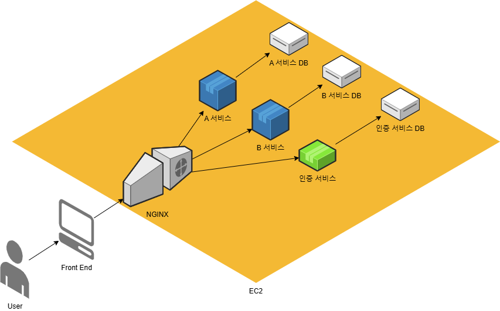

# 미니멈 MSA

mmb v1은 미니멈 MSA로 개발합니다.

## 미니멈 MSA의 조건

1. 서비스 단위 분리
   1. 최소한 2개 이상의 독립적인 서비스
   2. 독립적인 배포 가능
2. 서비스간 통신
   1. 각 서비스는 통신이 가능해야 함
   2. 상호간의 통신이 가능하거나 API Gateway를 통한 통신이 가능해야 함 
3. 톡립적인 데이터 저장소
   1. 각 서비스는 별도의 데이터 저장소를 가져야 함
4. 컨테이너 기반 배포
   1. Docker + Docker Compose (쿠버네티스 없이)

## 구성도

- API Gateway (Nginx)
  - 클라이언트 요청 라우팅 (인증 처리 x, 각 서비스가 직접 검증)
- 인증 서비스
  - 회원 가입, 소셜 로그인(구글), JWT 발급
- A 서비스 (예 : QnA 서비스)
  - JWT 검증
  - 질문/답변 CRUD 처리
- B 서비스 (예 : 사용자 정보 서비스)
  - JWT 검증
  - 사용자 정보 CRUD 처리

## 웹 서비스 사용 시나리오

1. 사용자의 로그인 요청 (버튼 클릭)
   1. 비회원
      1. 자동 회원 가입
      2. JWT 발급
   2. 회원
      1. JWT 발급
2. 사용자의 웹 서비스 사용
   1. 사용하는 기능에 해당하는 API 호출
   2. 모든 API 호출(요청)은 인증을 위해 발급받은 JWT를 헤더에 포함