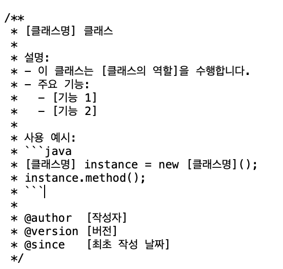
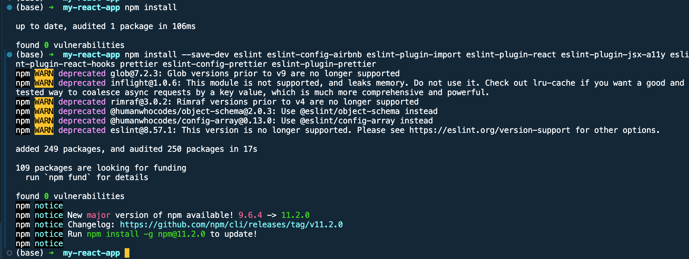
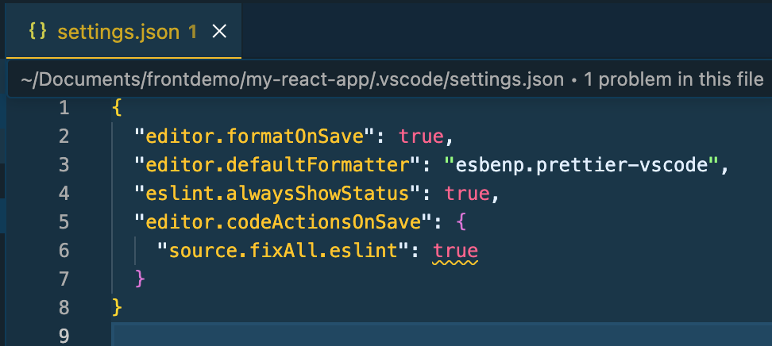

# 주석 작성과 오토포맷팅 가이드

## 1. 주석 작성 가이드

- 주석의 필요성 및 장점
    - 코드에 주석을 달면 가독성을 높이고, 다른 개발자가 코드를 쉽게 이해하도록 도와줌. 주석은 프로그램의 목적, 동작 방식, 사용 방법 등을 설명하여 유지보수와 협업을
      원활하게 해주는 필수 요소.
- 클래스, 메서드, 변수에 대한 주석 작성 예
    - 클래스 주석 예시
        - 
    - 메서드 주석 예시
        - 
    - 변수 주석 예시
        - 
- IDE 에서 주석템플릿 설정
    - 링크로 대체 : https://ifuwanna.tistory.com/312

## 2. 오토포맷팅(Auto-formatting) 가이드

- 오토포맷팅이란 무엇인가?
    - 오토포맷팅이란 무엇인가?: 오토포맷팅은 코드의 들여쓰기, 줄바꿈, 공백 등 코드 스타일을 자동으로 정렬하여 일관성 있게 맞춰주는 기능을 말한다. 개발자가 신경 쓰지
      않아도 정해진 규칙에 따라 코드를 재배치해 주므로, 팀원 모두 동일한 형식으로 코딩하게 됨. 예를 들어 중괄호 위치나 들여쓰기 크기 같은 스타일을 도구가 알아서
      통일해 주기 때문에, 코드 리뷰 시 사소한 스타일 논쟁을 줄이고 실제 코드 로직에 집중할 수 있음.
- 오토포맷팅 도구
    - Python: Black – 타협없는 PEP8 기반 코드 포매터로, 설정을 최소화하고 표준 스타일로 강제함. (black 명령으로 전체 파일을 포맷팅)
    - JavaScript/TypeScript 및 프론트엔드: Prettier – 의견이 반영된(opinionated) 코드 포매터로, 코드를 파싱하여 자체 규칙으로 다시
      출력함으로써 모든 팀원이 같은 스타일을 따름. (HTML, CSS, JSON 등도 지원)
    - Java: Google Java Format – Google의 자바 스타일 가이드에 맞춰 코드를 자동 정렬해주는 포매터.
      GITHUB.COM . (IntelliJ나 VS Code에 플러그인으로 통합 가능)
    - 이 밖에도 **C/C++**의 clang-format, Go의 gofmt 등 언어별로 권장되는 포매터가 있음. 팀에서는 해당 언어의 표준 포매터나 업계 표준
      도구를採用하여 코드를 일관성 있게 관리.
- 오토포맷팅 적용 시점
    - 코드 작성 중 (저장 시 자동 포맷팅)
        - format on save 설정
    - Git 커밋 및 푸시 전 (버전 관리 연계)
        - Git pre-commit 훅을 사용하여 black, prettier --write 등을 실행
    - 코드 리뷰 및 머지 전
        - GitHub Actions, CI/CD 파이프라인에서 자동 포맷 검사 후 머지 여부 결정

## 3. 무물보의 오토포맷팅 및 주석작성 가이드

- 주석 작성 가이드
    - 주석은 한글로 작성
    - 특정 메소드나 클래스의 "책임"을 3초 안에 파악할 수 있도록 짧고 간결하게 적는다.
    - method는 파라미터/리턴값/예외에 대해 작성하고 구현내용은 주석으로 작성하지 않는다.
    - author , version , since 는 git을 사용하여 확인가능하여 제외함.
    - 
- 오토 포맷팅 방법
    - 백앤드
        - 구글 스타일 가이드(설정파일)을 다운받아 IDE import 시킨다.
        - https://github.com/google/styleguide
        - 적용방법
            - 
            - 
            - 
    - 프론트앤드
        - 의존성 설치
            - npm install --save-dev eslint eslint-config-airbnb eslint-plugin-import
              eslint-plugin-react eslint-plugin-jsx-a11y eslint-plugin-react-hooks prettier
              eslint-config-prettier eslint-plugin-prettier
            - 
        - 프리티어 설정
            - 
        - eslint 설정
            - 
        - ide 설정(vscode workspace json 설정)
            - 
        - 코드 저장시 포맷팅, 코드검사(eslint) 실행되는것 확인
