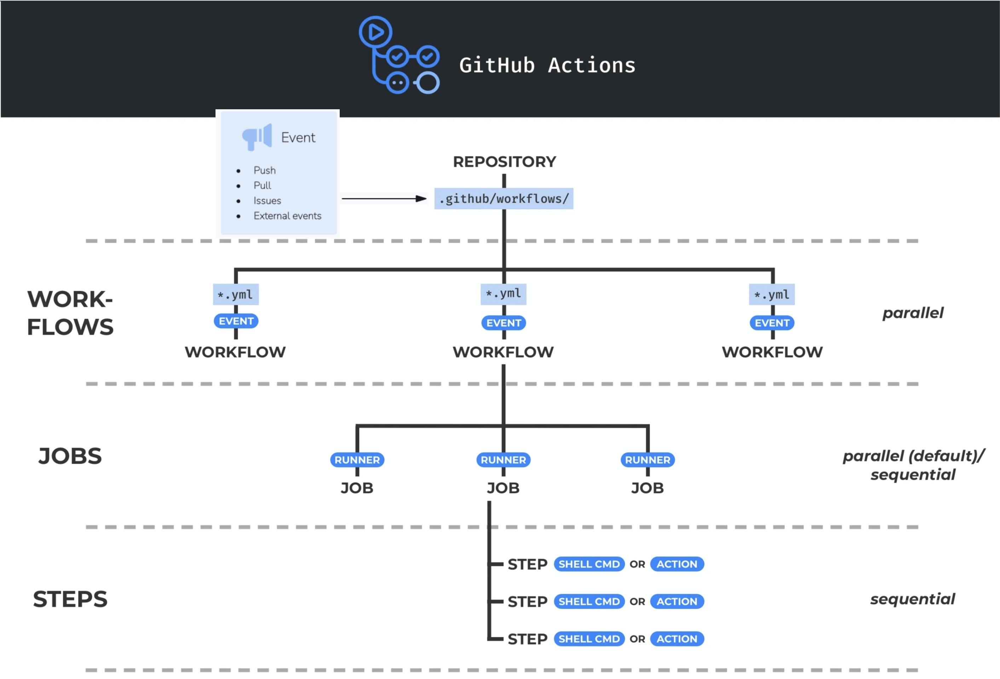
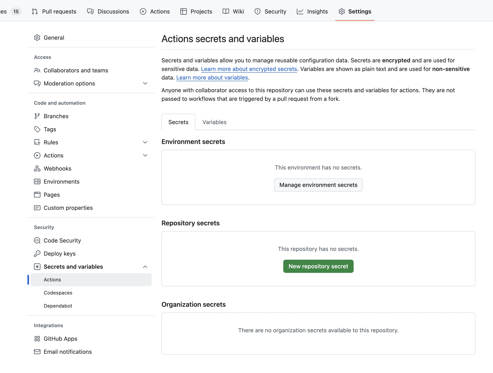
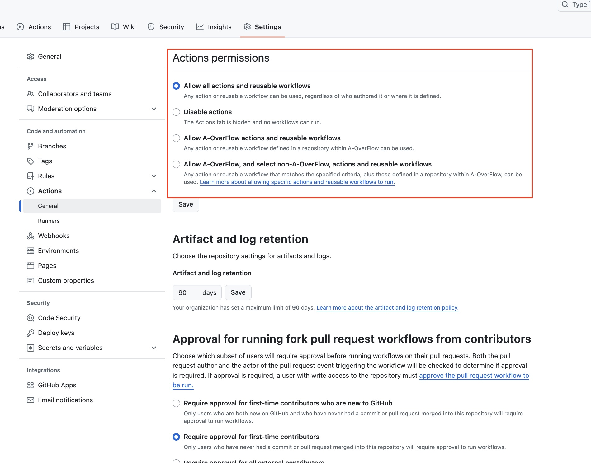
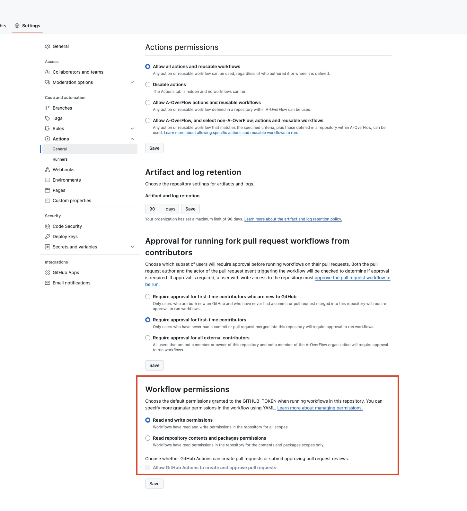
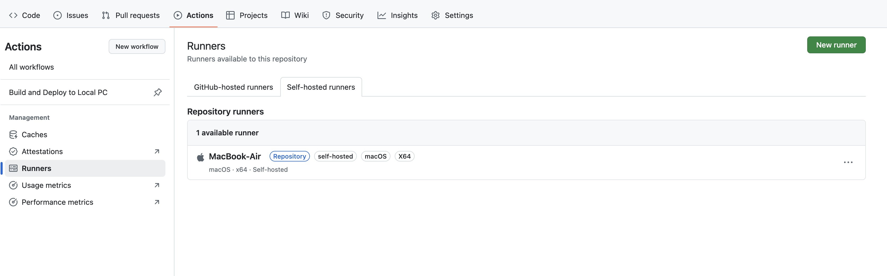
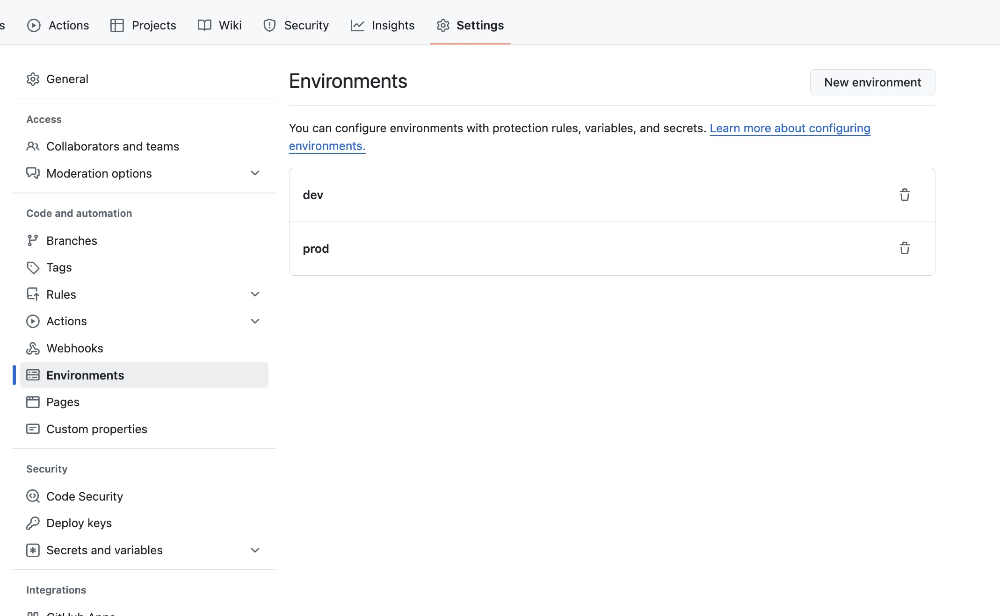
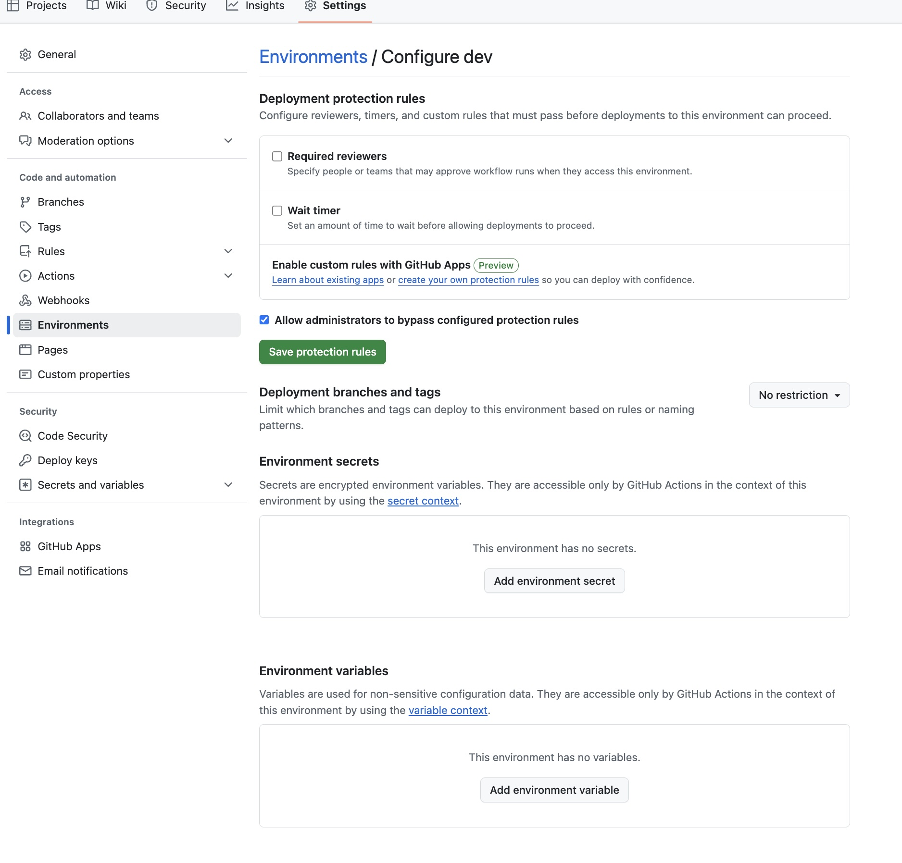
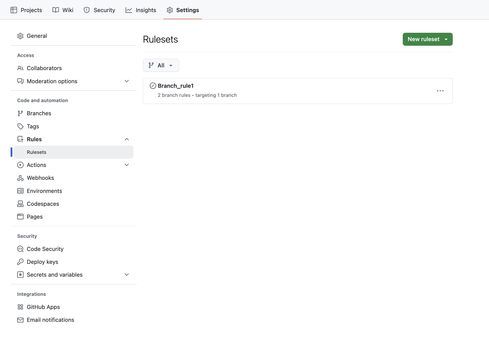
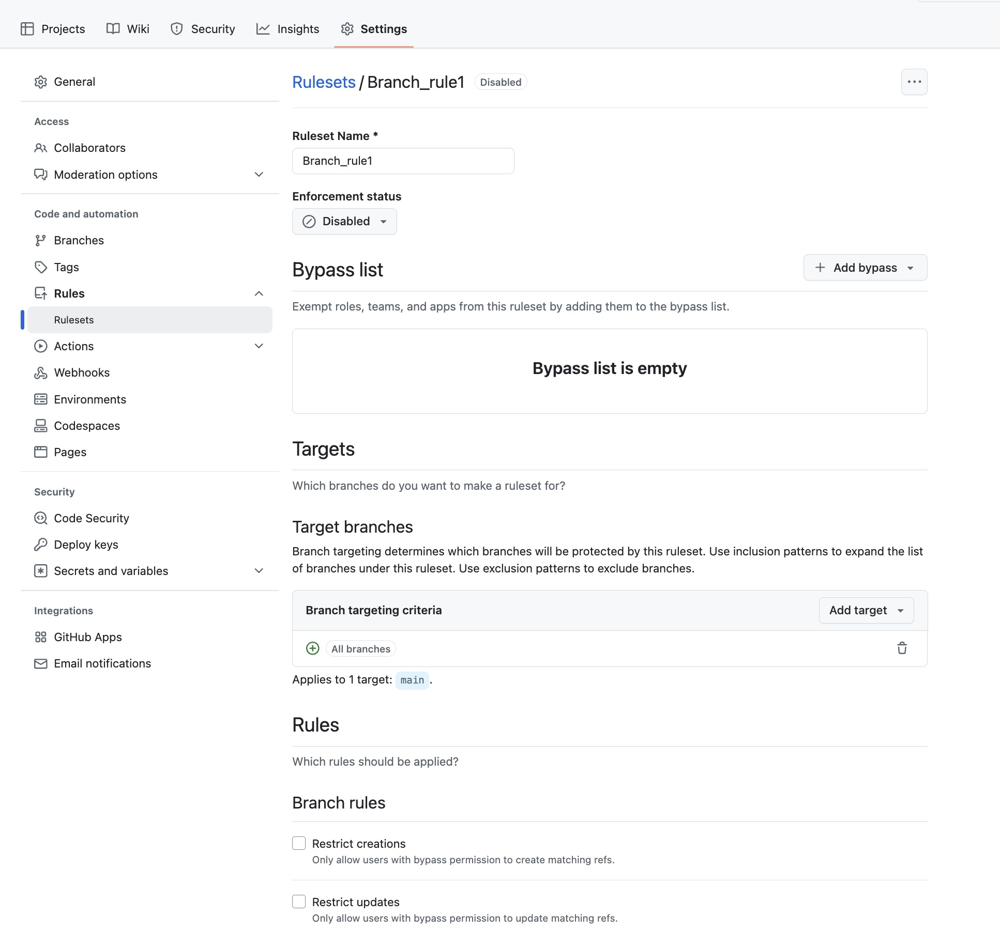
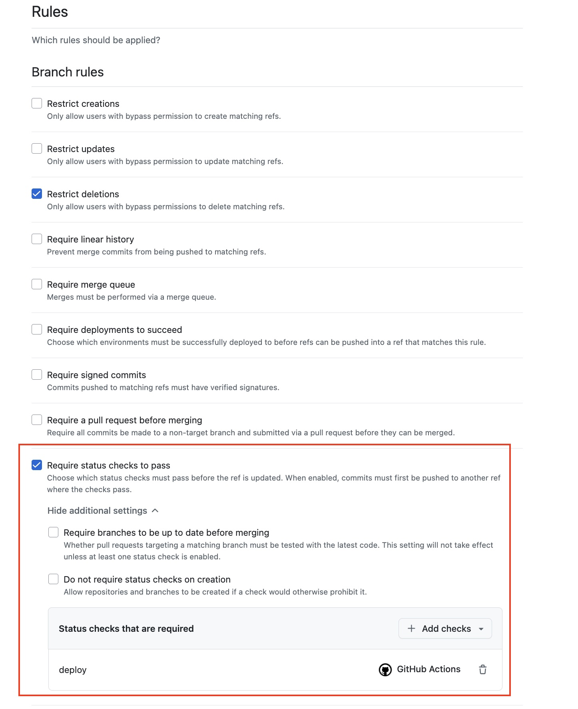

## 🚀 GitHub Actions 실행 흐름


```
[이벤트(push 등) 발생] 
         ↓
[GitHub 이벤트 감지(GitHub Event Hook System)]
         ↓ 
[조건에 맞는 workflow.yml 선택 및 환경변수 주입]
         ↓
[GitHub가 GitHub Action Runner에 환경변수 주입]
         ↓
[Runner에서 job 단위로 실행]
         ↓
[Job1] → [GitHub Runner에서 Step 1 → 2 → 3 실행]
[Job2] → [GitHub Runner에서 Step 1 → 2 실행]
         ↓
[Artifact 업로드(빌드 산출물 저장)]
         ↓
[Artifact 다운로드]
         ↓
[서버 배포 수행]
```

### ✅ 이벤트 발생 (`push`,  `pull_request` 등)
- GitHub 이벤트 시스템(Event Hook)이 자동으로 이벤트 감지 

### ✅ workflow.yml 탐색 및 실행 결정
- `worflow`는 레포지토리 내 .github/workflows/*.yml 파일로 정의
- 레포지토리 내 .github/workflows/ 에서 on 조건 매칭되는 workflow 파일(*.yml) 탐색
- 여러 workflow 파일이 있는 경우, 각각 독립적으로 실행(병렬)

### ✅ 환경변수 주입 (Runner에 전달)
- 환경변수는 GitHub UI > Settings 에서 설정할 수 있음 

-  Secrets : 민감 정보(암호화됨, 출력 안 됨)
	-  Environment Secrets : 특정 환경에서만 사용 가능 (운영서버 SSH 키 등)
	-  Repository Secrets : 현재 레포지토리 전용 (배포용 docker 계정 정보 등)
	-  Organization Secrets : 조직 전체 공유 가능 (슬랙 알림 Webhook URL 등)
-  Variables : 비민감 정보(비암호화, 출력됨)
	-  Environment Variables
	-  Repository Variables
	-  Organization Variables
-  Workflow 실행 직전, GitHub가 Runner에 환경변수를 주입

 ```
jobs:
    build:
        runs-on: ubuntu-latest
        env:
        APP_MODE: ${{ vars.APP_MODE }}
        steps:
        - name: Print secret (출력 안 됨)
            run: echo "Secret: ${{ secrets.API_KEY }}"
        - name: Print variable (출력됨)
            run: echo "Mode: ${{ vars.APP_MODE }}"
```
-  브랜치에 따라 environment 를 동적으로 설정할 수 있음
```
name: Deploy Service

on:
  push:
    branches:
      - main
      - develop

jobs:
  deploy:
    runs-on: ubuntu-latest

    environment:
      name: ${{ github.ref == 'refs/heads/main' && 'prod' || 'dev' }}

    steps:
      - name: Checkout code
        uses: actions/checkout@v4

      - name: Print environment variables
        run: |
          echo "ENV_NAME: ${{ vars.ENV_NAME }}"
          echo "API_KEY: ${{ secrets.API_KEY }}"

      - name: Deploy to server
        run: ./deploy.sh
```

### ✅ Workflow 실행
- 조건에 맞는 워크플로우 파일이 실행되며, 그 안의 `jobs`가 처리됨

### ✅ Job 실행
- `Job`은 Workflow 내 작업 단위
- 각 Job 은 독립적인 GitHub Actions Runner 에서 실행
- 기본적으로 병렬 실행되나, needs: 옵션으로 순차 실행하도록 지정 가능
```
jobs:
  build:
    runs-on: ubuntu-latest

  deploy:
    needs: build  # ← build Job이 완료된 이후 deploy 실행
    runs-on: ubuntu-latest
```

### ✅ Step 실행
- `Step`은 Job 내에서 순차적으로 실행되는 작업
- run(쉘 명령) 또는 uses(액션 호출)로 구성
```
steps:
  - uses: actions/checkout@v4
  - run: npm install
  - run: npm run build
```

### ✅ Artifact 업로드
- `Artifact`는 workflow 실행 중 생성된 결과물(예: .jar, .zip, ./dist 등)
- workflow 중 actions/upload-artifact 액션을 사용하는 Step에서 업로드 됨
- GitHub Actions 실행 페이지의 “Artifacts” 탭에서 확인 가능
```
name: Upload build artifact
uses: actions/upload-artifact@v4
with:
    name: my-app-build
    path: ./dist
```

### ✅ Artifact 다운로드
- GitHub → Actions 실행 페이지의 Artifacts 섹션 또는 workflow 내에서 ls 명령으로 확인 가능
- workflow 중 actions/download-artifact 를 사용하는 step 에서 다운로드 됨
```
name: Download artifact
uses: actions/download-artifact@v4
with:
    name: my-app-build
    path: ./downloaded
```

### ✅ 개발 서버 배포 수행
- 다운로드한 Artifact를 기반으로 실제 서버에 배포 작업 수행
- 방식: SSH 접속, SCP 전송, rsync, docker 명령 등 다양
```
- name: Deploy to server
  run: |
    scp -r ./downloaded user@server:/app
    ssh user@server 'cd /app && ./deploy.sh'
```


workflow.yml 문법 관련 공식 문서 : https://docs.github.com/en/actions/writing-workflows/workflow-syntax-for-github-actions

  
## 🚀 GitHub Action workflow에 영향을 줄 수 있는 설정(웹 UI 기준) 
**✅ Secrets and variables**

-  Secrets : 민감 정보(암호화됨, 출력 안 됨)
	-  Environment Secrets : 특정 환경에서만 사용 가능
		-  운영서버 SSH 키 등
	-  Repository Secrets : 현재 레포지토리 전용
		-  배포용 docker 계정 정보 등
	-  Organization Secrets : 조직 전체 공유 가능
		-  슬랙 알림 Webhook URL 등
-  Variables : 비민감 정보(비암호화, 출력됨)
	-  Environment Variables
	-  Repository Variables
	-  Organization Variables
 ```
jobs:
    build:
        runs-on: ubuntu-latest
        env:
        APP_MODE: ${{ vars.APP_MODE }}
        steps:
        - name: Print secret (출력 안 됨)
            run: echo "Secret: ${{ secrets.API_KEY }}"
        - name: Print variable (출력됨)
            run: echo "Mode: ${{ vars.APP_MODE }}"
```

**✅ Actions permissions**

GitHub 레포지토리에서 어떤 GitHub Actions 를 사용할 수 있는지 제어하는 설정



- Allow all actions and reusable workflows
  - GitHub 공식 액션 + 외부 액션 모두 허용
- Allow only actions created by GitHub
  - GitHub 공식 액션만 허용 (ex. actions/checkout)
- Allow select actions
  - 허용한 특정 액션만 사용 가능

```
- uses: actions/checkout@v4       # ✅ GitHub 공식 액션
- uses: softprops/action-gh-release@v1  # ❌ 외부 액션, 제한되면 실행 실패
```
**✅ Workflow permissions**

GitHub Actions 워크플로우 실행 시 자동으로 발급되는 GITHUB_TOKEN의 권한 수준을 설정하는 항목 


- Read repository contents permission (기본값)
- Read and write permissions
  - workflow에서 PR 생성, push, 레포 수정 등이 가능해짐
```
- name: Commit and Push
  run: |
    git config user.name "github-actions"
    git config user.email "github-actions@github.com"
    git add .
    git commit -m "자동 커밋"
    git push origin main
  env:
    GITHUB_TOKEN: ${{ secrets.GITHUB_TOKEN }}
```

**✅ Self-hosted runners**

GitHub Actions workflow를 실행할 때, GitHub이 제공하는 기본 머신(Hosted Runner)이 아니라, 사용자가 직접 설치하고 운영하는 머신(Runner)에서 실행하는 방식

주로 아래 경우에 self-hosted runner 를 사용한다.
- 빌드 환경이 특수할 때 (커스텀 라이브러리 사용 등)
- 내부망 서버에 배포해야 할 때
- 더 빠르게 빌드해야 할 때
- CI 요금 줄이고 싶을 때



해당 머신에서 Runner 다운로드, 설정 및 실행해야 함 
```
# 디렉토리 생성
mkdir actions-runner && cd actions-runner

# GitHub에서 Runner 다운로드
curl -o actions-runner-linux-x64-2.314.1.tar.gz -L https://github.com/actions/runner/releases/download/v2.314.1/actions-runner-linux-x64-2.314.1.tar.gz

# 압축 해제
tar xzf ./actions-runner-linux-x64-2.314.1.tar.gz

# 설정 (토큰 자동 생성됨)
./config.sh --url https://github.com/내계정/내레포 --token ABCDEFG...

# 실행
./run.sh
```
- workflow.yml
```
jobs:
  build:
    runs-on: self-hosted  # ← Self-hosted Runner에서 실행
```
**✅ Environment protection rules**

특정 배포 환경에 대해, workflow가 실행되기 전에, 승인자 승인, 대기 시간 제한, secret 값 지정 등을 강제할 수 있는 보안 장치 




- Required reviewers
  - workflow가 실행되기 전 승인자 지정
- Wait Timer
  - 승인 후, 자동 실행되기까지 대기 시간 설정
- Secrets
  - 해당 환경에서만 사용할 수 있는 secrets 값 지정
```
jobs:
  deploy:
    runs-on: ubuntu-latest
    environment:
      name: production
```
→ production 환경에 Protection Rule이 걸려 있다면, 해당 Job은 자동 실행되지 않고 대기 상태에 들어감

**✅ Branch protection rules**

특정 브랜치에 대해 실수 방지와 코드 품질 유지를 위한 보호 규칙 (직접 push 금지, PR merge 조건 설정, workflow 통과 필수화 등) 





**✅ Required status checks**

PR(Pull Request)을 특정 브랜치에 병합(Merge)하기 전에 지정된 워크플로우(Job) 또는 외부 CI가 “성공해야만” 병합할 수 있도록 강제하는 기능


- checks 에는 workflow.yml 내의 job 이름을 추가
- pull_request 에 연동된 GitHub Actions workflow 가 실행됨 
- 해당 job이 성공하지 않으면, PR의 merge 버튼이 비활성화됨 
- 실수로 오류 있는 코드를 merge하지 못하게 함

**✅ Repository dispatch**

REST API를 이용해 GitHub Actions 워크플로우를 원격에서 실행시키는 트리거 방식

- workflow.yml
```
on:
  repository_dispatch:
    types: [deploy-from-external]
```
- curl 호출 방식 : event_type에 repository_dispatch type 입력
```
curl -X POST https://api.github.com/repos/<OWNER>/<REPO>/dispatches \
  -H "Accept: application/vnd.github+json" \
  -H "Authorization: Bearer <YOUR_PERSONAL_ACCESS_TOKEN>" \
  -d '{"event_type": "deploy-from-external"}'
``
