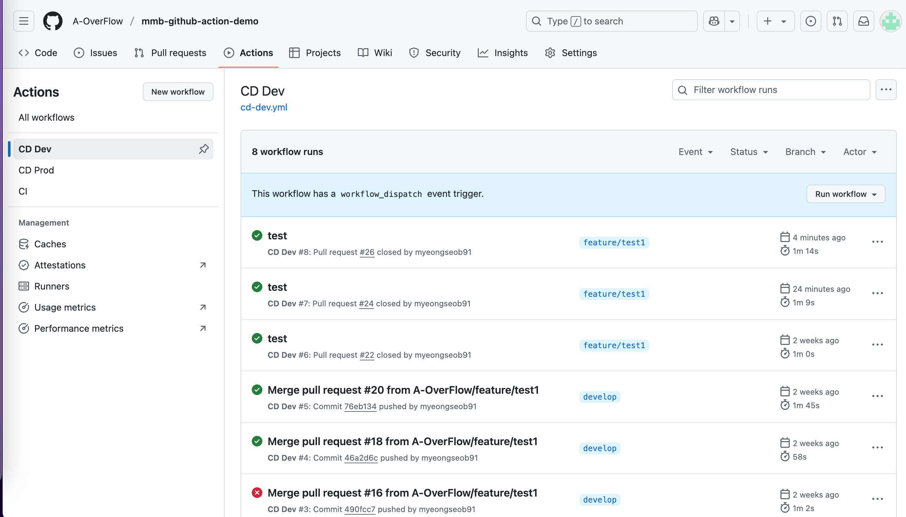

# CI/CD 프로세스 설명 문서2

## 1. GitHub Actions 이란?

GitHub Actions는 코드 변경에 따라 자동으로 빌드, 테스트, 배포 등 다양한 작업을 실행할 수 있도록 도와주는 CI/CD 자동화 도구입니다.

### 특징

- 별도의 CI 서버가 없어도됨
    - public 저장소 - 무제한무료
    - private 저장소 - 2,000분/월 (≈33시간) 무료.. (5분걸리는 빌드 40번돌릴수있음)
    - 셀프호스팅 러너 실행시 무제한 무료
        - **셀프 호스팅 러너(Self-hosted runner)**는 GitHub Actions 워크플로우를 **내가 준비한 서버(예: EC2, NAS, 개인 컴퓨터
          등)**에서 실행할 수 있게 해주는 기능입니다.
- 사용가능한 연동 action 많음: ex. `actions/checkout`, `appleboy/ssh-action` 등
    - https://github.com/marketplace/actions
    - 대략 20,000개 이상의 액션이 있고 현재도 추가중.. 아래는 인기액션
        - actions/checkout GitHub 리포지토리 코드를 clone 해오는 기본 액션
        - actions/setup-java 원하는 Java 버전 설치
        - actions/cache 의존성 캐싱으로 빌드 속도 향상
        - docker/build-push-action Docker 이미지 빌드 & 푸시
        - appleboy/ssh-action 원격 서버에 SSH 접속해 스크립트 실행
        - mxschmitt/action-tmate GitHub Actions 러너에 SSH로 접속해 디버깅

---

## 2. Mumulbo 에 적용된 CI/CD 설명

### 📊 CI/CD Flow Chart

1. github/workflow/ci.yml 실행되는 워크플로우

``` 
[CI 워크플로우 시작]
       ↓
트리거: pull_request
조건: 브랜치가 dev 또는 main, 변경된 경로가 '**'
       ↓
[코드 체크아웃 (Checkout code)]
       ↓
[JDK 21 설치 (Set up JDK 21)]
       ↓
[gradlew 실행권한 부여 (Grant execute permission for gradlew)]
       ↓
[Gradle 빌드 실행 (Build and Test)]
```

2. github/workflow/cd-dev.yml 실행되는 워크플로우

``` 
[CD Dev 워크플로우 시작]
       ↓
트리거: pull_request closed
조건: 브랜치가 dev AND merged == true
       ↓
[코드 체크아웃 (Checkout code)]
       ↓
[JDK 21 설치 (Set up JDK 21)]
       ↓
[도커 이미지 빌드 (Build Docker image)]
       ↓
[도커허브에 푸시 (Push Docker image to Docker Hub)]
실제 도커 허브에 결과물이 올라감.
       ↓
[EC2에 배포 (Deploy to EC2 via SSH)]
도커 허브에서 결과물을 pull 해서 사용함

```

### 참고

GitHub Actions에서 pull_request 이벤트는 다음과 같은 시점에 발생함

1. PR이 생성될 때
2. PR에 커밋을 추가할 때
3. PR이 닫힐 때 (closed)
4. PR이 머지될 때 (merged)
    - closed 면서 merged 면 닫히고, 머지됐을때만 깃허브액션 동작

### ✅ CI: Pull Request 입니다

```yaml
name: CI

on:
  pull_request:
    branches:
      - dev
      - main
    paths:
      - '**'

jobs:
  build:
    runs-on: ubuntu-latest
    steps:
      - name: Checkout code
        uses: actions/checkout@v3

      - name: Set up JDK 21
        uses: actions/setup-java@v3
        with:
          java-version: '21'
          distribution: 'temurin'

      - name: Grant execute permission for gradlew
        run: chmod +x gradlew

      - name: Build and Test
        run: ./gradlew clean build -x test
```

### ✅ CD (Dev): PR 목표 부분

```yaml
name: CD Dev

on:
  pull_request:
    types: [ closed ]
    branches:
      - dev
  workflow_dispatch:

jobs:
  deploy:
    if: github.event.pull_request.merged == true || github.event_name == 'workflow_dispatch'
    runs-on: ubuntu-latest
    steps:
      - name: Checkout code
        uses: actions/checkout@v3

      - name: Set up JDK 21
        uses: actions/setup-java@v3
        with:
          java-version: '21'
          distribution: 'temurin'

      - name: Build Docker image
        run: docker build -t mumulbo/apigateway:dev .

      - name: Push Docker image to Docker Hub
        env:
          DOCKER_USERNAME: ${{ secrets.DOCKER_USERNAME }}
          DOCKER_PASSWORD: ${{ secrets.DOCKER_PASSWORD }}
        run: |
          echo "$DOCKER_PASSWORD" | docker login -u "$DOCKER_USERNAME" --password-stdin
          docker push mumulbo/apigateway:dev

      - name: Deploy to EC2
        uses: appleboy/ssh-action@v0.1.8
        with:
          host: ${{ secrets.EC2_HOST }}
          username: ${{ secrets.EC2_USER }}
          key: ${{ secrets.EC2_KEY }}
          script: |
            docker pull mumulbo/apigateway:dev
            cd /home/ec2-user/infra
            docker-compose --env-file .env.dev up -d --no-deps --force-recreate mmb-apigateway
```

---

## 3. 디버깅 & Troubleshooting

### ✅ echo 출력 로그 확인

- `echo`로 환경변수나 중간 상태를 출력해 GitHub Action UI에서 확인 가능
- 셸 명령 실행 흐름까지 보고 싶을 때는 set -x 옵션 추가

```yaml
# Without set -x
Hello runner
runner

  # With set -x
+ echo 'Hello runner'
Hello runner
+ whoami
runner

```

### ✅ `workflow_dispatch`로 수동 실행 추가

- `.yml`에 `workflow_dispatch:` 넣으면 UI 상단에 **Run workflow** 버튼 생성
- 수동으로 CI/CD 실행 가능 → 빠른 테스트에 유용
  

### ✅ GitHub Actions UI로 로그 확인

- Actions 탭 → 실행 중인 github action 확인
- 
- Pull request → 실행 중인 github action 확인
- 

### ✅ GitHub CLI (`gh`) 사용

```bash
brew install gh
gh auth login
# workflow 목록 확인
gh workflow list
# 실행 로그 보기
gh run list
```


### ✅ `tmate` 액션 사용

- github action runner 에 접속하여 디버깅가능
- SSH로 workflow 중간에 직접 들어가 디버깅 가능
- 디버깅이 끝난후 exit 종료시 다음step으로 넘어감

```yaml
- uses: mxschmitt/action-tmate@v3
```


### ✅ Action 문법 체크

- [https://rhysd.github.io/actionlint/](https://rhysd.github.io/actionlint/)
- workflow.yml 문법 오류 미리 검증
- 

### ✅ 재실행 기능

- "Re-run all jobs": 전체 워크플로우 다시 실행
- "Re-run failed jobs": 실패한 step만 다시 실행
- 체크박스로 디버깅 활성화 가능 (더 많은 로그 출력됨)
- 

---


