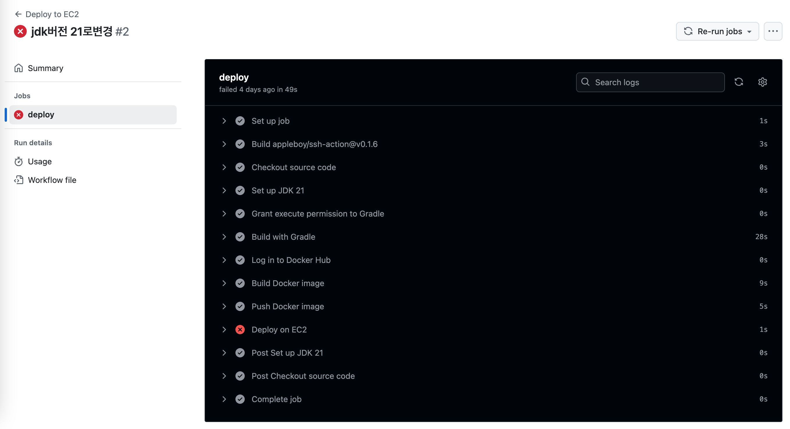
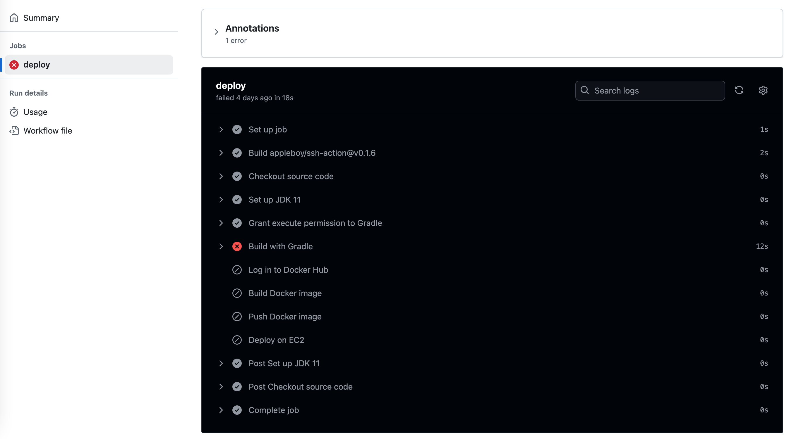

# CI/CD 자동화 Part 1 - GitHub Actions를 활용한 EC2 배포

이 문서는 GitHub Actions를 활용하여 Spring Boot 애플리케이션을 EC2에 자동 배포하는 CI/CD 파이프라인 구축의 첫 번째 단계를 다룹니다. 이 프로젝트는
점진적으로 확장될 예정입니다.

---

## 1. 개요

- GitHub Actions를 이용하여 `main` 브랜치에 코드가 푸시되면 자동으로 다음 작업을 수행합니다:

    1. Gradle로 애플리케이션 빌드
    2. Docker 이미지 생성 및 DockerHub 푸시
    3. EC2 서버로 SSH 접속해 Docker 컨테이너 실행

- 테스트 레포지토리:  
  [https://github.com/A-OverFlow/mmb-github-action-demo](https://github.com/A-OverFlow/mmb-github-action-demo)

- Workflow 파일 위치:  
  `.github/workflows/deploy.yml`

- DockerHub 저장소:  
  [https://hub.docker.com/repository/docker/myeongseob91/github_action_demo](https://hub.docker.com/repository/docker/myeongseob91/github_action_demo)

---

## 2. 동작방식

아래는 GitHub Actions를 통해 EC2로 애플리케이션을 배포하는 전체 플로우입니다.

```text
1. GitHub에 main 브랜치로 코드 푸시
   ↓
2. GitHub Actions에서 자동으로 deploy.yml 실행
   ↓
3. Java 21 설치 (내 앱과 호환되도록)
   ↓
4. Gradle로 앱을 빌드해서 .jar 파일 생성
   ↓
5. Docker 이미지로 패키징 후 DockerHub에 업로드
   ↓
6. EC2에 접속하여 최신 이미지로 컨테이너 실행
```

EC2 서버에서는 sudo docker pull, docker run 등을 통해 새로운 컨테이너가 실행됩니다.

## 3.deploy.yml 파일 설명

```yaml

# 워크플로우 이름 설정
name: Deploy to EC2

# main 브랜치에 push 이벤트가 발생했을 때 실행
on:
  push:
    branches:
      - main

jobs:
  deploy:
    # GitHub Actions가 실행될 환경 (Ubuntu 최신 버전)
    runs-on: ubuntu-latest

    steps:
      # 소스 코드 체크아웃 (현재 레포지토리의 코드를 가져옴)
      - name: Checkout source code
        uses: actions/checkout@v3

      # Java 21 설치 (Spring Boot 3.4.4 플러그인이 Java 17 이상 요구)
      - name: Set up JDK 21
        uses: actions/setup-java@v3
        with:
          java-version: '21'         # 사용할 Java 버전
          distribution: 'temurin'    # Temurin(OpenJDK) 배포판 선택

      # Gradle 실행을 위한 실행 권한 부여 (Linux 환경에서는 필요함)
      - name: Grant execute permission to Gradle
        run: chmod +x ./gradlew

      # Gradle을 사용하여 프로젝트 빌드 (clean → build)
      - name: Build with Gradle
        run: ./gradlew clean build

      # DockerHub 로그인 (secrets에 저장된 사용자 정보 사용)
      - name: Log in to Docker Hub
        run: echo "${{ secrets.DOCKER_PASSWORD }}" | docker login -u "${{ secrets.DOCKER_USERNAME }}" --password-stdin

      # Docker 이미지 빌드 (현재 디렉토리 기준 Dockerfile 사용)
      - name: Build Docker image
        run: docker build -t myeongseob91/github_action_demo .

      # 빌드한 이미지를 DockerHub에 푸시
      - name: Push Docker image
        run: docker push myeongseob91/github_action_demo

      # EC2에 SSH 접속 후 원격으로 Docker 컨테이너를 실행
      - name: Deploy on EC2
        uses: appleboy/ssh-action@v0.1.6
        with:
          host: ${{ secrets.EC2_HOST }}     # EC2 퍼블릭 IP 또는 호스트
          username: ${{ secrets.EC2_USER }} # EC2 사용자 이름 (예: ec2-user)
          key: ${{ secrets.EC2_KEY }}       # EC2 개인 키 (pem 파일 내용을 GitHub Secret에 저장)

          # EC2 내부에서 실행할 명령어
          script: |
            sudo docker pull myeongseob91/github_action_demo     # 최신 이미지 pull
            sudo docker stop app || true                         # 기존 컨테이너 중지 (없으면 무시)
            sudo docker rm app || true                           # 기존 컨테이너 삭제 (없으면 무시)
            sudo docker run -d --name app -p 80:8080 myeongseob91/github_action_demo  # 새 컨테이너 실행

```

## 4. github action 실행결과 확인

https://github.com/A-OverFlow/mmb-github-action-demo/actions

- 
- 

## 5. 향후확장 방안

1. 멀티 EC2 분산 배포 구조

- 각 EC2에 서로 다른 서비스를 배포 (예: A 서비스, B 서비스, C 서비스)
- deploy.yml 파일을 서비스별로 분리하거나, 하나의 워크플로에서 분기 처리 가능

2. Blue-Green 또는 Rolling 전략 실습

- EC2에 app-blue, app-green 두 개 컨테이너 실행
- Nginx로 트래픽 전환 (proxy_pass)
- 또는 헬스체크 후 점진적 교체(Rolling)

3. 빌드 모니터링을 위한 알림발송

- 슬랙, 디스코드, 팀즈(게시판만 가능), 이메일
- 이메일 적용예정

