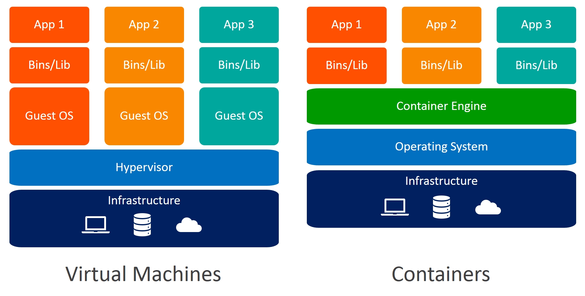
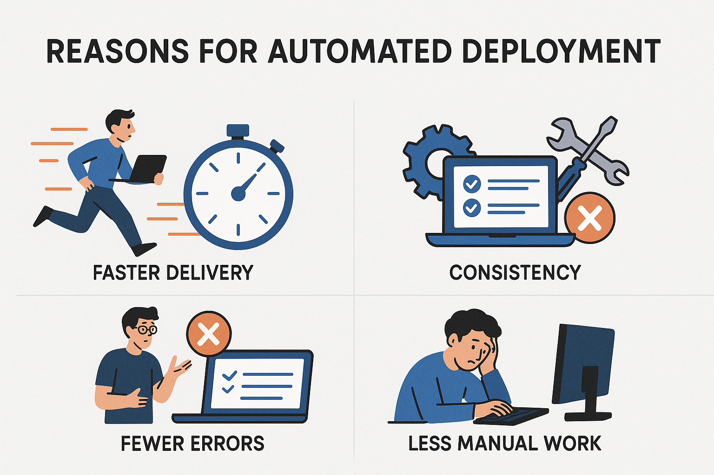
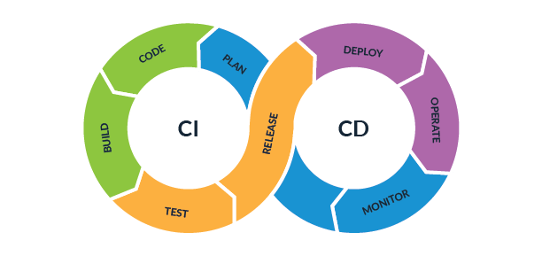

# Docker와 Docker Compose

## 0. Index

1. 컨테이너를 사용하는 이유
2. Docker Compose를 사용하는 이유
3. 자동 배포를 해야 하는 이유
4. application.yml, docker-compose.yml에 환경 변수 설정 방법과 이렇게 해야 하는 이유

## 1. 컨테이너를 사용하는 이유

### 1.1. ~~내컴에서 되는데?~~


실행 환경(나는 Windows, 너는 Ubuntu)이 달라도 Docker만 설치되어 있다면 이미지를 기반으로 동일한 환경으로 서비스를 실행할 수 있음

### 1.2. VM에 비해 가볍다! 빠르다!



VM은 실행 시 하나의 운영체제(Guest OS)를 부팅해야 함 => 커널, 드라이브, 시스템 서비스 등 준비하는데 시간, 리소스 큼  
반면, **호스트 OS를 공유**하기 때문에 운영체제 부팅 없이 바로 실행 가능. 그래서 VM보다 빠름

## 2. Docker Compose를 사용하는 이유

### 2.1. Docker vs. Docker Compose

Docker는 명령어(`docker run`, `docker build` 등)을 통해 컨테이너를 **한 개**씩 만들고 실행하고 관리함  
반면, Docker Compose는 docker-compose 파일로 **여러 개**의 컨테이너를 한번에 관리할 수 있음

### 2.2. So, why Docker Compose?

복잡한 서비스(여러 개의 서비스)를 실행할 경우 Docker 명령어로 하나씩 실행하면 관리가 힘듦  
But, Docker Compose는 docker-compose 파일을 기반으로 여러 서비스를 한번에 실행 가능  
이때 네트워크 설정, 볼륨 마운트, 컨테이너 실행 순서 등도 정의 가능  
운영 환경(local, dev, prod 등)별로 docker compose 파일을 조금씩 다르게 설정해서 시스템 간 관리 가능

## 3. 자동 배포를 해야 하는 이유 = 개발 생산성 향상!



### 3.1. 숙도 (Human Error 방지)



#### 사람이 수작업으로 하면?

개발 -> **테스트 실행(5분) -> 빌드(3분) -> 파일을 서버에 업로드(2분) -> 서버에서 개발 산출물 실행 및 확인(1분)**

추가로

- 파일을 서버에 업로드하는데 필요한 파일 누락. 해결하는데 3분
- 서버에서 개발 산출물 실행하는데 명령어 오류. 디버깅하는데 5분
- 어제는 됐는데 오늘은 안되는데요? = 망

1번 배포하는데 약 10분~20분 소요.  
10번 배포하면? 최소 100분!

#### 자동 배포를 적용하면?

개발 -> ~~테스트 실행(5분) -> 빌드(3분) -> 파일을 서버에 업로드(2분) -> 서버에서 개발 산출물 실행(1분)~~

알아서 배포 완료

## 4. application.yml, docker-compose.yml에 환경 변수 설정 방법과 이렇게 해야 하는 이유

### 4.1. 환경 변수 설정 방법

#### 4.1.1. application.yml 환경 변수 설정 방법

``` yaml
spring:
  application:
    name: ${APPLICATION_NAME}
  datasource:
    driver-class-name: com.mysql.cj.jdbc.Driver
    url: ${DATASOURCE_URL}
    username: ${DATASOURCE_USERNAME}
    password: ${DATASOURCE_PASSWORD}
    ...
```

#### 4.1.2. docker-compose.yml 환경 변수 설정 방법

``` yaml
version: '3'
services:
  member-service:
    container_name: mmb-member-service
    environment:
      APPLICATION_PORT: ${APPLICATION_PORT}
      APPLICATION_NAME: ${APPLICATION_NAME}
      ...
```

#### 4.1.3. .env 작성 방법

``` text
// KEY=VALUE
APPLICATION_PORT=8080
APPLICATION_NAME=MMB-MEMBER-SERVICE
```

#### 4.1.4. docker-compose 실행 시 환경변수 주입 방법

`docker-comopse -f --env-file .env up`

### 4.2. 이렇게 해야 하는 이유

#### What if? 환경 변수를 하드코딩하면?

- 비밀번호 같은 외부에 노출해서는 안되는 정보들이 외부로 노출될 수 있음 => 보안 위험
- 운영 환경별로 파일들을 생성 => github에 운영 환경별로 파일들이 생성됨 => 관리 어려움
    - docker-compose-dev.yml
    - docker-compose-stage.yml
    - docker-compose-prod.yml
    - ...
    - 운영 환경이 늘어나면 계속 추가
- 물론, 배포할 땐 추가 설정을 하지 않아도 되므로 편하겠지만...

#### 이런 저런 이유로 환경 변수를 사용하는 것이 좋다.

- 소스 코드에 민감한 정보들을 작성하지 않아도 되므로 보안성 향상
- 환경별로 설정을 분리할 수 있다.
    - docker-compose.yml 파일은 하나만 사용하고 환경별로 .env 파일을 만들어 환경마다 다르게 설정 가능
    - 운영 환경이 늘어나도 .env 파일만 작성하면 언제든지 확장하기 쉬움
