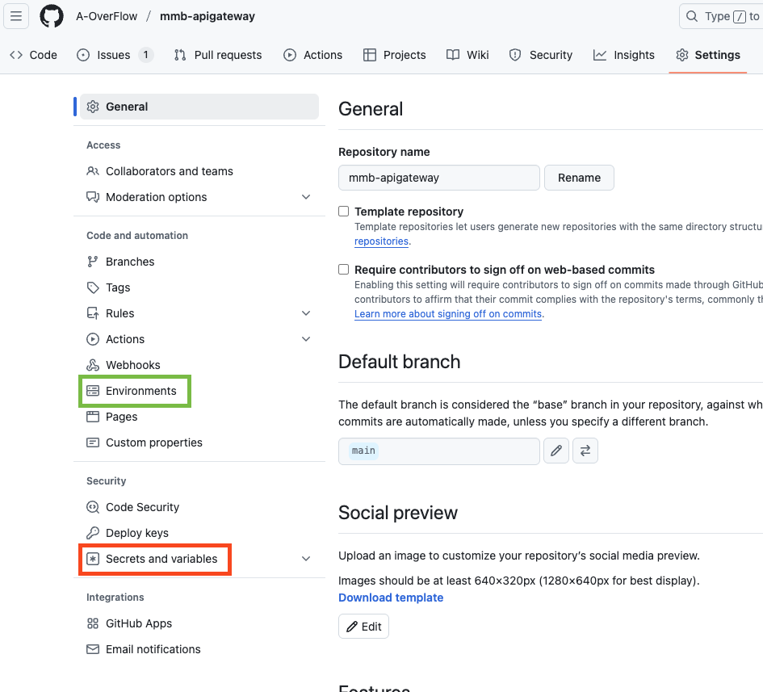
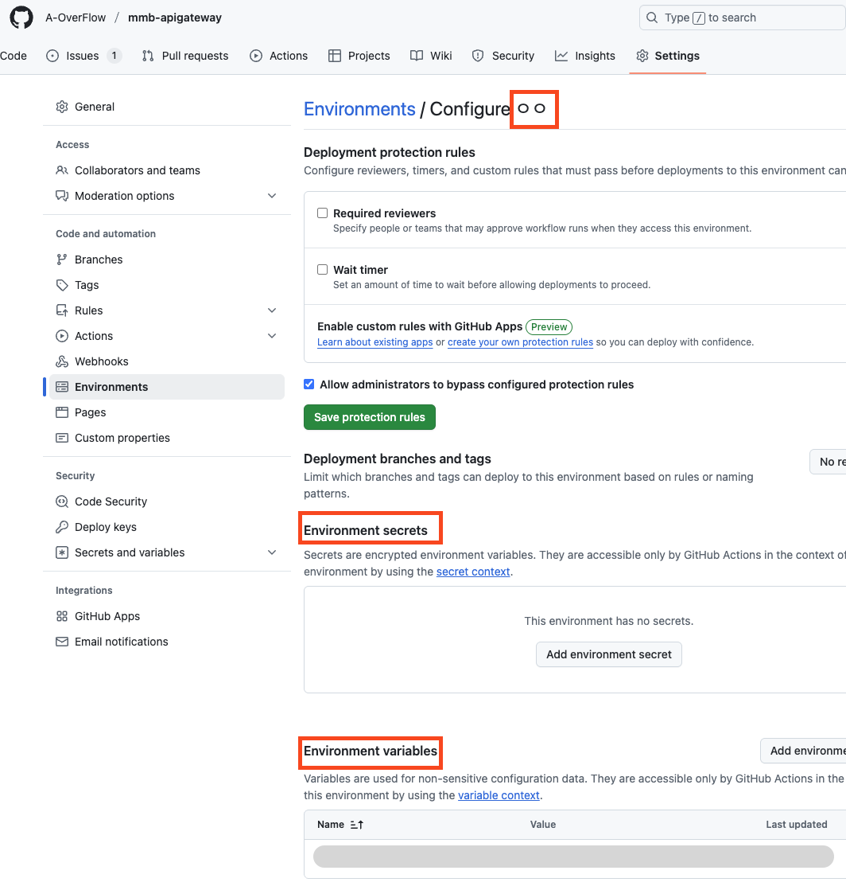

환경 변수 관리 방법 
- env 의 활용 
- github 에서의 secrets, variables 사용 
- docker-compose.yml 이나 github action 에서 는 어떻게 사용 ? 


서비스 개별 배포 시 유의할 점 
- depends_on 
- docker network 관리 

-------
## 환경 변수 관리 방법

### 어떤 것을 환경 변수로 사용하나요 ? 	

- **Docker Hub 정보**: 이미지 푸시/풀을 위한 Docker Hub `username`, `password`, `repository`
- **EC2 서버 정보**: 배포 대상 서버의 `IP 주소`, `접속 계정`, `SSH 키`
- **애플리케이션 정보**: 각 컨테이너에서 사용하는 `포트`, `실행 경로`, `서비스 이름`
- **DB 정보**: `DB URL`, `접속 계정`, `비밀번호`

이것이 어떤 것에 대한 환경변수 ?? 
> "각 서비스 들이 컨테이너로 동작하고, 서버환경에서 서비스로 배포될 수 있도록 필요한 정보들"

<br>

### 환경 변수의 종류 

| 종류                   | 설명                                  | 사용 위치                  |
| -------------------- | ----------------------------------- | ---------------------- |
| .env 변수                 | 환경 변수 파일에 명시된 변수                            | docker-compose 실행 시 필요 |
| github secrets       | 보안 변수 (비밀번호, 토큰, 계정명)               | Github Actions         |
| github variables     | 일반 변수 (서비스 이름)                      | Github Actions         |
| docker compose 환경 변수 | docker-compose.yml 에서 환경 변수 사용      | 서비스별 실행 설정             |
| ec2 환경 자체의 환경 변수     | EC2 내 .env , .bashrc 등 서버 내부의 환경 설정 | 서버 내 실행되는 서비스들이 참조     |

<br>

### 로컬 / 개발/ 운영 환경에서의 환경 변수 사용

- 로컬 환경 : .env 에 바로 적음
- 개발/운영 환경: github secrets , variables 에 적음

<br>

### 로컬 환경 : .env 파일의 변수

- .env 파일 내 변수 범위
	- .env와 docker-compose.yml 은 프로젝트의 최상위에 존재 (서비스 레포의 최상위)
	- application.yml 은 Spring boot 어플리케이션 resources 아래에서 관리 
	- 즉, 해당 어플리케이션 모든 범위에 해당 되는 변수 

```
# .env
APIGATEWAY_PORT=8080
JWT_SECRET_KEY=어쩌고저쩌고
```

```yml
# docker-compose.yml 
services:
  backend:
    environment:
      - PORT=${APIGATEWAY_PORT}
	...
```

```yml
# application.yml
server:  
  port: ${APIGATEWAY_PORT:8888}  # default값 8888
  http2:  
    enabled: false  
    max-http-request-header-size: 65536  
  
jwt:  
  secret: ${JWT_SECRET_KEY}
```
- 관리 방법 
	- 레포지토리 내에서 .env.example 파일로 변수 템플릿만 제공 
	- 실제 값은 .env 파일로 로컬에서만 존재함 
	- .gitignore 추가


실행 
```
docker-compose --env-file .env up
```

<br>

### 개발 / 운영 환경 : Github Secrets & Variables
.env 에서 관리하는 변수를 파일로 저장하지 않고, 레포 설정에서 관리할 수 있음. 
github action 에서 deploy 까지 한다면 ec2 서버에서 컨테이너 띄울 때 자동으로 .env 파일 생성해서 docker compose deploy 까지 보장함. 

#### 📌 Secrets
- 민감한 정보 (예: DockerHub 패스워드, EC2 SSH 키, DB 비밀번호)
- `${{ secrets.SECRET_NAME }}` 으로 사용

`- run: echo "Deploying with ${{ secrets.DOCKER_PASSWORD }}"`

#### ⚙️ Variables
- 서비스 이름, 경로, 도메인 등 비민감 설정 값 저장
- `${{ vars.SERVICE_NAME }}` 형태로 사용

`- run: echo "Deploy path: ${{ vars.DEPLOY_PATH }}"`


어디에서 보나요 ? 		
액션 로그에서 그 차이를 알 수 있습니다. 				
시크릿은 비평문으로, variables 는 평문으로 값이 적용되어져서 보임. 

<br>

#### 범위 
- Organization 범위 : 프로젝트 전체에 적용됨
- Repository 범위 : 레포 전체에 적용됨 
- Environments 범위 : 실행 환경 별로 적용됨
     



Environments 범위 						




#### Environments 범위 내에서 지정하는 방법 
- GitHub의 환경(Environment)을 `dev`, `prod`으로 분리
- 환경에 따라 각각의 secrets & variables 설정
	- 우리의 경우 포트 번호, 이미지 버전, 등등이가 달라지겠죠


```
name: Deploy to EC2 using Docker Compose

on:
  push:
    branches:
      - main / dev  # 브랜치 

jobs:
  deploy:
    runs-on: mmb-apigateway # 컨테이너 이름
    environment:
      name: dev   # 환경 이름 
    steps:
      - name: Print env variable
        run: echo "Value is ${{ vars.포트  }}"
```

<br>
그럼 어디에 어떤 변수를 써야 할까요? 이건 추후 .. 얘기해보아야 합니다. 

###### Organization level 
- Secret 
	- docker 허브 공용 계정 
- Variables 
이건 우리 프로젝트 전체에 적용되는 값이라,, 실제로 사용할 수 있을 . 것같진않아요.

###### Repository level
- Secret
	- docker 허브 공용 계정 
- Variables
	- 어플리케이션 이름 

###### Environment level
- Secrets 
	- EC2 정보 (이는 개발 / 운영 환경이 달라진다면 해당이 됨)
	- docker compose path 
	- 포트
- Variables
	- service version


<br>

##### 그럼 위 변수들을 어떻게 EC2에 전달할 것인가 ? 
1. github action 스크립트에서 빌드할 때, 런타임 변수로 해당 키 값들을 env: 로 넣어줄 수 있음.  
2. github action 스크립트에서 ">>.env.apigateway , .env.question" 처럼 docker compose.yml 파일과 함께 복사될 .env 파일을 만든다. 		
	
 
 **예시** 

```
name: Deploy to EC2 from Docker Hub

on:
  push:
    branches:
      - main

jobs:
  deploy:
    runs-on: mmb-apigateway #컨테이너 명
    environment:
      name: dev# 환경

## env: 로 값 할당 
    env: 
      DOCKER_USERNAME: ${{ secrets.DOCKER_USERNAME }}
      DOCKER_PASSWORD: ${{ secrets.DOCKER_PASSWORD }}
      EC2_USER: ${{ secrets.EC2_USER }}
      EC2_HOST: ${{ secrets.EC2_HOST }}
      EC2_SSH_KEY: ${{ secrets.EC2_SSH_KEY }}
      DOCKER_COMPOSE_PATH: ${{ vars.DOCKER_COMPOSE_PATH }}
      SERVICE_NAME: ${{ vars.SERVICE_NAME }}
      APP_PORT: ${{ vars.APP_PORT }}
      API_URL: ${{ vars.API_URL }}

    steps:
      - name: Checkout source code
        uses: actions/checkout@v4

      - name: Log in to Docker Hub
        run: echo "$DOCKER_PASSWORD" | docker login -u "$DOCKER_USERNAME" --password-stdin

      - name: Create .env file and deploy to EC2
        run: |
          echo "$EC2_SSH_KEY" > key.pem
          chmod 400 key.pem

          ssh -o StrictHostKeyChecking=no -i key.pem $EC2_USER@$EC2_HOST << EOF
            cd $DOCKER_COMPOSE_PATH
            
			# .env 형식으로 output 보냄 
			echo "APP_PORT=$APP_PORT" > .env
            echo "DB_URL=$DB_URL" >> .env

            docker-compose pull $SERVICE_NAME
            docker-compose --env-file .env up -d $SERVICE_NAME
          EOF


```


## 서비스 개별 배포 시 유의할 점 
### depends_on 관리 
depends_on 은 컨테이너의 **실행 순서만을 보장**하고, 정상 동작하는 것은 관여하지 않음. 즉, depends_on 아래에 명시된 서비스를 먼저 실행시키고, 종료할 때도 자신이 종료되고 난 후에 나머지도 종료되도록 함. 
오로지 컨테이너의 실행 순서만. 종속성(runtime dependency) 개념이 아님 

#### Health check 로 의존 서비스의 정상 동작 확인 
- healthcheck 기능은 컨테이너의 이상 동작을 감지하여, 실행/종료를 확인한다.
- depends_on 으로 명시한 서비스에는 헬스 체크 조건을 명시한다.
- health check 가 있는 서비스를 사용할 곳에서는 depends_on.condition: 에 service_healthy 로 입력해서, 다른 서비스와의 정상 연결을 목표한다.
- 참고) healthcheck는 docker compose 버전에 따라 deprecated 될 수도 있어서 확인 필요
```

services:
  backend:
    image: my-backend
    ports:
      - "8080:8080"
    healthcheck:
      test: ["CMD", "curl", "-f", "http://localhost:8080/health"]
      interval: 30s     # healthcheck 실행 간격
      timeout: 10s      # 실패 판정까지 대기 시간
      retries: 3        # 몇 번 실패해야 unhealthy로 간주할지
      start_period: 5s  # 컨테이너가 부팅되고 나서 체크 시작까지 대기 시간      

  frontend:
    image: my-frontend
    depends_on:
      backend:
        condition: service_healthy

```

#### 의존 서비스가 없을 때 개별 컨테이너 실행은?
--no-deps 옵션을 통해 순서 지정 없이 실행이 가능 함.
```

docker pull mumulbo/mmb-frontend:dev
docker-compose --env-file .env.dev up -d --no-deps --force-recreate mmb-frontend

```
어차피 다른 서비스와의 연결은 도커 네트워크 안에 포함된 서비스라면 상관없이 동작함. 


<br>

### docker network 관리

안 1) 각 docker compose 파일에 통합 network 명시하고 ec2 에서는 docker network 만 선언

`docker network create be-network`

각 서비스에는 네트워크 명시 해줌. 
근데 도커 네트워크를 설정해주기 전, 해당 도커 네트워크를 명시한 서비스 컨테이너가 먼저 실행된다면 에러가 남.

이를 방지하기 위해 , Ec2 서버에 docker network 를 최초로 실행해주거나, action 스크립트에 만약 도커 네트워크가 없다면 생성해주는 예외 처리를 넣어주면 됨. ec2에 docker network 를 삭제하지 않는 한 최초 세팅 시. 계속 남아있음.


안2 ) 상위 공통의 docker compose.yml 선언 (docker_composer.override.yml )
 
개발 시에는 필요하나 서비스 단위로 배포하는 운영 단계에서는 안1이 더 유연함. 또한 추후 docker compose 관련 동작도 쉘 스크립트로 관리한다면 안 1이 더 나아보이긴 함


