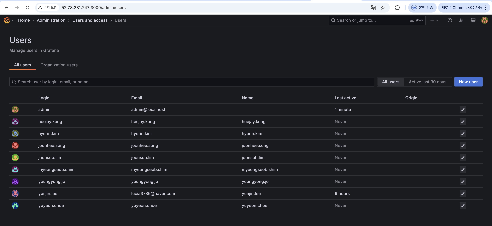
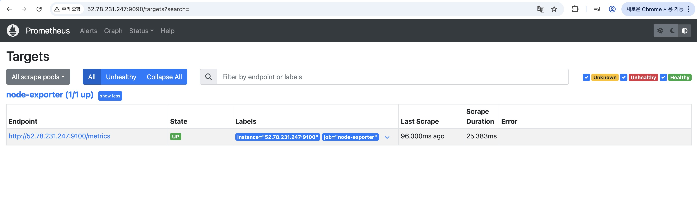

### W3 작업 내용
1. grafana 에 컴퓨팅 리소스(node_exporter) 데이터가 잘 보이도록 하기 
2. 대시보드에서 패널 재배치 및 필요한 패널 생성
3. 각 항목에 대한 설명 정리 (공유를 위해)
4. 계정, 그룹 추가 

### Grafana Administration

1. 팀원 별 계정 생성
2. 비즈니스 파트 / 인프라 파트로 분류하여, 비즈니스 파트는 viewer 권한, 인프라 파트는 admin 권한으로 설정

### Grafana Dashboard

#### Pressure
- 특정 리소스(CPU, 메모리, I/O)에 대해 프로세스들이 얼마나 오래 대기하고 있는지 나타냄
- 자원 부족으로 인해 실제로 프로세스들이 기다리는 시간의 비율을 나타냄
- 시스템의 병목 현상이나 성능 저하 진단 가능
#### Sys load
- 시스템에 실행 대기 중이거나 현재 실행 중인 프로세스 수의 평균
- 1분, 5분, 15분 동안의 평균값을 추가함
- 이 값이 높으면, CPU 자원에 대한 경쟁이 심하거나 I/O, 메모리 등의 병목 현상이 발생하고 있다는 신호일 수 있음 
#### Network Traffic
- 초당 외부로부터 수신/송신한 데이터의 양(Bytes 단위)
- 아래의 경우에 Network Traffic 이 발생함
  - 네트워크를 통해 클라이언와 데이터 주고받는 경우
  - 마이크로 서비스 간 Http, 메시징 등을 통해 데이터 교환하는 경우
  - 등등
-  **[To-Do]** 내부 서비스 간 통신에 대한 network traffic 도 확인 필요하다면 lo 인터페이스 추가 필요
#### Disk I/O
- 초당 완료된 디스크 읽기/쓰기 작업의 평균 속도
- 아래의 경우에 Disk I/O 가 발생함
  - 데이터 읽기/쓰기 (서비스가 DB에 데이터 저장/조회 등)
  - 시스템 부팅
  - 서비스 실행
  - 백업 및 복원 
  - 등등

### 참고사항
 \<EC2 IP>:9090/targets 에서 Prometheus가 스크랩 대상으로 설정한 모든 엔드포인트의 상태를 확인할 수 있다.  

### TODO
- 프로세스 별 매트릭 추가
  - CPU 사용량 TOP 3 프로세스
  - 메모리 사용량 TOP 3 프로세스
  - 등등..
- 로깅 시스템 구축
- 경보 알림 설정
  - 경보 발생 조건 (각 지표 별 정상/주의/위험에 대한 임곗값)
  - 경보 방법(메일?)
  - 경보 대상(관리자만? 모든 계정?)
- EC2 추가 시 대시보드에 추가 방법 확인
