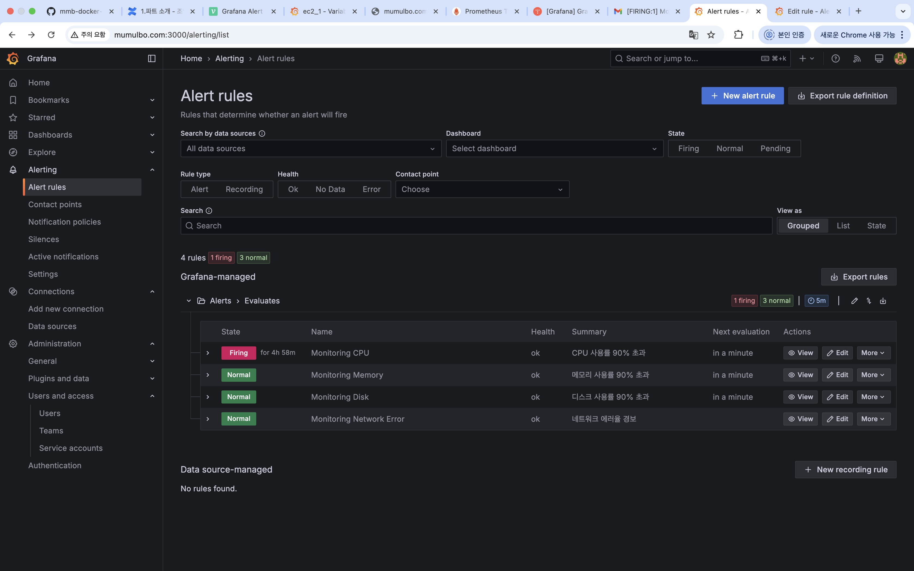
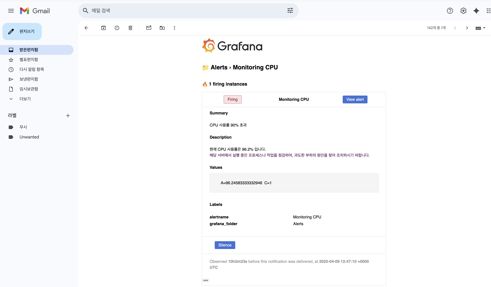

### W5 작업 내용
#### 1. process-exporter 설치 및 prometheus 연동
#### 2. process-exporter 관련 패널 추가
#### 3. 경보 알림 설정


### process-exporter 연동 
1. process-exporter.yml 추가
   - 모든 프로세스에 대해 매트릭 수집하도록 설정
```
[ec2-user@ip-172-31-32-196 infra]$ cat process-exporter.yml 
process_names:
  - name: "{{.Comm}}"
    cmdline:
    - '.+'
```
2. process-exporter 를 컨테이너로 실행 및 docker-compose.yml 에 추가해야할 내용 확인 
3. 대시보드 내에서 ec2 IP 및 node-exporter, process-exporter 포트를 변수로 관리
   - promql 에서 반복해서 사용하기도 하고, 추후에 ec2 추가, ip 및 port 변동이 있을 경우를 대비
4. 아래 패널 추가
   - CPU 사용량 top3 프로세스
   - 메모리 사용량 top3 프로세스
   - 디스크 사용량 top3 프로세스
   - 주요 프로세스의 uptime
   - 프로세스별 개수
   - 프로세스별 thread 개수

### Grafana 경보 설정
#### 메일 설정
1. SMTP 는 gmail SMTP 서버 사용
2. SMTP 접속용 구글 계정 새로 생성(mmbmail2025@gmail.com) -> user
3. 새로 생성한 계정에서 '앱 비밀번호' 생성 -> password
   - password는 계정 비밀번호가 아니라, '앱 비밀번호'임
4. 아래의 형태로 grafana.ini 생성
```
[ec2-user@ip-172-31-32-196 infra]$ cat grafana.ini 
[smtp]
enabled = true
; Gmail SMTP 서버 주소와 포트 (587은 TLS 용)
host = smtp.gmail.com:587

; SMTP 인증에 사용할 사용자 계정 정보
user = mmbmail2025@gmail.com
;password = mmbmail2025!@
password = bgch tauz rjcy cnkz

; 메일 발송 시 표시되는 발신자 주소와 이름
from_address = mmbmail2025@gmail.com
from_name = Grafana Alerts

; TLS 연결 설정
skip_verify = false
startTLS_policy = RequireStartTLS
```
5. docker-compose.yml 에서 grafana.ini 적용하도록 설정
```
  grafana:
    image: grafana/grafana
    (중략)
    volumes:
      - ./grafana.ini:/etc/grafana/grafana.ini:ro
      - grafana_data:/var/lib/grafana
    ports:
      - "3000:3000"
```
#### 경보 설정
아래 조건에 대한 경보 생성
1. CPU 사용률 90% 이상
2. RAM 사용률 90% 이상
3. 디스크 사용률 90% 이상
4. 네트워크 에러율 1 err/sec 이상






### TODO 
- 애플리케이션(컨테이너) 모니터링 
  - 경보 
    - API 게이트웨이나 웹 서버에서 응답 지연 발생 시 경보(HTTP 요청 응답 시간이 일정 임계치를 초과하는 경우 (예: 평균 응답 시간이 500ms 초과))
    - 특정 로그 메시지 빈도가 증가하거나, 특정 이벤트가 발생하는 경우
- EC2 추가, 개발/운영 도메인 분리, 로깅 추가 등에 대해 대시보드 구성 고민
  - 운영/개발 별로 통합된 2개의 대시보드로 시작하고, 서비스가 확장되고 모니터링 요구사항이 세분화되면 운영 환경은 3개(시스템, 로깅, 컨테이너) 대시보드, 개발 환경은 1~2개 대시보드로 확장
- 로깅 연동
