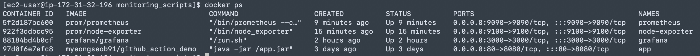
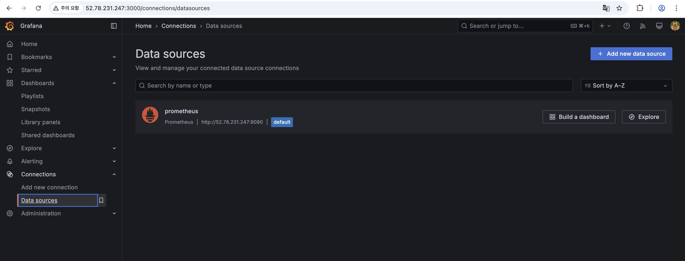
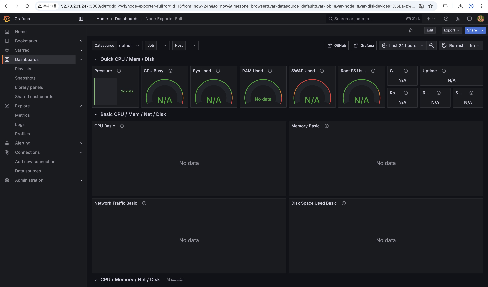

### 로깅 및 모니터링 시스템 필요성
- 오류 및 이슈 파악
- 디버깅
- 감사 및 분석

### 모니터링 대상 (초기 서비스)
- 인프라 메트릭 
  - CPU 사용률
  - 메모리 사용률
  - 디스크 I/O
  - 네트워크 트래픽
  - 인스턴스의 가용성(상태, 재부팅 여부 등)

### Prometheus
- 시계열 데이터(time series data)를 수집, 저장, 쿼리하는 모니터링 시스템 및 데이터베이스
- 마이크로서비스 아키텍처나 컨테이너 환경에서 각 서비스의 성능, 리소스 사용량, 에러율 등을 모니터링할 때 사용

### Node-exporter
- 시스템의 하드웨어 및 운영체제 관련 메트릭(예: CPU 사용률, 메모리 사용량, 디스크 I/O, 네트워크 통계 등)을 수집하여 Prometheus에 노출시켜 주는 메트릭 수집기

### Grafana
- 다양한 데이터 소스로부터 수집된 메트릭을 시각화하는 대시보드 도구
- Prometheus, Elasticsearch, InfluxDB 등 여러 데이터베이스와 연동 가능
  
### 작업 내용

1. node-exporter 컨테이너 생성<br>
`docker run -d --name node-exporter -p 9100:9100     prom/node-exporter`
2. prometheus.yml 작성<br>
- scrape_configs : node-exporter 연동<br>
```global:
  scrape_interval: 60s   # 모든 타겟에 대해 1분마다 메트릭 수집

scrape_configs:
  - job_name: 'node-exporter'
    static_configs:
      - targets: ['node-exporter:9100']
```
3. prometheus 컨테이너 생성<br>
`docker run -d --name prometheus -p 9090:9090 -v $(pwd)/prometheus.yml:/etc/prometheus/prometheus.yml prom/prometheus`

4. grafana 컨테이너 생성
  

5. 개인 pc 에서 접속을 위해 AWS 인바운드 규칙 추가
6. grafana 에서 prometheus 및 node-exporter 대시보드 생성
  


### TODO 
- 서비스 확장 후 어떤 데이터 모니터링 할 것인지 정의
- 대시보드 세부 설정 및 사용법
- kubernetes 클러스터 내에서 prometheus 배포 및 관리 자동화하는 방법 조사
- 경고 알림 설정 방법 
- 각 지표 별 정상/주의/위험에 대한 임곗값
