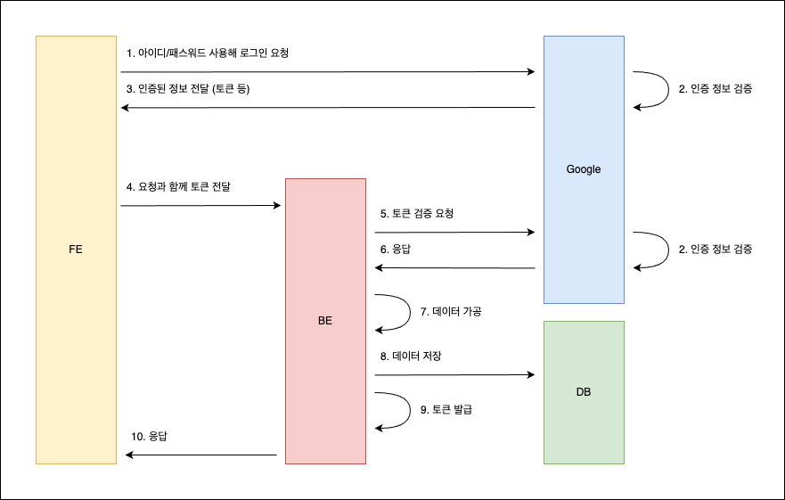

# 소셜 로그인

## 1. 소셜 로그인

### 1.1. 소셜 로그인 프로세스

### 1.2. 소셜 로그인 순서

1. FE 에서 소셜 로그인 버튼 클릭
2. 정보 입력후 로그인 요청
3. 구글 인증 서버에서 인증 처리
    1. 실패
        * 이후 과정 진행 하지 않음
        * FE 에서 에러 처리 필요
    2. 성공
        * 응답 받은 데이터를 통해 이후 과정 진행
4. BE 서비스로 요청
    1. 요청 데이터 전송 의논 필요
5. FE로 부터 전달 받은 데이터 검증
6. 구글 인증 서버로 해당 데이터로 요청해 검증
    1. 실패
        * 이후 과정 진행하지 않음
        * FE 에러 요청 전달 하여, 에러 처리 의논 필요
    2. 성공
    * 이후 요청 처리
7. 회원가입/로그인 로직 처리
    * 필요한 데이터 가공 의논 필요
8. 유저 정보 DB에 저장
9. 회원가입/로그인 요청 응답
    1. 응답 값
        * access token (jwt)
        * refresh token (jwt)
10. FE 토큰 저장 및 처리
    1. 저장 위치 의논 필요
        * local storage
        * 쿠키
11. 기타
    1. 토큰 재발급 (reissue 요청은 따로 작성한다) 제외
    2. access token만 발급
    3. access, refresh 둘다 발급