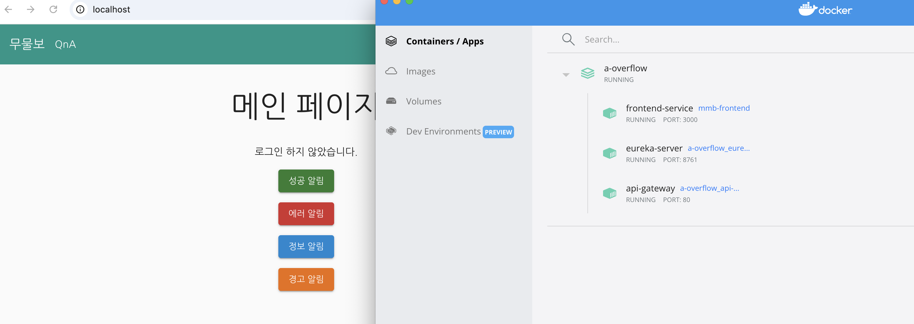
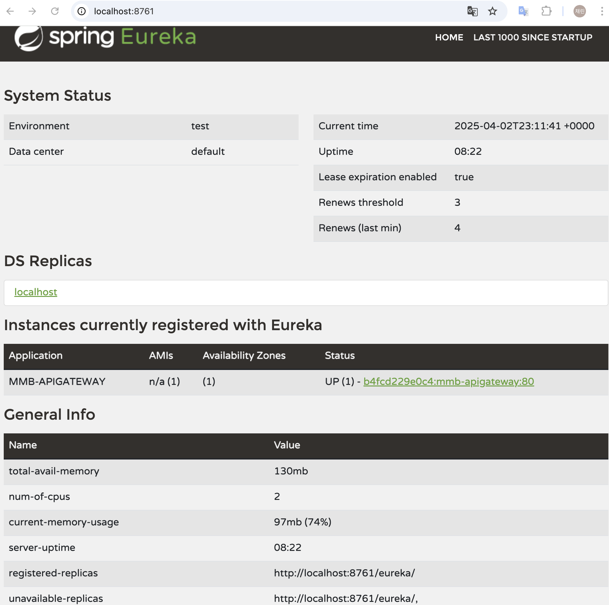

## 이번주 개인 로그
### API gateway 베이스 코드 작성
- 80번 포트로 진입하면 mmb-frontend 서비스로 보이도록 추가
  
- 로컬 환경의 docker compose 로 다른 서비스들과 컨테이너 네트워크 생성 되는지 확인
```yml
version: '3.8'
services:
  eureka-server:
    build:
      context: ./eureka-server
    container_name: eureka-server
    ports:
      - "8761:8761"
    networks:
      - mmb-network
    environment:
      - EUREKA_SERVER=true

  api-gateway:
    build:
      context: ./mmb-apigateway
    container_name: api-gateway
    depends_on:
      - eureka-server  # Eureka 서버가 먼저 실행됨
    environment:
      - SPRING_PROFILES_ACTIVE=default
      - EUREKA_SERVER_URI=http://eureka-server:8761/eureka/
    ports:
      - "80:80"
    networks:
      - mmb-network

  frontend-service:
    image: mmb-frontend
    build:
      context: ./mmb-frontend
    container_name: frontend-service
    ports:
      - "3000:80"
    networks:
      - mmb-network

#  member-service:
#    build:
#      context: ./member-service
#    container_name: member-service
#    ports:
#      - "8082:8082"
#    networks:
#      - mmb-network
#    environment:
#      - SPRING_PROFILES_ACTIVE=default


networks:
  mmb-network:
    driver: bridge

```  

  - eureka 클라이언트 등록 및 멤버 서비스도 eureka 클라이언트로 등록 되었을 때 api gw에서 연결 가능한지 확인 (멤버 서비스 부분은 코드 반영X)
    
  - deploy.yml 작성 후 테스트용 도커 허브에 이미지 Push까지 해보기 -> 실패 !!! --> 성공v
    - 문제 상황1) 로컬에서 해당 도커 허브에 접근이 되지만 github action 에서 도커 허브로 접근이 안됨. yml 파일이나 secrets 설정 문제일가능성이 큼.
    - 해결 방법
      -   docker login 시 sudo 옵션 제거
      -   docker hub 에 동일 이미지 명의 latest 태그가 있다면 삭제하거나 --no-cache 옵션을 줘서 무조건 푸쉬 되도록 함
- ec2에는 이미지 pull 만 하는 것 까지 실행
```bash
  [ec2-user@ip-172-31-32-196 ~]$ docker image ls
REPOSITORY                        TAG       IMAGE ID       CREATED          SIZE
hlkim266/mmb-apigateway           latest    a8c0c92342f3   36 seconds ago   552MB
myeongseob91/mmb-frontend         latest    ac5de372ac92   3 days ago       48.5MB
myeongseob91/mmb-frontend         <none>    6fc122ad089d   3 days ago       48.5MB
myeongseob91/mmb-frontend         <none>    ba6d28c53367   3 days ago       48.5MB
myeongseob91/mmb-frontend         <none>    a79ac19ba14c   4 days ago       48.5MB
myeongseob91/mmb-frontend         <none>    7efbef180984   4 days ago       48.5MB
myeongseob91/mmb-frontend         <none>    7d143734847a   4 days ago       48.5MB
myeongseob91/mmb-frontend         <none>    dfa6a7e6d9d2   4 days ago       48.5MB
myeongseob91/mmb-frontend         <none>    10bb7efed2e4   4 days ago       48.5MB
myeongseob91/mmb-frontend         <none>    a255f90814a2   4 days ago       48.5MB
myeongseob91/github_action_demo   latest    40bc694a05f2   11 days ago      525MB
prom/prometheus                   latest    5173ced6b24a   2 weeks ago      271MB
grafana/grafana                   latest    dfed5fef9fdb   6 weeks ago      564MB
prom/node-exporter                latest    aaa0ee0c2359   6 weeks ago      25MB
nginx                             latest    53a18edff809   8 weeks ago      192MB
mysql                             latest    fa262c3a6564   2 months ago     797MB
redis                             latest    ad4b31aa2de6   2 months ago     117MB
ncabatoff/process-exporter        latest    84864a8aea86   11 months ago    15.8MB
```

## 다음주 todo 
- config server 적용 여부 판단 
- 회원/질문 서비스로 포트 라우팅 및 docker compose 로 확인 
- docker-compose 용으로 deploy.yml 수정 (apigateway.yml 은 이미 docker-compose용으로 개발함)
