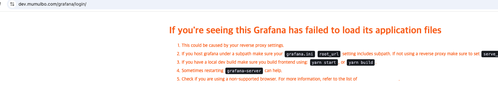

## 이번주 개인 로그

1. git dev 브랜치 분리 
2. 도메인 분리 (mumulbo.com / dev.mumulbo.com)
3. https 설정
4. nginx 내리고 apigateway 로만 prod , dev 에 각각접근할수 있는 환경구성
5. EC2 에서 docker compose로 릴리즈 전 준비 ... 

---  

### 1️⃣ dev 브랜치 생성 완료
- 이번주 작업부터는 dev 브랜치에서 작업 완료함.   
다음주 부터는 기능 별 feature 브랜치 따서 반영 예정 

### 2️⃣ 도메인 분리 
- EC2 Route 53 에 서브 도메인 추가 완료함.         

              


- dev.mumulbo.com 은 개발용으로 사용 예정. 

### 3️⃣ https 설정 
- 외부 포트는 443 , 내부 포트는 .. 개발용 8443 / 운영용 443 으로 정리
- 서브 도메인과 메인 도메인 ssl 인증서 위치 확인 
- application-dev.yml , applicatoin-prod.yml 은 https로 접속 가능하도록 분리 

<br>

### 4️⃣ application.yml 개발 / 운영 파일 분리   
🟢 **API GW 포트**
| 목적 | 설명 | 파일 | 포트 (외부:내부) |
| --- | --- | --- | --- |
| 공통 | - | application.yml |  - |
| 로컬 개발 | all 도메인 + http | application-local.yml |  8080:8080 |
| 개발 서버  | 서브 도메인 + https | application-dev.yml | 443:8443 |
| 운영 서버 | 메인 도메인 + https | application-prod.yml | 443:443 |

* docker compose 로 컨테이너 띄울 때 active 해주는 profile에 따라 라우팅 정보 달라짐 
* 컨테이너 내부 포트는 각 yml 파일에 설정되어 있고, "외부:내부" 형태의 포트 선언은 docker compose 에서 API Gateway 컨테이너를 띄울 때 설정해줌 


🟢 **서비스 포트** 

<운영용>
| 서비스 | path | 포트 (외부:내부) |
| --- | --- | --- |
| grafana | /grafana | 3000:3000 |
| 멤버 서비스  | /api/v1/members | 8082:8082 |
| oAuth 서비스  | /api/v1/auth | 8082:8082 |
| 질문 서비스  | /api/v1/questions |8081:8081 |
| 프론트 엔드  | / | - |
| Eureka  | 운영용 | 8761 (todo) |
| config server  | 운영용 | todo |

<개발용>
| 서비스 | path | 포트 (외부:내부) |
| --- | --- | --- |
| grafana | /grafana | 3000:3000 |
| 멤버 서비스  | /api/v1/members | 9082:9082 |
| oAuth 서비스  | /api/v1/auth | 9082:9082 |
| 질문 서비스  | /api/v1/questions |9081:9081 |
| 프론트 엔드  | / | - |
| Eureka  | 운영용 | 8761 (todo) |
| config server  | 운영용 | todo |


 
<br>

### docker compose 요청 사항 
#### ✅ grafana 추가 사항 
```
environment:
  - GF_SERVER_ROOT_URL=https://dev.mumulbo.com/grafana/
  - GF_SERVER_SERVE_FROM_SUB_PATH=true 
```
grafana는 최상위 경로에서 login으로 redirect 하고 있기 때문에, mumulbo API GW 에서 /grafana로 진입 시 mmb의 login path 로 리다이렉트 됩니다.         
이를 방지하기 위해 grafana 내부에서 진행하도록 grafana 컨테이너 environment 에서 위 설정값을 세팅해줘야 합니다.       <br>  
‼️ **Trouble shooting** ... <br>
위 옵션을 주고 로컬에서는 확인을 못해서 EC2에 올렸을 때 확인을 해보았는데 /grafana 로 접근 시 https://dev.mumulbo.com/login?redirectTo=%2Fgrafana 형태로 리디렉션됨.
 이는 로그인 과정이 그라파나 로그인이 아닌 무물보 로그인으로 실행되는 것임.     
Gateway의 " RewritePath=/grafana(?<segment>/?.*), /${segment} "  도 선언해주었으나 지속적으로 발생하여, 우선은 SERVER_ROOT_URL 을 localhost:3000 으로 선언해서 그라파나 컨테이너의 단독 실행에는 문제가 발생하지 않도록 함 ...      
<br>
또한 /grafana/login 으로 접근 시 아래 그라파나 프록시 설정에러 페이지가 나옴         


해당 부분또한 내 로컬에서 그라파나 이미지를 pull 해서 좀 더 확인해 볼 예정 


#### ✅ container name 
api gateway 에 라우팅 규칙 정할 때 컨테이너 이름으로 라우팅되기 때문이 이 부분이 협업 시 정말 중요한 부분이었음.!!!! 그리고 컨테이너들이 같은 도커 네트워크 아래에 존재해야 통신이 가능한 정보도 중요.

| 서비스 | container name | 
| --- | --- |
| API GW | mmb-apigateway  |
| 프론트엔드 | mmb-frontend |
| 멤버 서비스 | member-service |
| 질문 서비스 | question-service |
| 그라파나 | grafana  |


#### ✅ .env 옵션    
API GW 에서는 local / dev / prod에 대한 구분만 필요합니다. 이부분은 docker compose 의 command 에 아래와 같은 커맨드로 active 가능함. 


```
command: ["java", "-jar", "application.jar", "--spring.profiles.active=dev"]
```


## 다음주 todo
1. grafana 라우팅 문제 확인 
2. application.yml 에 하드코딩 되어 있는 포트번호나 ssl 인증서 경로들 변수화해서 리팩토링 
3. 로컬에서 ec2 환경과 유사하게 구성 후 백엔드 서비스 API  확인 및 운영하면서 나오는 문제들 대응 
4. config server / eureka 확인 (가능하면) 


