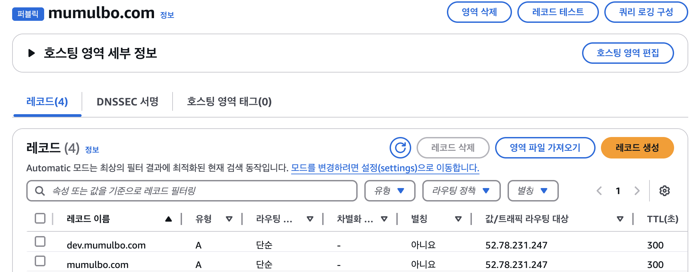
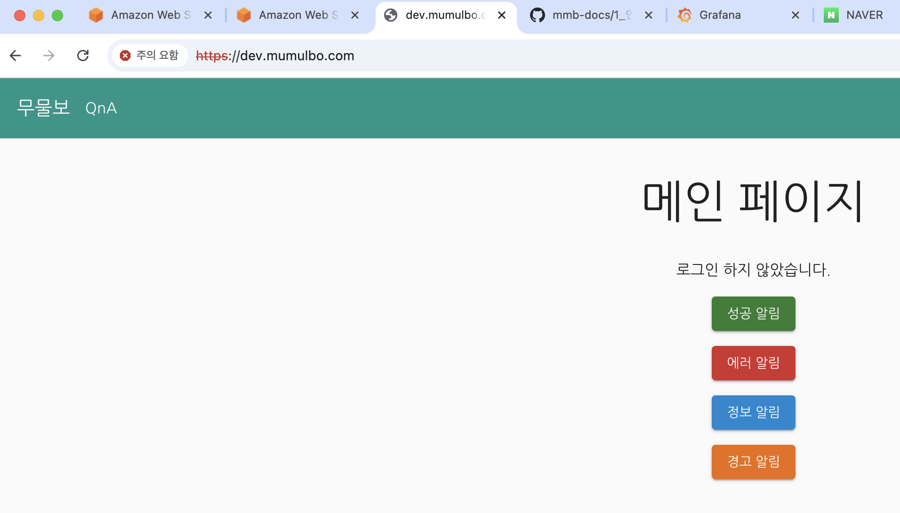

## 이번주 개인 로그

1. git 브랜치 분리 (git 반영시 main , develop 브랜치에서 각각작업되는구조로 변경)
2. 도메인 분리 
 - 메인 도메인 : mumulbo.com
 - 서브 도메인 : dev.mumulbo.com
3. https 설정
4. nginx 내리고 apigateway 로만 prod , dev 에 각각접근할수 있는 환경구성

---  

### 1️⃣ dev 브랜치 생성 완료
- 이번주 작업부터는 dev 브랜치에서 작업 완료함.     
PR도 문서 작성 후 올릴 예정.     
다음주 부터는 기능 별 feature 브랜치 따서 반영 예정 

### 2️⃣ 도메인 분리 
- EC2 Route 53 에 서브 도메인 추가 완료함. 




- dev.mumulbo.com 은 개발용으로 사용 예정. 

### 3️⃣ https 설정 
- application-dev.yml , applicatoin-prod.yml 은 https로 접속 가능하도록 분리 

<br>

### 4️⃣ application.yml 개발 / 운영 파일 분리   
🟢 API GW 포트
| 목적 | 설명 | 파일 | 포트 |
| --- | --- | --- | --- |
| 공통 | - | application.yml |  - |
| 로컬 개발 | all 도메인 + http | application-local.yml |  8080 |
| 개발 서버  | 서브 도메인 + https | application-dev.yml | 8443 |
| 운영 서버 | 메인 도메인 + https | application-prod.yml | 443 |

* 위에서 설정해주는 포트는 각 yml 파일들에서 오버라이드되기 때문에 docker compose의 port 에서는 운영용 포트만 선언해주시면 됩니다. 

🟢 서비스 포트 
| 서비스 | path | 포트 (외부:내부) |
| --- | --- | --- |
| grafana | /grafana | 3000:3000 |
| 멤버 서비스  | /api/v1/members | 8082:8082 |
| oAuth 서비스  | /api/v1/auth | 8082:8082 |
| 질문 서비스  | /api/v1/questions |8081:8081 |
| 프론트 엔드  | / | - |
| Eureka  | 운영용 | 8761 (todo) |
| config server  | 운영용 | todo |

* 서비스 포트는 모든 도메인에 다 동일하게 적용
* API 별 path는 서비스 개발 팀에서 올려준 docs 참고함. 변경 시 이 문서도 업데이트 예정 
 
<br>

### docker compose 요청 사항 
#### ✅ grafana 추가 사항 
```
environment:
  - GF_SERVER_ROOT_URL=https://dev.mumulbo.com/grafana/
  - GF_SERVER_SERVE_FROM_SUB_PATH=true 
```
grafana는 최상위 경로에서 login으로 redirect 하고 있기 때문에, mumulbo API GW 에서 /grafana로 진입 시 mmb의 login path 로 리다이렉트 됩니다.         
이를 방지하기 위해 grafana 내부에서 진행하도록 grafana 컨테이너 environment 에서 위 설정값을 세팅해줘야 합니다. 

#### ✅ container name 
api gateway 에 라우팅 규칙 정할 때 컨테이너 이름으로 라우팅되기 때문이 이 부분에 대한 땅땅땅이 필요함 

| 서비스 | container name | 
| --- | --- |
| API GW | api-gateway (이부분은 사실 상관없음요.) |
| 프론트엔드 | frontend-service |
| 멤버 서비스 | member-service |
| 질문 서비스 | question-service |
| 그라파나 | grafana (그라파나는 위 env 설정을 못해서 테스트를 못해봐서.. 코드에는 추가 안되어있음. 수정예정) |
| oAuth ?  | ..모름 |

#### ✅ .env 옵션    
API GW 에서는 local / dev / prod에 대한 구분만 필요합니다. 이부분은 서비스파트의 필요사항과 중복되는 것 같아서 이후에 옵션값으로 수정할 예정입니다.     
before 
```
server:
  port: 8443
```
after
```
server:
  port: ${APPLICATION_PORT}
```


