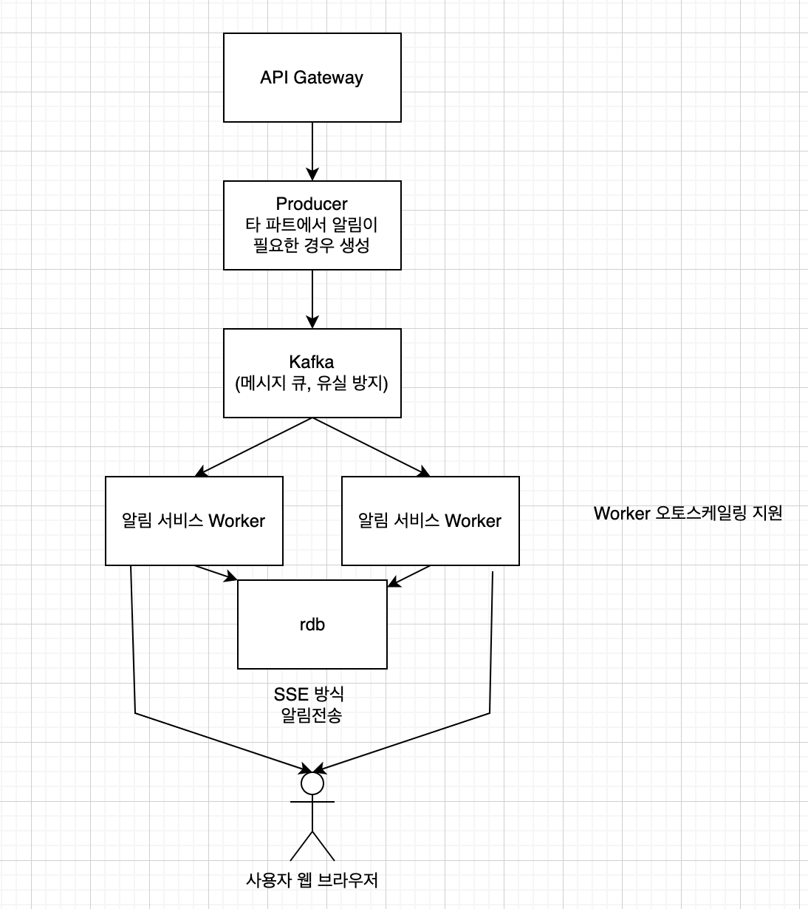

우리 파트의 관리자 기능은 크게 3가지로 나눌수있다.
알림 서비스, 관리자 서비스, 모니터링 서비스
3가지의 서비스들의 기능을 나열해보았다.

- **1. 알림 기능**
    - **1.1 필수 알림**
        - 1.1.1 새로운 답변 등록 (최소 기능)
        - 1.1.2 답변 채택
        - 1.1.3 댓글 알림
        - 1.1.4 신고 처리 결과 알림
        - 1.1.5 새로운 신고 발생 (관리자)
    - **1.2 추가 알림**
        - 1.2.1 좋아요/추천 알림 – 자신의 답변에 좋아요(추천)가 달렸을 때
        - 1.2.2 태그 구독 알림 – 구독한 태그의 새 질문이 올라왔을 때
        - 1.2.3 질문/답변 검색 구독 – 특정 키워드(예: "Spring Security")와 일치하는 질문이 올라왔을 때
        - 1.2.4 포인트 획득 알림 – 답변 채택 등으로 포인트를 획득했을 때
        - 1.2.5 인기 질문 알림 – 하루 동안 특정 수 이상의 조회/추천을 받은 질문이 있을 때
        - 1.2.6 최신 질문 알림 – 특정 카테고리의 최신 질문이 올라왔을 때

- **2. 모니터링**
    - **2.1 실시간 통계 데이터 제공**
        - 2.1.1 신규 질문/답변 수
        - 2.1.2 신규 댓글 수
        - 2.1.3 오늘 발생한 신고 건수
        - 2.1.4 가장 많이 본 질문 (TOP 5)
        - 2.1.5 가장 많이 채택된 답변 (TOP 5)
        - 2.1.6 포인트 상위 사용자 (TOP 5)
        - 2.1.7 최근 1시간 내 활동한 사용자 수

- **3. 관리자 기능**
    - **3.1 유저 관리**
        - 3.1.1 신고 누적 사용자 관리 (경고, 일시정지, 차단)
    - **3.2 신고된 게시글 삭제**
        - 3.2.1 신고된 질문 삭제
        - 3.2.2 신고된 답변 삭제

더 많은 기능이 생기겠지만 일단 이정도로 생각하고 설계를 진행해보려 한다.
알림 -> 관리기능 -> 모니터링 순으로 설계를 진행해볼예정이다.

먼저 우선순위가 높은 알림서비스 이다.
알림 아키텍쳐를 결정하려면 어느수준까지 기능을 지원할것인지 선택이 필요하다.

- 고민거리
    - 알림 전달 방식
        - 실시간 or 배치
        - 3.17 파트회의 결정사항 (실시간)
    - 메세지 저장 방식
        - 유실 방지 할것인지?
            - 3.17 파트회의 결정사항 (메시지가 최대한 유실되지않도록)
    - 메세지 큐 선택
        - 3.17 파트회의 결정사항 (단일사용자 순서보장 , 대용량 처리 가능)
        - 메시지 순서를 보장해야하는가?
        - 대용량 알림(백만개 이상) 도 처리해야할수 있는가?
    - 알림 메시지 전송 실패시
        - 3.17 파트회의 결정사항 (실패한 알림 3번 재시도, 재시도3회 이상 실패시 로깅)
        - 실패한 알림을 몇번까지 재시도 할 것인가?
        - 재시도에도 불구하고 최종적으로 실패한 알림에 대해서는 어떻게 처리할것인가?
            - 재시도 전략
            - Dead Letter Queue
            - 알림 상태 저장 (Read Confirmation 등)
    - 확장성
        - 트래픽 증가 대처방법
            - 3.17 파트회의 결정사항 (트래픽이 증가할 경우 알림전송 worker 오토스케일링)
            - 오토 스캐일링
            - 캐시(redis) 사용
    - 알림 발송시 우선순위가 필요한지?
        - 3.17 파트회의 결정사항 (우선순위 필요없음)
        - 우선순위 큐 (Priority Queue) 사용
        - FIFO
    - 알림 전송 방식
        - 3.17 파트회의 결정사항 (실시간 전송 기술중 구현 난이도 고려하여 SSE 로 선택함)
        - 알림이 몇초안에 전달되어야 하는가?
        - 실시간성이 매우 중요한것인가?
            - 실시간 푸시 알림 (WebSocket, SSE, Firebase Cloud Messaging)
            - 지연 전송 (Batch, Polling)
    - 멀티 디바이스 & 플랫폼 지원
        - 3.17 파트회의 결정사항 (처음엔 브라우저만 지원.. 나머지는 추후진행)
        - 모바일 + 웹 푸시 + 이메일 동시 지원
        - 웹 기반 알림 (Notification API, WebSocket)
    - 중복 전송 방지
        - 3.17 파트회의 결정사항 (중복방지 안되도록)
        - kafka 설정 및 어플리케이션 레벨에서 unikey 사용하여 방지

최종적으로 결정된 사항들을 지원할수있는 아키텍쳐 사진이다.

- 

하지만 아직 병목이 발생할만한 지점이 많아 보완이 많이필요하다.
RDB에 많은 데이터가 한꺼번에 들어오면 병목이 될 수 있고
SSE 방식 특성상 서버와 클라이언트가 연결을 유지하기때문에 사용자가많아지면
메모리 점유율이 높아질수있다.
그러므로 worker 와 sse 서비스를 분리하고 중간에 redis pub/sub 을 넣는것도
괜찮아보인다.

고민거리
알림 받을 대상을 누가 정해야할까?
3.17 파트회의 결정사항 (알림받을 대상은 알림서비스 에서 정한다.)

- 알림을 받을사람은 kafka 컨슈머(알림서비스)가 정한다. 이를위해
  질문아이디, 답변아이디 등을 kafka 파라미터로 받는다.
  그리고 질문/답변 게시판의 데이터를 알림을 받을사람을 조회할수있을만큼의 최소한의
  데이터를 중복저장한다.

- kafka 프로듀서
    - 알림 사용하는 파트에서 누구에게 보낼지를 조회해야하기때문에 타 파트 로직이 복잡해짐
- kafka 컨슈머
    - 알림 보낼사람을 재 조회 해야함(db or 타 시스템 api)
