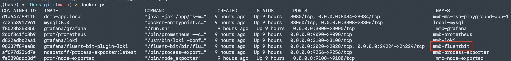
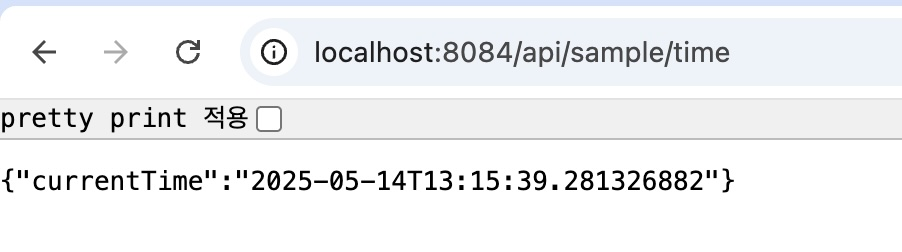
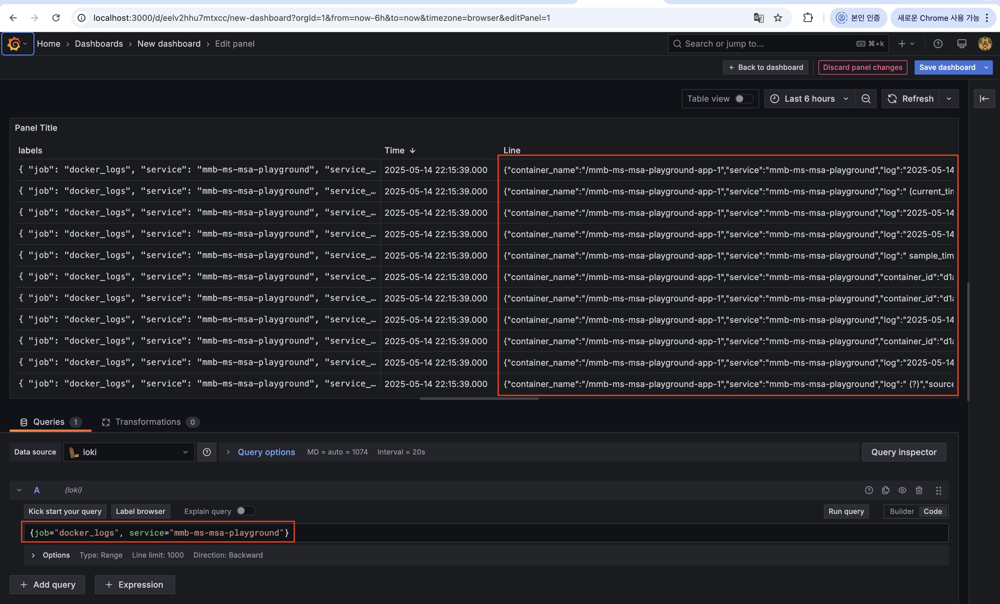

# 지난 주 목표
로깅 연동 

# 완료한 작업
### 1. 로깅 연동 구조 변경 (로그 수집기 : Promtail → Fluent Bit)
- 기존에는 파일에 직접 로그를 써서 로그 파일을 수집하는 방식으로 진행하려고 했어서, 로그 수집기로 Promtail 이라는 것을 사용했다. 
- 로그 파일로 남기는 대신 stdout 으로 로그를 출력하고 fluent bit 로 로그를 전송하는 방식이 있다고 해서 Promtail 대신 Fluent Bit 사용하기로 함 

**💡 Promtail 이 적합한 경우**
- 로그를 파일에 남기는 경우 
- 로그 파일 경로가 명확한 경우
- 시스템 로그, 애플리케이션 로그를 직접 tail 하고 싶을 때 

**💡 Fluent Bit 가 적합한 경우**
- 로그를 수집할 서비스(컨테이너)가 많은 경우
- stdout로 출력되는 로그 수집하고 싶은 경우
- 리소스를 적게 들이고 싶을 때 (C 언어 기반이라 빠르고 가벼움)


```
[As-Is]
+----------------+       +----------------+       +-------------+ 
| Application(s) |  -->  | Promtail       |  -->  | Loki        | 
|                |       | (로그 수집기)     |       | (저장 & 검색) | 
+----------------+       +----------------+       +-------------+ 

[To-Be]
+----------------+       +----------------+       +-------------+ 
| Application(s) |  -->  | Fluent Bit     |  -->  | Loki        | 
|                |       | (로그 수집기)     |       | (저장 & 검색) | 
+----------------+       +----------------+       +-------------+ 
```
### 2. 로그 수집하려는 서비스의 docker-compose.yml 작업 필요
**services > logging 항목 추가** 
- `driver: fluentd` : 로그 드라이버를 fluentd 로 지정한다. 
  - stdout/stderr 로그를 Fluent Bit 로 직접 전송한다. 
- `options`
  - `fluentd-address: localhost:24224` : Fluent Bit 가 로그를 수신할 주소:포트
  - `tag: mmb-ms-msa-playground` : 로그마다 붙일 태그 (MSA 환경에서는 서비스명을 사용하는 것이 좋음)
```
services:
  app:
    build:
      context: .
      dockerfile: Dockerfile
    image: mumulbo/mmb-ms-msa-playground:IMAGE_TAG_PLACEHOLDER
    env_file:
      - .env
    ports:
      - "${SERVICE_PORT}:8084"
    networks:
      - external-net
    depends_on:
      - db
    logging:
        driver: fluentd
        options:
            fluentd-address: localhost:24224
            tag: mmb-ms-msa-playground
```

### 3. Fluent Bit 컨테이너 띄우기 
**1) fluent-bit.conf 파일 작성**
```
[SERVICE]
  HTTP_Server   On
  HTTP_Listen   0.0.0.0
  HTTP_Port     2020
  Log_Level     info

[INPUT]
  Name    forward
  Listen  0.0.0.0
  Port    24224

[OUTPUT]
  Name    loki
  Match   *
  Host    mmb-loki
  Port    3100
  Labels  job=docker_logs,service=$service
```
- OUTPUT 에 loki 설정함으로써 loki 에서는 별도로 Fluent Bit 를 받기위한 설정 안해줘도 됨
- (참고) service 명에 계속 docker_logs 가 출력되어서 extract_tag.lua 라는 파일 추가해줌

**2) 모니터링 서비스 docker-compose.yml 에 fluentbit 추가**
```
  mmb-fluentbit:
    image: grafana/fluent-bit-plugin-loki
    platform: linux/amd64
    container_name: mmb-fluentbit
    ports:
      - "${FLUENTBIT_LOKI_PORT}:24224"  # Fluent Bit forward input 포트
      - "${FLUENTBIT_PORT}:2020"  # Fluent Bit 상태 확인 포트
    volumes:
      - ./fluentbit/fluent-bit.conf:/fluent-bit/etc/fluent-bit.conf
      - ./fluentbit/extract_tag.lua:/fluent-bit/scripts/extract_tag.lua:ro
    networks:
      - mgt-net
```
**3) docker compose up 수행**

```
❗️주의할 사항 (컨테이너 띄우는 순서) ❗️

[mmb-monitoring-stack] → [mmb-(로그 찍는 서비스)] 
```
- 서비스 먼저 띄우려고 하면 fluentd 없다고 에러나서 못뜸
- 서비스의 docker-compose.yml 에 logging driver 로 fluentd 를 설정해놓았기 때문에, 
- 꼭 fluentd 를 컨테이너로 먼저 띄우고 난 다음에 서비스를 띄워야 한다. 

**4) 로그 생성하고 Grafana 에서 확인**


- service 명으로 검색했을 때 수집한 로그 출력됨 


# 진행 중인 작업
**💢 확인 및 개선 필요한 사항**
- 모니터링 서비스(mmb-monitoring-stack) up 하고 테스트 서비스(mms-ms-playground) up 하면 테스트 서비스가 떴다가 죽음 
  - 근데 다시 up 하면 잘 됨 
  - 원인 파악 필요 ,, 
- 일단 grafana 에서 보이는 것까지만 확인해서 그 이후 작업 필요 .. 
- 내가 확인하고 싶은 로그만 필터링
- 설정 파일 등 좀 더 단순화할 수 있는지
- 어떤 로그 어떻게 모니터링할 지 


# 배운 점


# 개선할 점
`진행 중인 작업`과 동일합니다

# 기타 공유 사항
None

# 다음 주 계획
`진행 중인 작업`과 동일합니다
