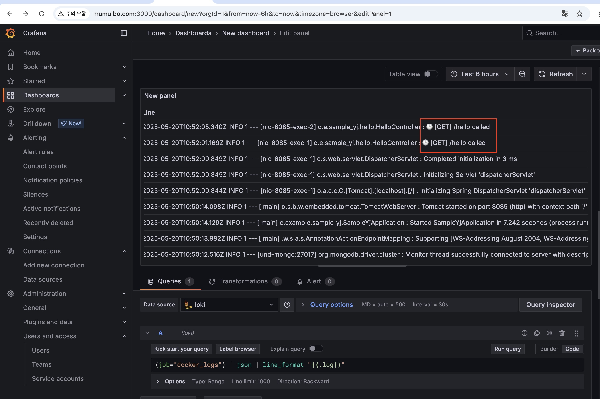

# 지난 주 목표
ec2 에 로깅 연동 적용

# 완료한 작업
### 1. ec2 에 fluent-bit 컨테이너 띄움
### 2. 로그 수집 확인 
1) ec2 의 놀이터 서비스(mmb-yj-playground)에 logging driver 를 fluentd 로 설정
   ```
    services:
    app:
        image: mumulbo/sample-yj:dev
        env_file:
        - .env
        ports:
        - "${SERVICE_PORT}:8085"
        networks:
        - mumulbo-network
        depends_on:
        - mongo
        restart: always
        logging:
        driver: fluentd
        options:
            fluentd-address: localhost:24224
            tag: mmb-yj-msa-playground
   ```
2) 놀이터 서비스에서 로그 발생
3) Grafana 에서 Loki 연동 후 수집한 로그 확인 


# 진행 중인 작업
**💢 확인 및 개선 필요한 사항**
- 내가 확인하고 싶은 로그만 필터링
  - 지금 불필요한 로그들도 같이 수집되고 있음
- 어떤 로그 어떻게 모니터링할 지 
- api gateway 와의 연동 ,, 

# 배운 점
놀이터 서비스의 docker-compose.yml 에서 `fluentd-address: localhost:24224` 부분을 `fluentd-address: mmb-flentbit:24224` 와 같이 localhost → 컨테이너명으로 변경해야 하는게 아닌가 해서 삽질을 좀 했었는데 

결론은 `localhost` 로 나타내는게 맞았다. 

로그는 컨테이너 안에서 보내는 게 아니라, Docker 데몬이 직접 fluentd에게 로그를 전송하기 때문에, 

Docker 엔진이 이해할 수 있는 호스트 기준 IP 또는 호스트네임으로 설정해야 한다고 한다. 


# 개선할 점
`진행 중인 작업`과 동일합니다

# 기타 공유 사항
None

# 다음 주 계획
`진행 중인 작업`과 동일합니다

API Gateway 쪽 코드도 분석할 예정 ,, 