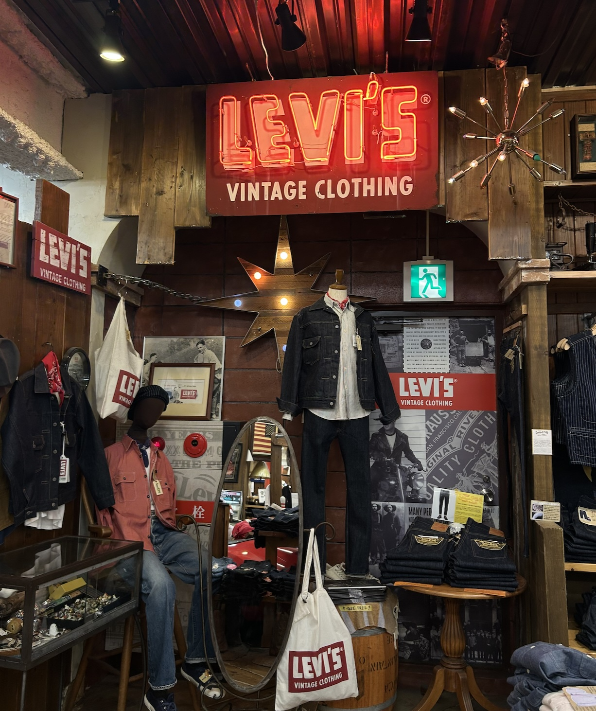
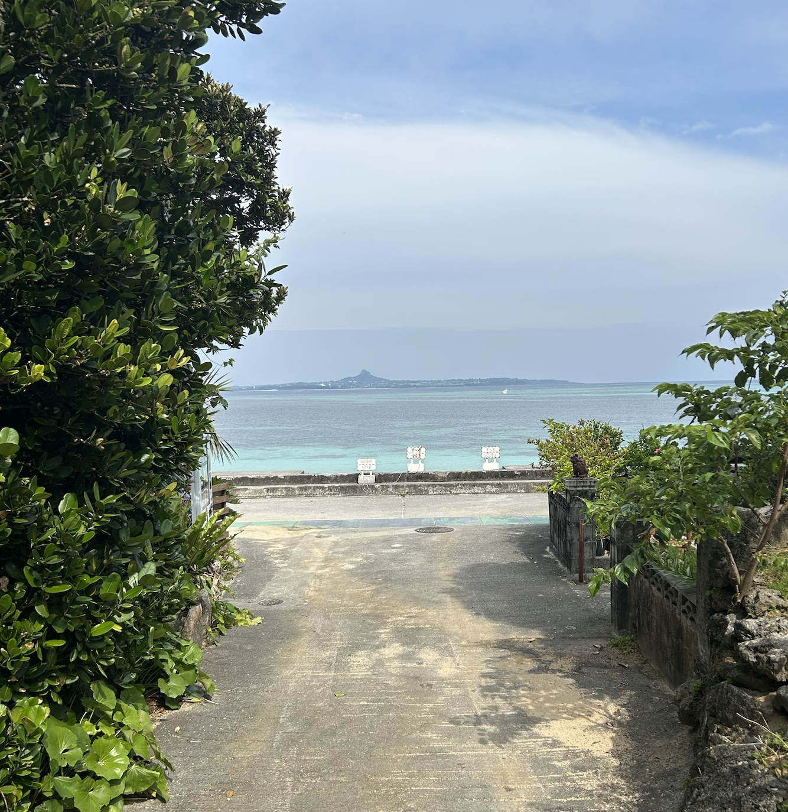

# 오키나와 여행 회고록 🌊
## 일정 : 2025/05/31 ~ 2025/06/03
- 사전투표 하고 갔습니다
## 주요 일정
### (1) 아메리칸 빌리지 (⭐️⭐️⭐️)
- 쇼핑 좋아한다면 가볼만 함

### (2) 비세 후쿠기 가로수길 + 비세자키 해변 (⭐️⭐️⭐️⭐️⭐️) 
- 꼭 가보시길 ..

### (3) 코우리섬 (⭐️⭐️)
- 전망이 좋긴 한데, 근처 지나갈 일 있으면 같이 가보는 것도 좋을 듯

### (4) 나키진 성터 (⭐️⭐️⭐️)
- 사람도 별로 없고 볼 것도 꽤 있음

## 가장 맛있었던 것 TOP 2
### 오하요 브륄레
- 충격적인 맛 .. 달고나와 바닐라 아이스크림의 조화가 말로 표현할 수 없음
- 3박 4일동안 5개 먹고옴

### 야끼니꾸 - 琉球古民家焼肉処うむい
- 깐깐징어 남편의 원픽
- 소갈비 1인분에 1400엔 정도 하는데 엄청 부드럽고 육즙이 대박임 ㅜ

## 아쉬웠던 것
진격의 거인 이치방쿠지 뽑으러 돈키호테 몇군데 찾아갔으나 매진이어서 구경도 못함 ,, ㅠ 칙쇼 ,,
