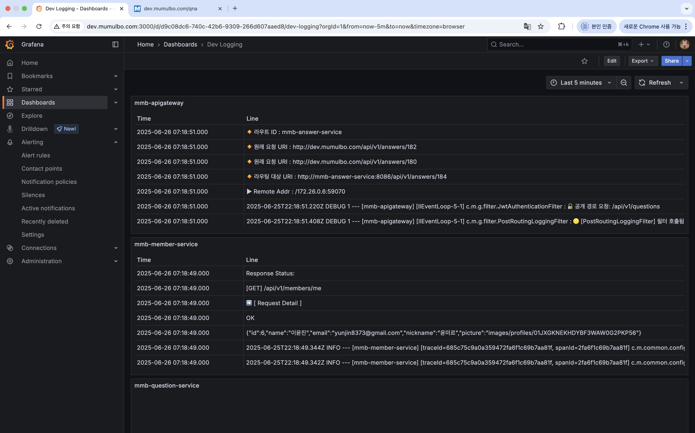

# 지난 주 목표
- apigateway
  - 채팅서비스 요청은 token 이 헤더 대신 쿼리 파라미터로 들어가도록 수정
- 모니터링 
  - 각 서비스 별 로그 파일 연동

# 완료한 작업
- apigateway
  - 채팅서비스 요청은 token 이 헤더 대신 쿼리 파라미터로 들어가도록 수정
- 모니터링 
  - 각 서비스 별 로그 파일 연동

  - apigateway, member 서비스 외에는 조회되는 로그가 없는데, 일부 서비스의 코드 확인해보니 로그를 따로 찍고 있지 않은 것 같음

# 진행 중인 작업
None

# 배운 점
None

# 개선할 점
None

# 기타 공유 사항
None 

# 다음 주 계획

