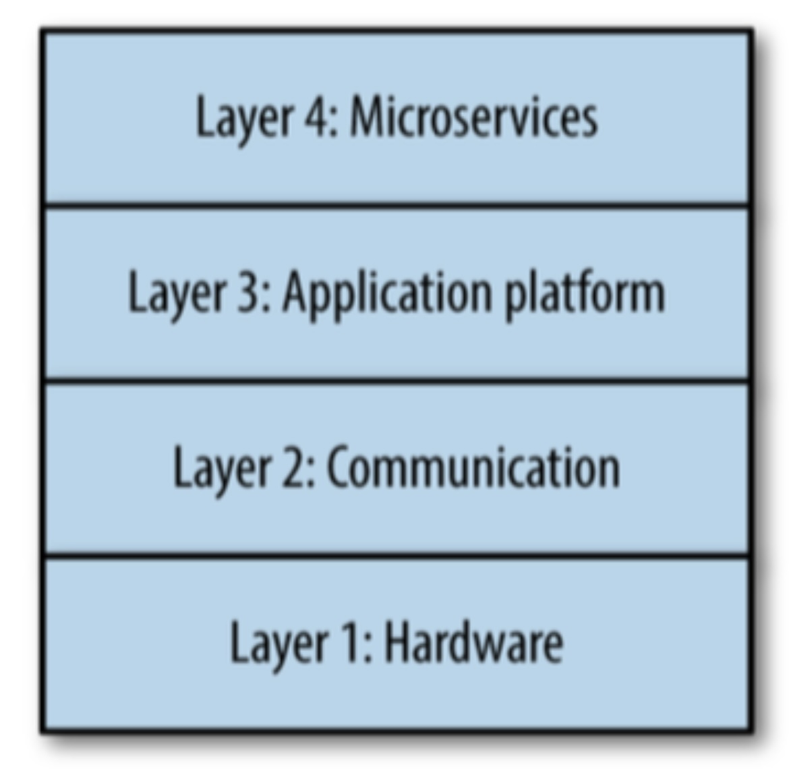
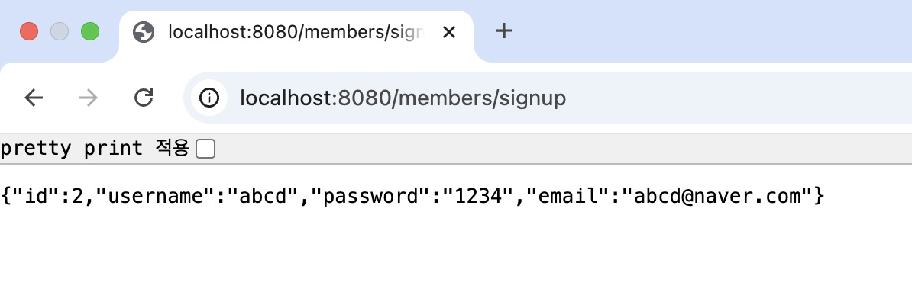
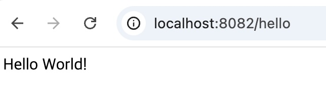
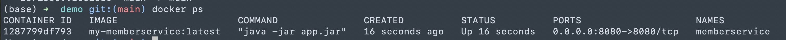

## W2 목표 
- '마이크로서비스 구축과 운영' 책 학습
- 웹 서비스 개발 공부 (Spring Boot)
- 인프라 관련 학습 (NGINX + CI/CD)

### 1. '마이크로서비스 구축과 운영' 1~2장 학습
#### 1장. 마이크로서비스
- 마이크로서비스의 버저닝 피하기
  - 마이크로서비스는 라이브러리가 아닌 독립적인 소프트웨어 애플리케이션이므로, 특정 버전에 고정된 릴리즈나 라이브러리가 아닌 살아서 변화하는 대상으로 취급해야 한다. 따라서, 버저닝을 피해야 한다. (API 엔드포인트(REST, Trhift 등)도 마찬가지)
- 마이크로서비스를 성공적으로 운영하려면, 아래 방식으로 인프라를 구축, 표준화하고 유지 관리해야 한다.
  - 안정적
  - 확장 가능
  - 내결함성
  - 신뢰할 수 있음
- 마이크로서비스 생태계 (1~3 계층 : 인프라 계층)
  - 
  - 계층 1: 하드웨어
    - 물리적 서버 (온프레미스, 클라우드(EC2 등))
    - 데이터베이스 (전용 / 공유))
    - OS
    - 자원 격리 / 자원 추상화(도커, 메소스 등)
    - 구성 관리 (Ansible 등)
    - 호스트 수준의 모니터링 / 로깅
  - 계층 2: 통신
    - **네트워크**
    - **다른 마이크로서비스와 통신 방법**
      - 원격 RPC 사용 (동기(HTTP + REST/Trhist))
      - 다른 마이크로서비스의 API엔드포인트에 메시징 (비동기)
      - 메시징의 경우, 메시지 브로커가 단일 실패 지점(Single Point of Failure)가 될 수 있음
    - **서비스 디스커버리**
      - 마이크로서비스 요청을 라우팅
      - 정확하게 라우팅하고, 정상적인 인스턴스로만 라우팅해야 함
      - ex. ZooKeeper, etcd, Consul, Hyperbahn
    - **서비스 레지스트리**
      - 마이크로서비스들의 IP, port를 기록한 데이터베이스
    - **로드 밸런싱**
      - 애플리케이션으로 요청이 발생하는 생태계의 모든 위치에 필요
      - ex. ELB, Eureka, Nginx, HAProxy
  - 계층 3: 애플리케이션 플랫폼
    - 셀프 서비스 내부 개발 도구
    - 개발 환경
    - 테스트, 패키징, 빌드, 배포 도구
    - 전개 파이프라인
    - 마이크로서비스 수준의 로깅/모니터링
  - 계층 4: 마이크로서비스
    - 모든 마이크로서비스
    - 마이크로서비스 관련 환경 설정 구성
- 마이크로서비스 아키텍처의 trade-off

  1) 팀의 고립 / 팀 간 의사소통 부재 (역콘웨이 법칙)
  2) 기술적 스프롤 현상 : 팀마다 다른 언어, 프레임워크, 도구 등 사용
     1) 해결 방법: 표준화 
  3) 시스템 장애 발생 가능성
  4) 자원 경쟁
     1) 해결 방법: 우선순위와 중요도에 따라 권한 부여

#### 2장. 생산 준비 기준 갖추기

마이크로서비스가 생산 준비 기준을 갖추기 위한 요구사항(원칙) 
  1) 안정성
  2) 신뢰성
  3) 확장성
  4) 내결함성
  5) 재난 대비
  6) 성능
  7) 모니터링
  8) 문서화

➢ 위 기준을 갖춘 마이크로서비스는 가용성을 높인다. 

### 2.웹 서비스 개발 공부 (Spring Boot)
목표 : 회원가입 기능만 있는 웹서비스
1) IntelliJ 설치 
2) Spring Boot 프로젝트 생성
3) User Controller / Domain / Repository / Service 패키지 및 클래스 생성
   - Controller로 요청이 들어오면 Service로 전송하고, Service는 Repository로 DB통신하는 구조로 설계
4) MySQL 을 docker 로 실행
5) HTML 파일 생성 (signup.html)
   - Username, Password, Email 입력 및 버튼 클릭하면 POST /members/signup 로 정보 전송
6) http://localhost:8080/signup.html 접속 후 회원가입 시도




----
#### 2.1. 트러블슈팅 기록 및 참고사항

**application.yaml**
1) 애플리케이션 실행했을 때, JDBC 연결 시 public key 관련 에러가 발생한다면, application.yaml의 spring.datasource.url 에 allowPublicKeyRetrieval=true 옵션을 추가해준다.
    - MySQL 8의 기본 인증 방식에 따른 이 문제는 자주 발생하는 이슈이다
2) jpa.hibernate.ddl-auto = update 로 설정하면, 애플리케이션 실행 시 스키마를 자동 업데이트 해준다. 
   - **update**: 데이터베이스에 해당 테이블이 없으면 생성하고, 스키마 변경사항이 있으면 업데이트
   - **create** 또는 **create-drop**: 애플리케이션 시작 시 테이블을 새로 생성 (기존 데이터는 삭제될 수 있음)
**Repository 클래스**
1) Repository 클래스 생성 시, **JpaRepository** 를 extend 하는 interface 로 생성하면, CRUD를 위한 메서드(save(), findById(), findAll() 등)가 포함되어 있어, 따로 구현할 필요가 없음

### 3. 인프라 관련 학습 (NGINX + CI/CD)
#### 3.1. NGINX
1) Docker 설치 (Docker Desktop)
2) nginx.conf 파일 생성
   
   : 80 으로 접속 시 8081 로 라우팅

    ```(base) ➜  nginxBasic cat nginx.conf 
    server {
        listen 80;
        location / {
            proxy_pass http://host.docker.internal:8081;
        }
    }```

3) docker run 으로 nginx 컨테이너 띄우기 

    - -d : 백그라운드로 실행
    - –name nginx-proxy: 컨테이너 이름을 지정합니다.
    - -p 8082:80: 호스트의 8082 포트를 컨테이너의 80 포트에 매핑
    - -v $(pwd)/nginx.conf:/etc/nginx/conf.d/default.conf:ro: 현재 디렉토리의 nginx.conf 파일을 컨테이너의 기본 설정 파일로 마운트(read-only)

    `docker run -d --name nginx-proxy -p 8082:80 -v $(pwd)/nginx.conf:/etc/nginx/conf.d/default.conf:ro nginx`



#### 3.2. CI/CD
1) 2에서 생성했던 회원가입 웹 서비스를 docker 이미지로 생성하는 dockerfile 작성
2) GitHub Action 에서 deploy.yaml 파일 작성
   - JAVA_HOME 선언해줘야 함
   - Runners 에서 실행할 환경을 설정해줘야 함 (self-hosted 사용)
   - DB는 로컬 호스트의 DB를 사용하므로, 프로젝트의 application.yaml 에서 localhost:3306 을 host.docker.internal:3306 으로 수정 필요
```name: Build and Deploy to Local PC

on:
  push:
    branches:
      - main

jobs:
  build-deploy:
    runs-on: self-hosted
    env:
      JAVA_HOME: /opt/homebrew/Cellar/openjdk@17/17.0.14/libexec/openjdk.jdk/Contents/Home
    steps:
      # 1. GitHub 리포지토리에서 최신 코드 체크아웃
      - name: Checkout code
        uses: actions/checkout@v3

      # 2. Maven 빌드를 실행하여 최신 JAR 파일 생성 (target 폴더에 생성됨)
      - name: Build with Maven Wrapper
        run: ./mvnw clean package -DskipTests

      # 3. Docker 이미지를 빌드 (Dockerfile에서 target/*.jar 를 app.jar로 복사)
      - name: Build Docker image
        run: docker build -t my-memberservice:latest .

      # 4. 기존에 실행 중인 컨테이너가 있다면 종료하고 삭제 (없으면 에러 무시)
      - name: Stop existing container
        run: |
          docker stop memberservice || true
          docker rm memberservice || true

      # 5. 새 컨테이너를 백그라운드에서 실행 (호스트의 8080 포트를 컨테이너의 8080 포트와 매핑)
      - name: Run new container
        run: docker run -d --name memberservice -p 8080:8080 my-memberservice:latest
```
3) github action 수행
4) docker ps 로 떠 있는 container 확인 및 웹 접속


