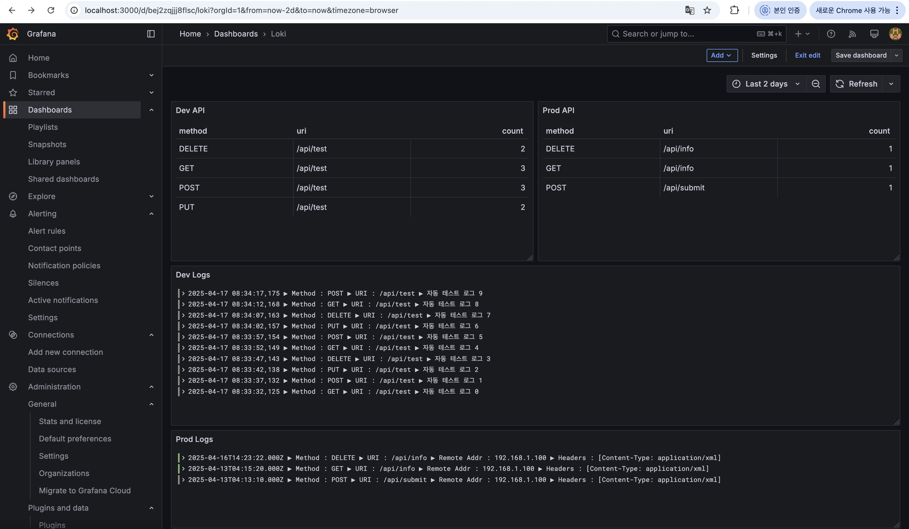
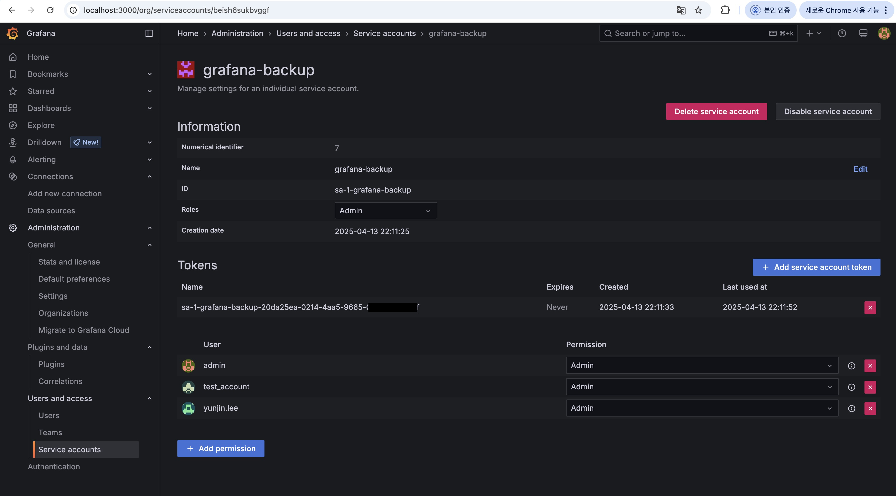
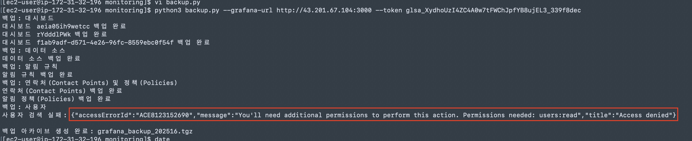

# 지난 주 목표
1. 쉘스크립트로 그라파나 형상관리
2. 컨테이너 모니터링 exporter 연동 및 패널 추가
3. 로깅 모니터링 방법 조사 
   
# 완료한 작업
1. 로깅 모니터링 방법 조사 (로컬 테스트 완료)
    - Loki (로그 집계 시스템(로그 저장, 인덱싱)) + promtail(로그 에이전트(로그 수집해서 Loki로 전송))
    - promtail-config.yaml
        ```
        (base) ➜  backup_grafana cat ../promtail-config.yaml
        server:
        http_listen_port: 9080
        grpc_listen_port: 0

        positions:
        filename: /tmp/positions.yaml

        clients:
        - url: http://loki:3100/loki/api/v1/push

        scrape_configs:
        - job_name: apigateway-logs
            # read_from 옵션 제거 (지원되지 않음)
            static_configs:
            - targets: [ "localhost" ]
                labels:
                job: apigateway
                env: dev
                __path__: /var/log/apigateway/dev.log
            - targets: [ "localhost" ]
                labels:
                job: apigateway
                env: prod
                __path__: /var/log/apigateway/prod.log

            pipeline_stages:
            - regex:
                # 정규표현식: 대시보드 로그에서 Method와 URI를 추출
                expression: 'Method\s+:\s+(?P<method>[A-Z]+).*URI\s+:\s+(?P<uri>\S+)'
            - labels:
                method: ""
            uri: ""
        ```
    - docker-compose.yml
        ```
        loki:
            image: grafana/loki:latest
            user: "0"
            ports:
            - "3100:3100"
            command: -config.file=/etc/loki/loki-config.yaml
            volumes:
            - ./loki-config.yaml:/etc/loki/loki-config.yaml
            - loki_data:/tmp/loki

        promtail:
            image: grafana/promtail:latest
            volumes:
            - ./promtail-config.yaml:/etc/promtail/config.yaml
            - ./apigateway-logs:/var/log/apigateway
            - promtail_positions:/tmp
            command: -config.file=/etc/promtail/config.yaml
        (중략)
        volumes:
            loki_data:
            promtail_positions:
        ```


### 특이사항
- 로그 파일 내에 로그가 있는 상태인데, 처음에 연동하면 내용이 안뜸(No Data) <br>-> 파일을 직접 수정해주는 등 파일의 timestamp 가 변경되어야 수집됨

# 진행 중인 작업
1. 스크립트로 그라파나 형상관리 
    - 언어 : python
    - 백업 스크립트 : /home/ec2-user/monitoring/backup.py
      - Grafana API 를 호출해서 데이터(대시보드, 알림 등) 별 json 파일로 저장
      - tgz 형태로 압축
    - 복원 스크립트 : /home/ec2-user/monitoring/restore.py
      - tgz 파일을 압축 해제해서, json 파일들을 Grafana API 로 전송(POST)

=> 복원 dependency 도 있고, alert 복원쪽이 계속 실패해서 원인 분석하느라 오래걸리는 중 

2. 로깅 모니터링 방법 조사 (ec2에서 작업 진행중)
   - 로그 파일 생성 후 연동 테스트 필요

# 배운 점
1. 오픈소스 툴 적용하기 전에 최신화가 되었는지 확인이 필요하다.
   
grafana backup 하는 오픈소스로 grafana-backup-tool, grafcli 이 있다고 해서, 로컬에서 둘다 설치하고 테스트 해봤는데 로컬에서는 백업 시 에러가 발생했다. 
확인해보니 현행화가 안되어있어서 최신 버전(11)은 지원 안되는 것 같음 .. 
그래서 챗GPT 에게 물어보고 직접 Python 스크립트를 생성하는 방법으로 진행했다 .. 

2. 공식 문서를 확인하자 (Grafana API)
   
처음에 챗GPT가 알려준 스크립트를 로컬에 적용해보면서, 에러나는 부분은 조금씩 수정하는 방향으로 진행했었는데, 
로컬에서 테스트 완료해서 EC2에 그대로 backup 스크립트 적용하려고 나니 에러가 발생했었다.  
확인해보니 Grafana 버전마다 제공하는 API 가 달라서, 발생한 에러였다. 
작업할 때 버전 확인 -> 해당 버전에 맞는 공식 문서를 확인해서 작업했으면 삽질하는 시간이 줄었을 것 같다. 

3. Grafana API 호출 토큰

Grafana API 호출할 때 계정 정보(id, password) 또는 계정 토큰이 필요하다. 처음에는 계정 토큰을 사용하는 방식으로 진행했다. 이것도 로컬(구버전)에서는 관리자 계정 토큰을 생성하는 메뉴가 따로 있었는데, ec2(latest) 버전부터는 해당 메뉴를 더이상 지원하지 않고, 서비스 계정(3rd-party 인듯)에 대한 토큰 생성만 가능하다.

근데  Grafana API 중에서 관리자 계정들을 조회(GET)하는 API 를 호출할 때는 관리자 급의 권한이 있어야 하는것으로 보인다. 

서비스 계정 토큰으로는 계속 조회에 실패해서, 그냥 restore 할 때 수동으로 모든 계정 직접 추가해주는 방식으로 진행했다. 


# 개선할 점
컨테이너 볼륨 디렉터리 자체를 압축해서 백업해놨다가, 추후 필요할 때 압축 해제해서 적용하는 방법이 제일 쉬운 것 같은데, 

너무 공수도 오래 들고 삽질도 제일 많이 하는 방법(API 호출해서 Json 파일로 저장)을 선택한 것 같다. 

쫌만 더하면 할 수 있을 것 같고, 오기가 생겨서 계속 진행하고 있는데, '이틀 이상 삽질했는데 해결 안되면 다른 방법으로 갈아타기'와 같이 스스로 규칙을 정해야 할 것 같다 ,, 

# 기타 공유 사항
추후에 모니터링 하고 싶은 내용이 있다면 공유해주세요 !

# 다음 주 계획
작업하느라 다른 파트원들이 작업한 세부 내용을 잘 모르기도 하고, 모니터링은 당장 중요도가 우선순위가 높은 작업이 아닌 것 같아서 다음주는 작업을 진행하면서, Apigateway 쪽 코드 분석을 진행해보려고 합니다

1. 스크립트로 그라파나 형상관리 완료
   - 주말까지 해결 안되면 다른 방법으로 진행
2. EC2 에 로깅(Loki + promtail + grafana) 환경 구축 (+ docker-compose.yml 파일 설정)
3. apigateway 코드 분석

