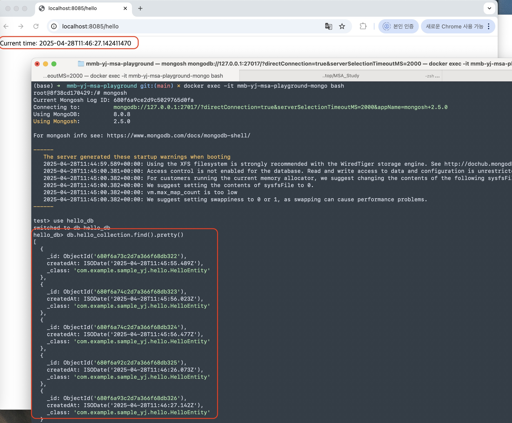
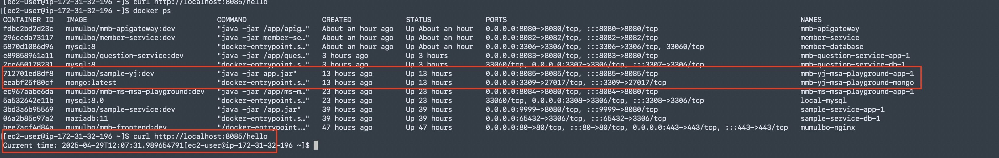
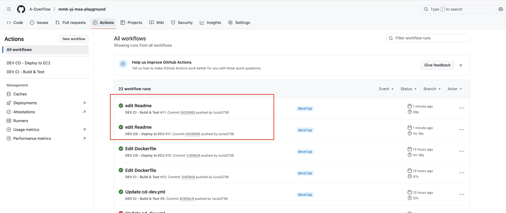

# 지난 주 목표
마이크로서비스 생성 부터 배포까지 진행

# 완료한 작업
1. API(GET /hello) 호출 시, current time 반환 및 DB에 저장




2. Dockerfile, docker-compose.yml, docker-compose.override.yml 작성하여 애플리케이션과 DB(mongo)를 컨테이너로 띄우기



3. ci.yml, cd.yml 작성
   - develop 브랜치에 push 발생한 경우 ci/cd 수행 



# 진행 중인 작업
None

# 배운 점
docker-compose.override.yml 이라는걸 사용하면 기본 설정(docker-compose.yml)을 덮어쓰기 할 수 있다. 
기본 설정 파일(docker-compose.yml)은 운영 설정, docker-compose.override.yml 파일은 개발 환경, 로컬 테스트 용으로 구분된다. 

현재는 build, image 항목만 덮어쓰기 했지만 그 외에 port, 볼륨 마운트 등도 추가할 수 있다. 

```
# 로컬 개발환경 설정
# docker compose up -d --build
services:
  app:
    build:
      context: .
      dockerfile: Dockerfile
    image: sample-yj:local
```

# 개선할 점
현재 develop 브랜치에 대해서만 환경변수, ci/cd 가 적용되어있어서 main 브랜치에 대한 작업도 필요할것같다. 


# 기타 공유 사항
None

# 다음 주 계획
미정
