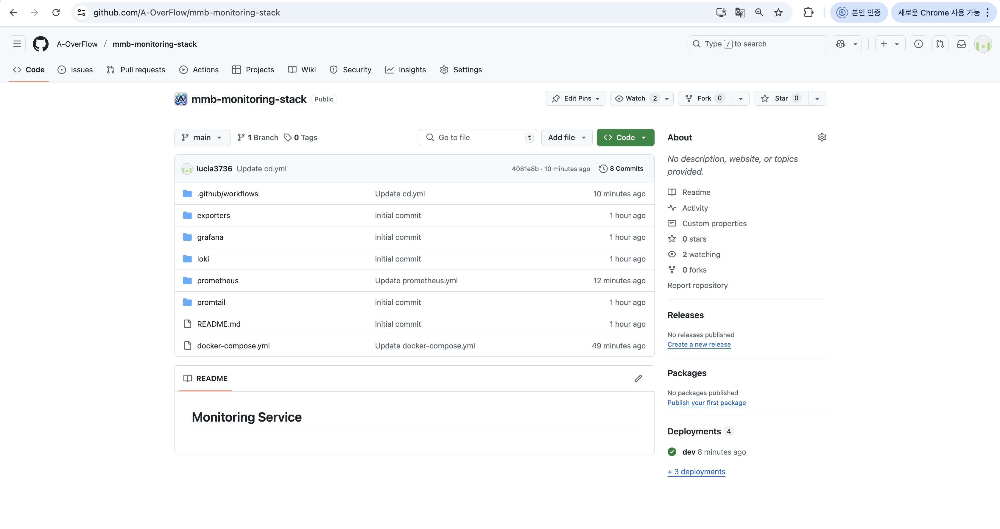
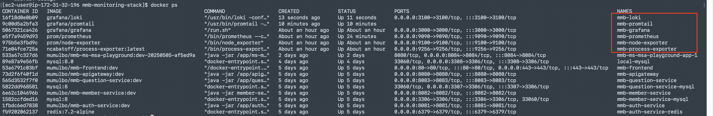
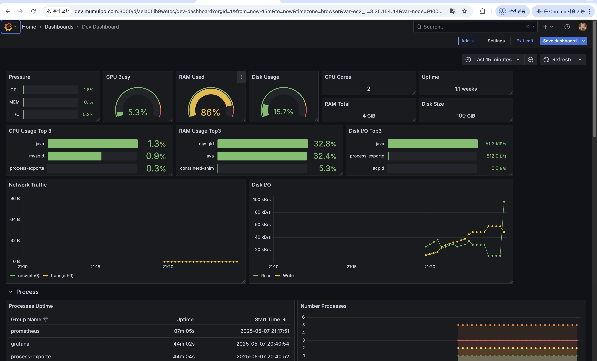
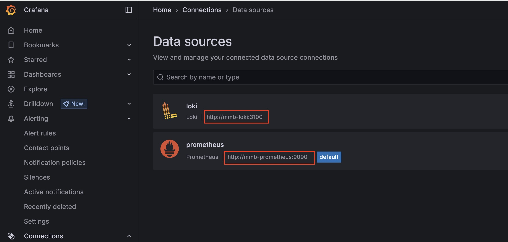

# 지난 주 목표
모니터링 서비스 레포지토리 설정 및 복원

# 완료한 작업
1. mmb-monitoring-stack 레포지토리 설정
   - docker-compose.yml 생성
   - 각 서비스(grafana, prometheus, node-exporter, process-exporter, loki, promtail) 관련 설정 파일 생성
   - GitHub Action 설정

2. 모니터링 서비스 복원 
   - 기존 Grafana 컨테이너 삭제할 때 volumes 까지 지우지는 않아서 데이터 남아있었음
   - GitHub Action 으로 docker compose up 시 컨테이너 모두 올라가는 것 확인 

   - Grafana 대시보드 정상화 

# 진행 중인 작업
1. loki + promtail + grafana 연동 및 패널 추가

    - 로그 파일 경로
    - 로그 파일 포맷
    - 모니터링할 항목 등 

# 배운 점
Grafana 에서 데이터 소스(prometheus, loki) 연동할 때, URL 을 아래와 같이 사용했었다. 
- http://(Public IP):(외부 포트) 

그리고 대시보드에 패널 추가할 때도, 쿼리 내에 instance 에 IP 를 직접 입력해서 아래와 같이 사용했었는데 
- node_cpu_seconds_total{instance="3.35.154.44:node-exporter",job="node-exporter"}

IP 가 바뀌면서 모든 데이터소스, 쿼리를 수정해줘야 하는게 너무 번거로웠다. 

찾아보니 아래와 같이 컨테이너명을 사용하면 돼서, IP 가 변경될 때마다 수동으로 변경해줘야 하지 않아도 된다. 

- AS-IS 
  - http://(Public IP):(외부 포트) 
  - node_cpu_seconds_total{instance="3.35.154.44:9100",job="node-exporter"}
- TO-BE
  - http://(서비스 컨테이너명):(내부 포트) 
  - node_cpu_seconds_total{instance="mmb-node-exporter:9100",job="node-exporter"}

# 개선할 점
None

# 기타 공유 사항
None

# 다음 주 계획
상동
