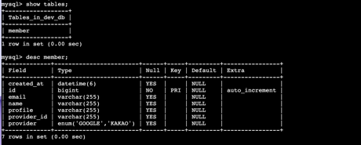
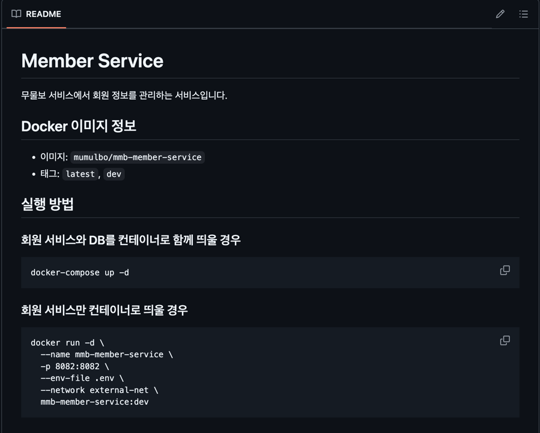

# 지난 주 목표

- 인증 서비스, 회원 서비스 각각 개발한 기능들 `develop` 브랜치에 머지
- README.md 작성

# 완료한 작업

1. 인증 서비스, 회원 서비스 기능들 개발 서버에 배포 완료
   

2. README 작성 완료(간단하게)
   

# 진행 중인 작업

.

# 배운 점

.

# 개선할 점

.

# 기타 공유 사항

뭘 해야 하는지 모르겠어요 @_@

# 다음 주 계획

- 아마 메모리 제한 관려해서 docker-compose 파일 수정?
- SRS 새로 작성? 기존껄로 대체할 수 있으면 생략
- 프로필 관련 기능을 구현하려면 스토리지가 필요할 것 같은데 `minIO`로 한번 해볼까 함
