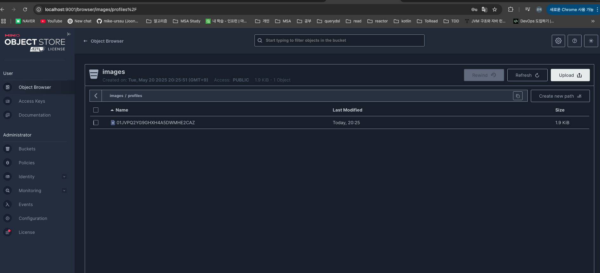
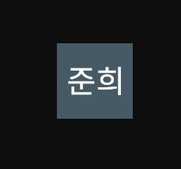

# 지난 주 목표

- `Google`이 제공하는 기본 정보에 회원 정보 추가
- 프로필 이미지 관리를 위해 `MinIO` 도입

# 완료한 작업

1. `Profile` Table 추가
   

2. `MinIO` 도입  
   2.1. `Google` 프로필 이미지를 `MinIO`에 업로드 -> 회원가입 Api 연동 완료
   

   2.2. `MinIO`에서 이미지 조회
   http://localhost:9000/images/profiles/01JVPQ2YG9GHXH4A5DWMHE2CAZ 로 요청하면 이미지 조회 가능  
   

3. 개발 서버에 배포 완료  
   nginx 설정 안돼서 프로필 이미지 조회 불가.

# 진행 중인 작업

- 프로필 정보 수정 Api 개발 예정
- SRS 끄적끄적중

# 배운 점

`MinIO` 괜찮다.

# 개선할 점

.

# 기타 공유 사항

browser에서 프로필 이미지를 조회할 수 있도록 `nginx`에서 라우팅 처리 필요 (feat. 책임님)

1. 이미지 조회: `/images/**` -> `minio:9000`
2. `minio` web console 접속: `/minio` -> `minio:9001`

# 다음 주 계획

- 프로필 정보 수정 Api 개발
- **문서 작성**. 설명 없으면 로컬에서 테스트하기 매우 어려울 듯 (readme, SRS 등)
- 시간되면 log 관련 설정들 추가
