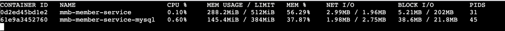

# 지난 주 목표

- 회원 서비스 관련 컨테이너 메모리 제한 설정
- 회원 서비스 부하 테스트
- 회원 정보 조회 api 응답값 변경 (요청자: 책임님)
- 회원 서비스 SRS 작성

# 완료한 작업

## 1. 컨테이너 메모리 제한

### docker-compose.yml 파일 수정

1. 컨테이너마다 `mem_limit: XXXMB` 옵션 추가
2. 애플리케이션에 `JAVA_OPTS` 설정 추가
    ```yaml
      member-service:
        environment:
          JAVA_OPTS: Xmx128m -Xms128m -XX:MaxMetaspaceSize=64m -Xss256k -XX:+UseSerialGC
        mem_limit: 512MB
    ```

3. MySQL 설정 파일(`my.cnf`) 적용
    ```yaml
      mysql:
        volumes:
          - member_mysql_data:/var/lib/mysql
          - ./docker/mysql/my.cnf:/etc/mysql/my.cnf
        mem_limit: 384MB
    ```
   ```text
    [mysqld]
    # 연결 수 제한
    max_connections = 20
    
    # 문자셋 설정
    character-set-server = utf8mb4
    collation-server = utf8mb4_general_ci
    
    # InnoDB 엔진 메모리 줄이기
    innodb_buffer_pool_size = 128M
    innodb_log_file_size = 32M
    innodb_log_buffer_size = 8M
    innodb_flush_log_at_trx_commit = 2
    innodb_file_per_table = 1
    
    # 임시 테이블과 정렬용 메모리 줄이기
    tmp_table_size = 8M
    max_heap_table_size = 8M
    sort_buffer_size = 512K
    join_buffer_size = 512K
    read_buffer_size = 512K
    read_rnd_buffer_size = 512K
    
    # 기타 설정
    table_open_cache = 64
    key_buffer_size = 8M
    thread_cache_size = 4
    performance_schema = OFF
    ```

### 메모리 사용량 비교 (회원 서비스 vs. 질문 서비스)

#### 질문 서비스에서 사용하는 컨테이너 메모리 사용량


| 컨테이너명                      | 메모리 사용량(MB) |
|----------------------------|-------------|
| mmb-question-service       | 313.7       |
| mmb-question-service-mysql | 457.7       |
| -> 총 합                     | **768.4**   |

#### 회원 서비스에서 사용하는 컨테이너 메모리 사용량



| 컨테이너명                    | 메모리 사용량(MB) |
|--------------------------|-------------|
| mmb-member-service       | 288.2       |
| mmb-member-service-mysql | 145.4       |
| -> 총 합                   | **433.6**   |

## 2. 부하 테스트

Artillery, JMeter, Locust, k6 등 테스트 도구는 많고 사용법도 비슷. 어떤 툴을 사용해도 상관 X

처음엔 Artillery를 선택했는데 시나리오 기반으로 테스트 수행 시 `여러 요청이 동일 테이터 사용 이슈`가 발생. (Known Issue)  
그래서 k6로 전환 및 문제 없음 확인.

### k6 테스트 구조


### 테스트 시나리오

`회원가입 -> 회원 정보 조회 -> 프로필 정보 조회` 시나리오를 초당 100개의 요청을 10초동안 총 3000개 요청

### 실행 화면


### 결과 화면 (summary.html)


### 결론

**제한된 메모리로 약 160 TPS 처리 성공**  
애플리케이션의 메모리를 384MB로 설정할 경우 최대 메모리 사용량이 99%까지 차지함  
애플리케이션 메모리를 512MB로 늘려 최대 메모리 사용량을 70%대로 유지


## 3. 기타 작업

- 회원 정보 조회 api 응답값 변경
- [회원 서비스 SRS](https://github.com/A-OverFlow/mmb-docs/blob/main/0_%ED%94%84%EB%A1%9C%EC%A0%9D%ED%8A%B8_%EA%B4%80%EB%A6%AC/0_SRS/%ED%9A%8C%EC%9B%90%EC%84%9C%EB%B9%84%EC%8A%A4_SRS.md) 작성 완료

# 진행 중인 작업

.

# 배운 점

시스템이 예상 요청 수(tps, 동시 사용자 수 등)를 감당할 수 있는지 확인하고  
병목 현상이 발생하는 지점(CPU, 메모리, DB 쿼리, 네트워크 등)을 찾아 성능을 개선하여  
고부하 상황에서도 시스템이 에러 없이 안정적으로 동작하는지 테스트하기 위해 부하 테스트를 진행함

Throughput 관점에서 최소 처리 속도를 가진 지점이 전체 처리량을 결정하기 때문에 성능 모니터링을 통해 부하가 발생하는 지점을 정확하게 찾는 것이 중요.  
이번엔 애플리케이션에서 병목 현상이 걸림 -> 메모리 사용률 99%  
병목 지점을 수직 확장 또는 수평 확장을 통해 해결해야 함 ex) 메모리를 384MB -> 512MB로 늘림

# 개선할 점

시간 흐름에 따라서 처리 과정을 살펴보면 더 좋을 것 같음  
k6 테스트 과정을 grafana와 연동하여 모니터링할 수 있다고 함  
지금은 맛보기 단계니까 SKIP

# 기타 공유 사항

.

# 다음 주 계획

- 애플리케이션 로깅 작업
    - 로직 진행 상태 확인을 위한 로그 메시지 추가
    - 요청별로 로그를 확인하기 위해 MDC(Mapped Diagnostic Context)을 이용한 traceId 적용
- 새로운 api 구현? <- 논의 필요 (회원 서비스에서 api를 제공할 필요가 있는지)
    - 내가 작성한 질문 목록 조회
    - 내가 작성한 댓글에 대한 질문 목록 조회
