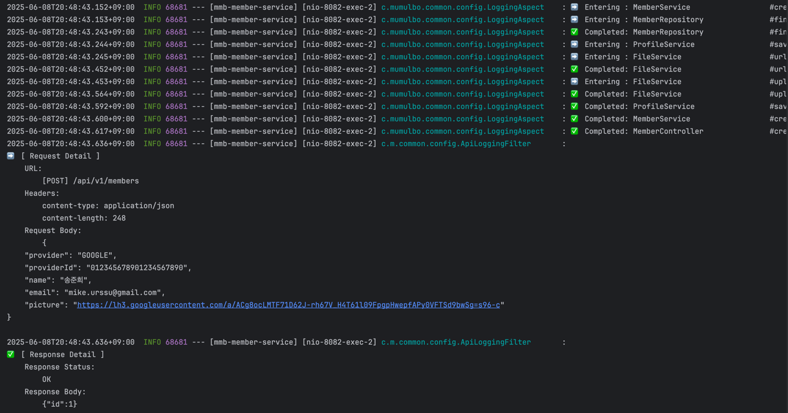
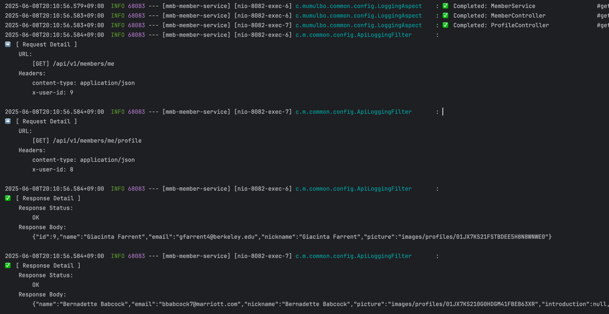
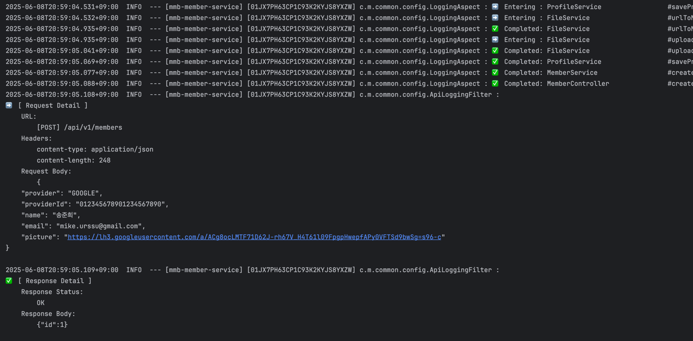

# 지난 주 목표

- 회원 서비스 로깅 설정
    - 애플리케이션 로그 메시지 추가
    - 요청을 구분하기 위해 로그 메시지에 `TRACE_ID` 추가

# 완료한 작업

## 애플리케이션에 로깅 메시지 추가

### 1. 클래스, 메소드 로그 메시지 추가

`AOP`를 통해 `@RestController`, `@Service`, `@Repository` 어노테이션이 붙은 클래스의 메소드 호출/종료 시 호출한 클래스, 메소드 정보를 로깅

#### 코드

```kotlin
@Component
@Aspect
class LoggingAspect {
    private val log = KotlinLogging.logger { }

    @Around(
        "execution(* *(..)) && (" +
            "@within(org.springframework.web.bind.annotation.RestController) || " +
            "@within(org.springframework.stereotype.Service) || " +
            "@within(org.springframework.stereotype.Repository))"
    )
    fun logMethodExecution(joinPoint: ProceedingJoinPoint): Any? {
        val className = String.format("%-30s", joinPoint.signature.declaringType.simpleName)
        val methodName = String.format("%-30s", joinPoint.signature.name)
        log.info { "➡️ Entering : $className #$methodName" }

        val startTime = System.currentTimeMillis()
        return try {
            val result = joinPoint.proceed()
            val duration = String.format("%4d", System.currentTimeMillis() - startTime)
            log.info { "✅ Completed: $className #$methodName in    $duration ms" }
            result
        } catch (e: RuntimeException) {
            val duration = String.format("%4d", System.currentTimeMillis() - startTime)
            log.error { "❌ Failed   : $className #$methodName after $duration ms" }
            throw e
        }
    }
}
```

#### 로그 메시지

 ```text
    { 기본 메시지 }  ➡️ Entering : MemberController #createOrGetMember             
    { 기본 메시지 }  ➡️ Entering : MemberService #createOrGetMember             
    { 기본 메시지 }  ➡️ Entering : MemberRepository #findByProviderAndProviderId   
    { 기본 메시지 }  ✅ Completed: MemberRepository #findByProviderAndProviderId in 97 ms
    { 기본 메시지 }  ➡️ Entering : ProfileService #saveProfile                   
    { 기본 메시지 }  ➡️ Entering : FileService #urlToMultipartFile            
    { 기본 메시지 }  ✅ Completed: FileService #urlToMultipartFile in 430 ms
    { 기본 메시지 }  ➡️ Entering : FileService #uploadImage                   
    { 기본 메시지 }  ✅ Completed: FileService #uploadImage in 110 ms
    { 기본 메시지 }  ✅ Completed: ProfileService #saveProfile in 571 ms
    { 기본 메시지 }  ✅ Completed: MemberService #createOrGetMember in 690 ms
    { 기본 메시지 }  ✅ Completed: MemberController #createOrGetMember in 711 ms
```

### 2. Api Request / Response 정보

`OncePerRequestFilter`를 구현하여 Api 요청/응답 정보를 로깅

#### 코드

```kotlin
@Component
class ApiLoggingFilter : OncePerRequestFilter() {
    override fun doFilterInternal(request: HttpServletRequest, response: HttpServletResponse, filterChain: FilterChain) {
        val wrappedRequest = ContentCachingRequestWrapper(request)
        val wrappedResponse = ContentCachingResponseWrapper(response)

        filterChain.doFilter(wrappedRequest, wrappedResponse)

        logRequestDetails(wrappedRequest)
        logResponseDetails(wrappedResponse)
        wrappedResponse.copyBodyToResponse()
    }
}
```

#### Request 로그 메시지

```text
2025-06-08T20:16:03.469+09:00  INFO 68242 --- [mmb-member-service] [nio-8082-exec-1] c.m.common.config.ApiLoggingFilter       : 
➡️ [ Request Detail ]
	URL:
		[POST] /api/v1/members
	Headers:
		content-type: application/json
		content-length: 248
	Request Body:
		{
    "provider": "GOOGLE",
    "providerId": "012345678901234567890",
    "name": "송준희",
    "email": "mike.urssu@gmail.com",
    "picture": "https://lh3.googleusercontent.com/a/ACg8ocLMTF71D62J-rh67V_H4T61l09FpgpHwepfAPy0VFTSd9bwSg=s96-c"
}
```

#### Response 로그 메시지

 ```text
2025-06-08T20:16:03.470+09:00  INFO 68242 --- [mmb-member-service] [nio-8082-exec-1] c.m.common.config.ApiLoggingFilter       : 
✅ [ Response Detail ]
	Response Status:
		OK
	Response Body:
		{"id":1}
 ```

### 결과



## 문제점

여러 개의 요청이 동시에 들어올 경우 진행 상황을 파악하기 어려움



## 해결 방안

### `MDC(Mapped Diagnostic Context)` 적용

#### MDC란?

`MDC`는 `Mapped Diagnostic Context`의 약자로, 주로 로그를 남길 때 **컨텍스트(Context) 정보를 함께 기록하기 위해** 사용하는 기능.  
멀티스레드 환경에서 로그를 분석할 때 요청별로 로그를 구분하기 어렵기 때문에 부가 정보를 자동으로 붙여서 기록.  
여기서는 `Filter`를 사용해 요청마다 고유 ID(`TRACE_ID`)를 생성하고 `MDC`에 저장하여

#### 코드

```kotlin
@Component
class ApiLoggingFilter : OncePerRequestFilter() {
    override fun doFilterInternal(request: HttpServletRequest, response: HttpServletResponse, filterChain: FilterChain) {
        val wrappedRequest = ContentCachingRequestWrapper(request)
        val wrappedResponse = ContentCachingResponseWrapper(response)

        // TRACE_ID 추가하는 부분
        val traceId = ULID.nextULID().toString()
        MDC.put(APPLICATION_NAME, applicationName)
        MDC.put(TRACE_ID, traceId)

        try {
            filterChain.doFilter(wrappedRequest, wrappedResponse)
        } finally {
            logRequestDetails(wrappedRequest)
            logResponseDetails(wrappedResponse)
            wrappedResponse.copyBodyToResponse()

            MDC.remove(APPLICATION_NAME)
            MDC.remove(TRACE_ID)
        }
    }
}
```

#### application.yml에 log pattern 추가

```yaml
logging:
  pattern:
    console: "%d{yyyy-MM-dd'T'HH:mm:ss.SSSXXX}  %-5level --- [%X{APPLICATION_NAME}] [%X{TRACE_ID}] %logger{36} : %msg%n"
```

### 결과



# 진행 중인 작업

.

# 배운 점

.

# 개선할 점

.

# 기타 공유 사항

.

# 다음 주 계획

.
