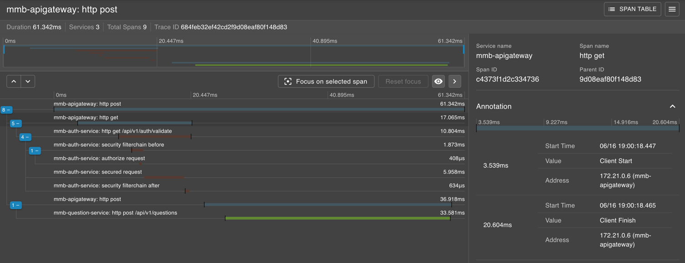
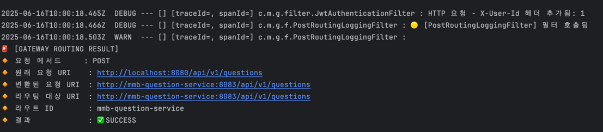

# 지난 주 목표

- 서비스들에 `Zipkin` 적용
- ~~`minio` 컨테이너명 수정~~

# 완료한 작업

## 예시 화면

## 문제점

### 1. 어느 시점에 무엇을 관찰해야 할 지 잘 모르겠다

**로그**랑 같이 확인을 해야 의미가 생길 것 같은데?

### 2. Api Gateway에 TraceId 안찍힘

`Webflux` 기반이라 따로 설정해줘야 한다고 함. **연구 필요**.

# 진행 중인 작업

아직 코드 정리가 안돼서 커밋 안함. 이번 주에 할 예정

# 개선할 점

.

# 기타 공유 사항

`zipkin`은 모든 서비스에 적용되니까 `Grafana, Loki` 처럼 인프라에서 관리해야 하는 것 아닌가?

# 다음 주 계획

- 각 서비스에 Zipkin 적용 및 개발 서버에 반영(회원 서비스에 반영하고 추후 다른 곳으로 컨테이너 이동)
- `minio` 컨테이너명을 `mmb-minio`로 변경

# 15주간 회고

이론적으로만 알고있던 MSA 프로젝트를 팀을 이루어 실습하고 그 결과를 눈으로 확인할 수 있어서 아주 좋았다.  
스터디를 하기 전에는 안개 속에서 헤멘 느낌이었는데  
이번 스터디를 통해 직접 MSA를 개발하면서 조금씩 알아가고 있는 것 같다.

프로젝트를 진행하면서 개발 및 운영을 함께 진행했고  
`minio`(스토리지)나 `K6`(부하테스트 툴) 등 다양한 오픈소스를 적용해볼 수 있었다.

또한 훌륭한 팀원들과 함께 서로 공부한 내용들을 공유하는 과정에서  
혼자서 했다면 시간이 아주 오래 걸릴만한 내용들을 단기간에 알아갈 수 있어서
아주 알차고 의미있는 경험이었다고 생각한다.
