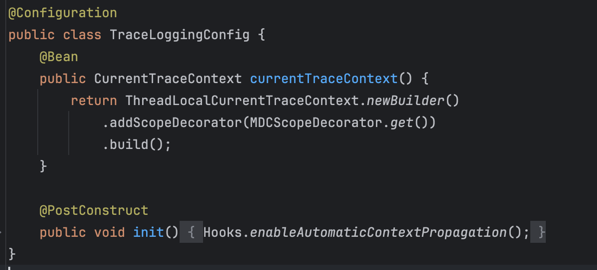

# 지난 주 목표

- 서비스들에 `Zipkin` 적용
- ~~`minio` 컨테이너명 수정 (또 미룸)~~

# 완료한 작업

## Api Gateway에 TraceId 안찍히는 문제 해결

### [Before]

### [After]

## 어떻게 해결했나?

기존 Servlet 기반(`Spring MVC`)에서는 같은 쓰레드에서 모든 요청을 처리하므로 `ThreadLocal`을 기반으로 트레이싱 정보를 관리할 수 있음.  
반면 `Spring WebFlux`는 기본적으로 **Reactor** 기반의 비동기 스트림 처리 환경이기 때문에 요청 처리 과정에서 쓰레드가 계속 바뀔 수 있음.  
따라서 `CurrentTraceContext`를 이용하여 트레이싱 정보를 관리함.

## 문제점?

로깅하는 곳 마다 `Mono.deferContextual~~`를 직접 추가해줘야 함. 매우 귀찮음. 어쩔 수 없는 듯.

# 진행 중인 작업

.

# 개선할 점

.

# 기타 공유 사항

1. Zipkin 관련 환경 변수 설정  
   zipkin 설정하려면 모든 서비스에 Github Action 변수를 추가, cd 스크립트를 변경하는데 너무 귀찮아  
   **Organization 변수**에 추가해서 최소한으로 작업하고 싶음  
   그래서 안하고 있음

2. Nginx 설정  
   웹에서 결과를 확인하려면 Nginx 설정 추가해야 함  
   `/zipkin` -> `mmb-zipkin`으로 라우팅  
   `/minio` -> `mmb-minio`으로 라우팅

# 다음 주 계획

- 각 서비스에 `Zipkin` 일괄 적용
- `minio` 컨테이너명을 `mmb-minio`로 변경
