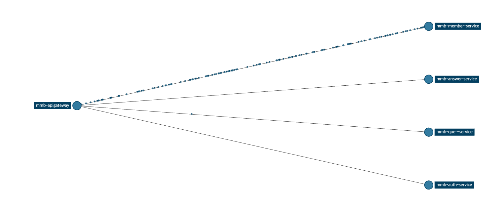
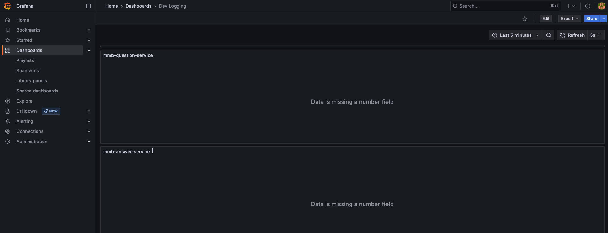

# 지난 주 목표

- 서비스들에 `Zipkin` 적용
- `minio` 컨테이너명 수정

# 완료한 작업

## 1. Chatting Service를 제외한 모든 서비스에 zipkin 설정 완료

~~`fluentBit` 실행 방법 모름. 그래서 로컬에서 못띄워서 테스트 안하고 서버에 반영함.~~

## 2. minio 컨테이너명 수정 준비 완료

서버에 반영하면 `nginx`에서 라우팅 설정 전까지 먹통되니까 개발 서버에 반영 안함.  
책임님께서 시간될 때 함께 작업하시면 될 듯.

# 진행 중인 작업

.

# 개선할 점

.

# 기타 공유 사항

## `Grafana`에 안나오는데 왜?

## 모든 서비스 로그들을 한꺼번에 확인할 수 있는 방법은 없을까?

`TraceId`로 필터링해서 확인할 수 있다면 좋을 것 같은데?

# 다음 주 계획

몰루
