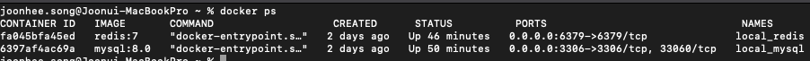
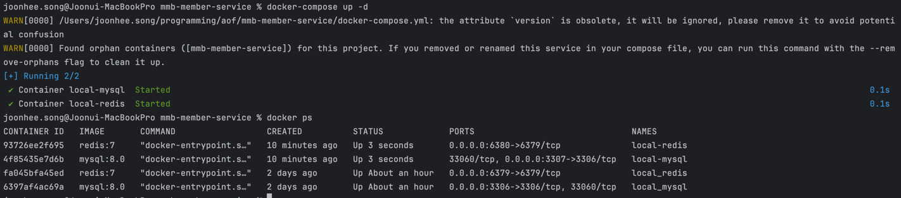

# 작업 내용

## 회원 서비스 v1 api 구현

- 회원가입
- 로그인
- 토큰 재발급 (버그 수정 필요)
- 회원 정보 조회
    - Controller에서 `Header`로부터 `Token`을 직접 꺼내 사용

## 회원 api 문서 작성

# 이슈 및 해결 방법

## 이슈

로컬에서 개발한 Api를 테스트하기 위해서 테스트용 DB가 필요  
그래서 Docker를 이용해서 MySQL, Redis 컨테이너를 하나씩 생성

```
docker run -d \
  --name local_mysql \
  -e MYSQL_ROOT_PASSWORD={{PASSWORD}} \
  -e MYSQL_DATABASE={{DATABASE}} \
  -e MYSQL_USER={{USER}} \
  -p 3306:3306 \
  mysql:8.0
```

```
docker run -d \
  --name local_redis \
  -p 6379:6379 \
  redis:7
```



컨테이너를 생성하려고 할 때마다 매번 명령어를 입력해서 실행해야 하니까 매우 불편

## 해결

한번에 여러 개의 컨테이너를 띄울 수 있도록 docker-compose 파일 작성

```
version: '3.8'
services:
  mysql:
    image: mysql:8.0
    container_name: local-mysql
    environment:
      MYSQL_USER: root
      MYSQL_ROOT_PASSWORD: root1234
      MYSQL_DATABASE: aoverflow
    ports:
      - "3307:3306"

  redis:
    image: redis:7
    container_name: local-redis
    ports:
      - "6380:6379"
```

`docker-compose up -d` 명령어를 통해 컨테이너들을 백그라운드에서 실행



# 다음 계획

- 회원 서비스에 필요한 DDL 파일 생성
- Google OAuth 적용(회원가입, 로그인)
- Spring Security에 JWT 적용

# 개인 회고

개발 시간이 촉박해서 `선 개발 후 문서 작성`을 해서 문서 작성할 땐 편했지만  
협업하는 사람의 입장에서 생각해보면 개발할 때 참고할 문서가 없어서 답답

아직 본격적으로 개발하지 않았기 때문에 티가 안났지만  
앞으로 개발 규모가 커지고 관리할 서비스들이 많아지면 문서를 아주 많이 확인할텐데  
원활한 협업을 위해서 문서화 작업의 우선순위를 더 높여야겠다!
