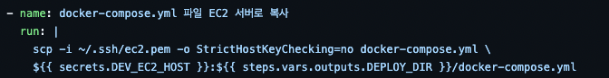
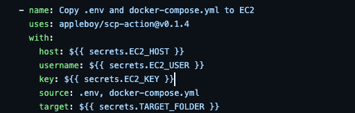
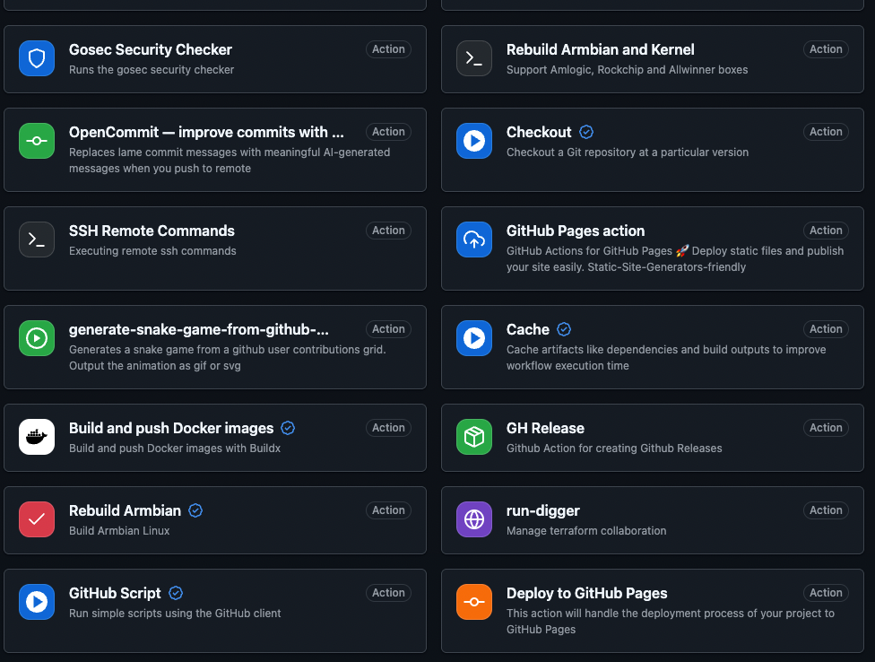

# 지난 주 목표

- 개발 서버에 자동 배포 구성

# 완료한 작업

1. 로컬 개발 환경 구축
    - 로컬 환경 `develop` 브랜치에서 서비스를 프로세스와 컨테이너로 실행할 수 있는 환경 구축  
      (**필수: DB가 container로 떠있어야 함**)
2. CI/CD 구성
    - Docker Image 생성을 위해 `Dockerfile` 작성
    - 애플리케이션을 컨테이너로 실행하기 위해 `docker-compose.yml` 파일 작성
    - 빌드 자동화를 위해 `ci.yml` 파일 작성
    - 개발 서버에 자동 배포를 위해 `cd-dev.yml` 파일 작성

# 진행 중인 작업

.

# 배운 점

## 개발 / 배포 A-Z

개발 - 배포를 A-Z 혼자 한바퀴 돌려보면서 실제 배포가 어떻게 이루어지는지 **실습 성공**  
앞으로 문제 생기면 혼자서 해결 가능하지 않을까? 가능했으면 좋겠다!

## Github Action

직접 명령어를 이용해서 실행할 수 있음


Action을 활용해서 실행할 수 있음


-> 명령어 안궁금해. Action을 이용할래. 나중에 수정하기도 편할껄

[Github Action Marketplace](https://github.com/marketplace?type=actions)에서 지원도 짱짱함


# 개선할 점

## 환경변수 관리

``` text
DB_ROOT_PASSWORD=demo_password
APPLICATION_PORT=8082
APPLICATION_NAME=member-service
DB_USERNAME=demo_user
DB_PASSWORD=demo_password
DB_HOST=mysql
CONTAINER_DB_PORT=3306
DB_NAME=demo_db
JPA_DDL_AUTO=create
JPA_FORMAT_SQL=true
JPA_SHOW_SQL=true
LOG_ROOT_LEVEL=info
LOG_JPA_LEVEL=trace
```

어떤 값들을 환경변수로 설정할건지, secrets로 할껀지, vars로 할껀지, 이름은 어떻게 할건지, 관리는 누가 할건지?
이게 정해져야 마음이 편할 것 같다.

## Container 실행 순서?

`docker-compose.yml` 파일에서 `member-service`에 `depends_on`을 추가해서 db 컨테이너가 뜨면 실행되도록 했는데  
`mysql`에 db가 생성되기 전까지 `member-service`에서 에러가 발생함.  
지금은 `restart: unless-stopped`을 추가해서 DB가 연결될 때까지 재시작하도록 설정했지만, 찝찝.
알잘딱깔센 실행할 방법은 없을까?

## DB 관리는 어떻게?

지금은 자동 배포될 때마다 table을 새로 생성하는데 앞으로는 이렇게 하면 안됨.  
그럼 최초에 한번만 table을 생성하고 그 뒤로는 이걸 계속 써야 하는데 어떻게 하면 좋을까?

# 기타 공유 사항

.

# 다음 주 계획

로컬에서 어떻게 테스트하는지 다른 사람들이 보고 실행할 수 있게 레포에 README 작성
