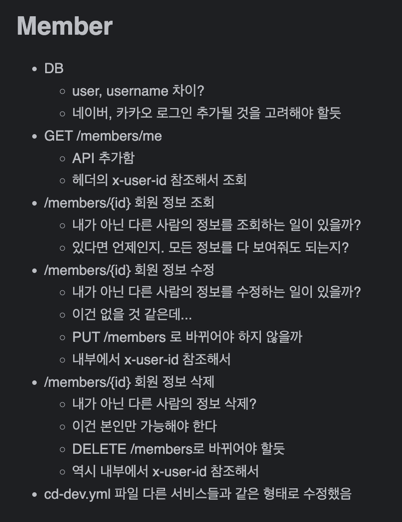
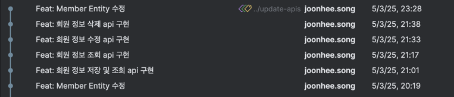
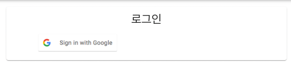
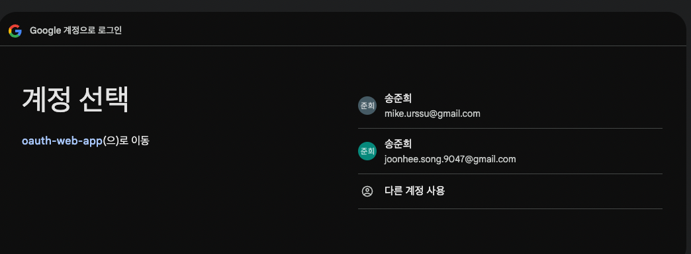
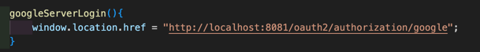
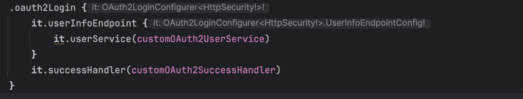
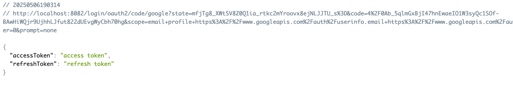
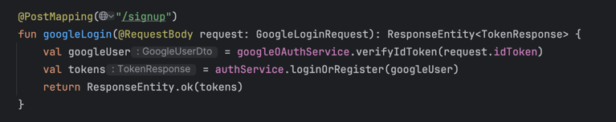
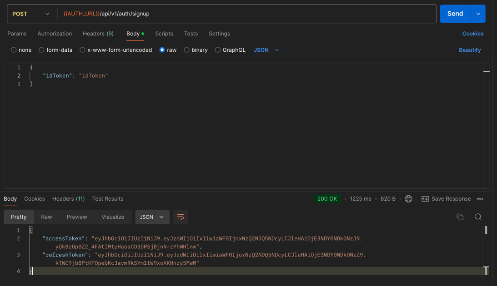

# 지난 주 목표

# 완료한 작업

## Member-Service Docs, Api 수정 (develop 브랜치에 배포 X)

## Auth Service 수정 (develop 브랜치에 배포 X) <- 짱 어려움 💣💣💣

Backend에서 전부 처리하는 방식?이 있고 Api를 이용해서 처리하는 방식?이 있음  
화면상으로는 똑같음

구글 로그인 버튼을 누르고  

계정 로그인함  

### 1. Backend에서 `Spring Security`를 이용한 OAuth 연동 (Backend에서 전부 처리)

Front에서 `localhost:8081/~`로 요청 -> **Backend**가 구글 로그인 화면을 보여줌  

구글 계정으로 로그인하면 `Spring Security`의 `oauth2Login` 내부에서 로그인/회원가입 처리함  

처리 결과  

### 2. `Backend Api`를 직접 호출하여 OAuth 연동 (Front에서 `id_token` 전달)

# 진행 중인 작업

**선 구현, 후 공부** 중인데 아직 **후 공부**가 덜 됨 + 좀더 동작 확인 필요  
누군가한테 컨펌 후 develop 브랜치에 반영 예정

# 배운 점

OAuth 많이 어렵다.  
auth-service 소스 코드 뜯어봤는데 저 두 개 방식이 함께 구현되어 있어서 처음에 갈피를 못잡음  
동작 방식 확인 후 두 개 방식 모두 테스트 준비하는데 시간이 오래 걸림(google oauth 등록, front <- 돌아다니는 소스 코드 참고)  
두 방식 모두 구현해보면서 비교를 하는데 아직 어떤 방식이 더 괜찮은지 못정함.

# 개선할 점

auth-service 테스트 코드 아직 작성 안함  
외부 연동이 필요한 기능에 대해서 테스트 코드를 어떻게 작성해야 하는지 학습 필요(시간 좀 필요할 듯)

# 기타 공유 사항

.

# 다음 주 계획

1. auth-service 테스트 코드 작성? (후순위)
2. 현재 개발중인 브랜치를 develop 브랜치로 머지
