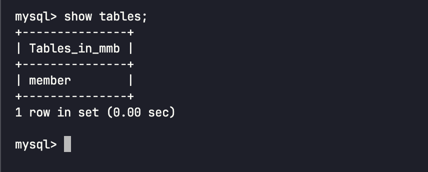

# 1. 5 주차 작업 내역

## 1.1. 작업 내용

1. docker-compose.yml 작성 및 환경 변수 설정

2. 구동 실패로 인해 mysql dialect 설정 추가

3. 로컬 환경 구동

테스트 컨테이너를 통한 테스트시에 다음과 같이 컨테이너가 구동된다.  

인프라의 버전 혹은 구동 포트등도 설정 가능하지만, 테스트가 너무 느리다.  

4. ec2에 구동 후 요청 성공 확인

5. 회원 서비스에 도커 관련 파일 추가

## 1.2. 이슈 및 해결 방법

1. 컨테이너 구동 실패로 인해 mysql dialect 설정 추가

`spring.jpa.properties.hibernate.dialect: org.hibernate.dialect.MySQLDialect`

2. mysql에 테이블 없어 구동 실패

`ddl-auto: none` 이며 테이블 생성이 되지 않아
`spring.jpa.hibernate.ddl-auto: create` 으로 테이블 생성하도록 수정 하여 구동

## 1.3. 다음 계획

1. 질문 서비스 배포가 안되었다. 배포 가능 하도록 수정 & 도커 관련 파일 추가 예정
2. 환경 변수 문서 정리 완료 후 배포 전에 전달 예정
3. 회원 서비스 구글 로그인 관련 부분 작업 진행 예정
4. 서비스 추가에 따른 API 문서 내용 추가

## 1.4. 개인 회고

1. PR 코드 리뷰는 꼼꼼하게 하였고, 댓글 & 화상 회의를 통해 의견 정리
2. API 가이드 전달하여 파트원들 작성하였음
3. 서비스별 환경 변수 정리가 마무리 되어야함
4. 파트원들의 속도를 낼수 있게 최대한 가이드를 제공이 필요